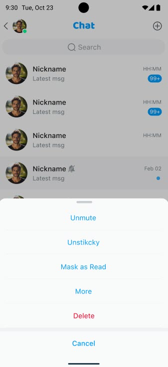

`EaseConversationListFragment` is used to display all conversations of the current user, including one-to-one chats and group chats (excluding chat rooms). It provides conversation search, deletion, pinning, and do not disturb functions, specifically:

- Click **Search** to go to the search page and search for conversations.
- Click a conversation list item to jump to the conversation details page.
- Click the expand button in the navigation bar and select **New conversation** to start a conversation.
- Long press a conversation in the list to display the menu, where you can delete the conversation, pin the conversation, or disable messages.

A single conversation displays the conversation name, the last message, the time of the last message, the pinned and muted status, and other information.

For one-to-one chats, the name displayed in the conversation is the nickname of the other user. If the other user has not set a nickname, then their user ID is displayed. The conversation avatar is the other user's avatar. If it is not set, then the default avatar is used.
For group chats, the conversation name is the name of the current group and the avatar is the default avatar.

For details about the features related to the conversation list, see [Product features](./overview/product-features.md).


## Usage examples

```kotlin
class ConversationListActivity: AppCompactActivity() {
    override fun onCreate(savedInstanceState: Bundle?) {
        super.onCreate(savedInstanceState)
        setContentView(R.layout.activity_conversation_list)

        EaseConversationListFragment.Builder()
                        .build()?.let { fragment ->
                            supportFragmentManager.beginTransaction()
                                .replace(R.id.fl_fragment, fragment).commit()
                        }
    }
}
```

## Advanced usage

### Customize settings through EaseConversationListFragment.Builder

An `EaseConversationListFragment` Builder construction method is provided for custom settings. The currently provided settings are as follows:

```kotlin
EaseConversationListFragment.Builder()
    .useTitleBar(true)
    .setTitleBarTitle("title")
    .enableTitleBarPressBack(true)
    .setTitleBarBackPressListener(onBackPressListener)
    .useSearchBar(false)
    .setItemClickListener(onItemClickListener)
    .setOnItemLongClickListener(onItemLongClickListener)
    .setOnMenuItemClickListener(onMenuItemClickListener)
    .setConversationChangeListener(conversationChangeListener)
    .setEmptyLayout(R.layout.layout_conversation_empty)
    .setCustomAdapter(customAdapter)
    .setCustomFragment(myConversationListFragment)
    .build()
```

The methods provided in `EaseConversationListFragment#Builder` are shown in the following table:

| Method | Description |
|:---:|:---:|
| `useTitleBar()` | Set whether to use the default title bar (`EaseTitleBar`). Set to `true` for yes, `false` (default) for no. |
| `setTitleBarTitle()` | Set the title of the title bar. |
| `enableTitleBarPressBack()` | Set whether to display the back button. The default is not to display the back button. Set to `true` for yes, `false` (default) for no. |
| `setTitleBarBackPressListener()` | Set the listener for clicking the back button in the title bar. |
| `setItemClickListener()` | Set the click event listener. |
| `setOnItemLongClickListener()` | Set the long-press event listener. |
| `setOnMenuItemClickListener()` | Set the menu click event listener. |
| `setConversationChangeListener()` | Set the listener for conversation changes. |
| `setEmptyLayout()` | Set a blank page for the conversation list. |
| `setCustomAdapter()` | Set a custom adapter, the default is `EaseConversationListAdapter`. |
| `setCustomFragment()` | Set a custom chat fragment, must be inherited from `EaseConversationListFragment`. |

### Add a custom conversation layout

You can inherit from `EaseConversationListAdapter` to implement your own `CustomConversationListAdapter` and then set `EaseConversationListFragment#Builder#setCustomAdapter` to `CustomConversationListAdapter`.

1. Create a custom adapter `CustomConversationListAdapter`, inherit from `EaseConversationListAdapter`, and override the `getViewHolder` and `getItemNotEmptyViewType` methods.

   ```kotlin
   class CustomConversationListAdapter : EaseConversationListAdapter() {
   override fun getItemNotEmptyViewType(position: Int): Int {
   // Set custom itemViewType according to message type
   // If you use the default itemViewType, return super.getItemNotEmptyViewType(position)
   return CUSTOM_YOUR_CONVERSATION_TYPE
   }
   
   override fun getViewHolder(parent: ViewGroup, viewType: Int): ViewHolder<EaseConversation> {
   // Return the corresponding ViewHolder according to the returned viewType
   // Return a custom ViewHolder or use the default super.getViewHolder(parent, viewType)
   return CUSTOM_YOUR_VIEW_HOLDER()
   }
   }
   ```
   
1. Add `CustomConversationListAdapter` to `EaseConversationListFragment#Builder`.

   ```kotlin
   builder.setCustomAdapter(customConversationListAdapter);
   ```
   
### Customize by inheriting EaseConversationListFragment

Create a custom `CustomConversationListFragment`, inherit from `EaseConversationListFragment`, and set  `EaseConversationListFragment#Builder`.

```kotlin
builder.setCustomFragment(customConversationListFragment);
```

### Set chat avatar and nickname

```kotlin
// Chat type settings setUserProfileProvider
EaseIM.setUserProfileProvider(object : EaseUserProfileProvider {
override fun getUser(userId: String?): EaseProfile? {
// Query the corresponding userId information locally and return it
return DemoHelper.getInstance().getDataModel().getAllContacts()[userId]?.toProfile()
}

override fun fetchUsers(
userIds: List<String>,
onValueSuccess: OnValueSuccess<List<EaseProfile>>
) {
// Profile provider. Users can get the Profile information of the corresponding ID from their own server according to the userId list and return it through onValueSuccess().
// At the same time, the obtained information can be updated to the cache through EaseIM.updateUsersInfo(). When getting the Profile, UIKit will query from the cache first.
}
})
// Group type settings setGroupProfileProvider
EaseIM.setGroupProfileProvider(object : EaseGroupProfileProvider {

override fun getGroup(id: String?): EaseGroupProfile? {
ChatClient.getInstance().groupManager().getGroup(id)?.let {
return EaseGroupProfile(it.groupId, it.groupName, it.extension)
}
return null
}

override fun fetchGroups(
groupIds: List<String>,
onValueSuccess: OnValueSuccess<List<EaseGroupProfile>>
) {
// Get group-related information based on the groupId list through onValueSuccess() and update the cache information.
}
})
```

## Default functions implemented in EaseConversationListFragment

### Do Not Disturb

Use the following methods provided in `EaseConversationListViewModel` to set the Do Not Disturb (DND) mode:

- `makeSilentForConversation`: Set the conversation to DND.
- `cancelSilentForConversation`: Cancel DND.

### Pin a conversation

Use the following methods provided in `EaseConversationListViewModel` to pin a conversation to the top:

- `pinConversation`: Pin a conversation.
- `unpinConversation`: Unpin the conversation.

### Mark a conversation read

Mark a conversation read using the `makeConversionRead` method provided in `EaseConversationListViewModel`.

### Delete a conversation

Use the `deleteConversation` method provided in `EaseConversationListViewModel` to delete a conversation.



## Event listening

The following monitoring is provided in `EaseConversationListFragment#Builder`:

```kotlin
EaseConversationListFragment.Builder()
    .setTitleBarBackPressListener()
    .setItemClickListener(onItemClickListener)
    .setOnItemLongClickListener(onItemLongClickListener)
    .setOnMenuItemClickListener(onMenuItemClickListener)
    .setConversationChangeListener(conversationChangeListener)
    .build()
```

| Method | Description |
|:---:|:---:|
| `setTitleBarBackPressListener()` | Set the listener for clicking the back button in the title bar. |
| `setItemClickListener()` | Set the item click event listener. |
| `setOnItemLongClickListener()` | Set the item long press event listener. |
| `setOnMenuItemClickListener()` | Set the item menu click event listener. |
| `setConversationChangeListener()` | Set the listener for conversation changes. |