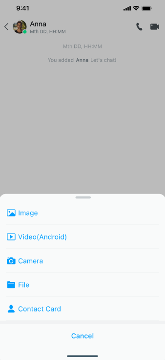

# Message chat

UIKit provides `EaseChatActivity` and `EaseChatFragment` to facilitate quick integration and customization of chat pages. This page illustrates the following features:

- Send and receive messages, including text, emojis, images, voice, video, files, and business card messages.
- Copy, quote, recall, delete, edit, resend, and review messages.
- Pull roaming messages from the server.
- Clear local messages.

For details about message-related features, see [Product features](./overview/product-features.md).

## Usage examples

The `EaseChatActivity` page requests permissions, such as camera permissions, voice permissions, and others.

```kotlin
// conversationId: Peer user ID for a one-to-one conversation and group ID for a group chat
// chatType: For one-to-one chat and group chat, it is EaseChatType#SINGLE_CHAT and EaseChatType#GROUP_CHAT, respectively.
EaseChatActivity.actionStart(mContext, conversationId, chatType)
```
```kotlin
class ChatActivity: AppCompactActivity() {
    override fun onCreate(savedInstanceState: Bundle?) {
        super.onCreate(savedInstanceState)
        setContentView(R.layout.activity_chat)
        // conversationId: Peer user ID for a one-to-one conversation and group ID for a group chat
        // chatType: For one-to-one chat and group chat, it is EaseChatType#SINGLE_CHAT and EaseChatType#GROUP_CHAT, respectively.
        EaseChatFragment.Builder(conversationId, chatType)
            .build()?.let { fragment ->
                supportFragmentManager.beginTransaction()
                    .replace(R.id.fl_fragment, fragment).commit()
                }
    }
}
```

## Overview of custom chat pages

You can configure the chat page title bar, message list items, input menu, and other elements.

### Customize settings through EaseChatFragment.Builder

The `EaseChatFragment.Builder` method facilitates customization of settings. The currently provided settings are as follows:

```kotlin
// conversationID: Peer user ID for a one-to-one conversation and group ID for a group chat
// easeChatType: SINGLE_CHAT and GROUP_CHAT for one-to-one and group chat, respectively
EaseChatFragment.Builder(conversationID, easeChatType) 
        .useTitleBar(true)
        .setTitleBarTitle("title")
        .setTitleBarSubTitle("subtitle")
        .enableTitleBarPressBack(true)
        .setTitleBarBackPressListener(onBackPressListener)
        .getHistoryMessageFromServerOrLocal(false)
        .setOnChatExtendMenuItemClickListener(onChatExtendMenuItemClickListener)
        .setOnChatInputChangeListener(onChatInputChangeListener)
        .setOnMessageItemClickListener(onMessageItemClickListener)
        .setOnMessageSendCallBack(onMessageSendCallBack)
        .setOnWillSendMessageListener(willSendMessageListener)
        .setOnChatRecordTouchListener(onChatRecordTouchListener)
        .setOnModifyMessageListener(onModifyMessageListener)
        .setOnReportMessageListener(onReportMessageListener)
        .setMsgTimeTextColor(msgTimeTextColor)
        .setMsgTimeTextSize(msgTimeTextSize)
        .setReceivedMsgBubbleBackground(receivedMsgBubbleBackground)
        .setSentBubbleBackground(sentBubbleBackground)
        .showNickname(false)
        .hideReceiverAvatar(false)
        .hideSenderAvatar(true)
        .setChatBackground(chatBackground)
        .setChatInputMenuBackground(inputMenuBackground)
        .setChatInputMenuHint(inputMenuHint)
        .sendMessageByOriginalImage(true)
        .setEmptyLayout(R.layout.layout_chat_empty)
        .setCustomAdapter(customAdapter)
        .setCustomFragment(myChatFragment)
        .build()
```

`EaseChatFragment#Builder` provides the following methods:

| Method | Description |
|:---:|:---:|
| `useTitleBar()` | Set whether to use the default title bar (`EaseTitleBar`). Set to `true` for yes, `false` (default) for no. |
| `setTitleBarTitle()` | Set the title of the title bar. |
| `setTitleBarSubTitle()` | Set the subtitle of the title bar. |
| `enableTitleBarPressBack()` | Set whether to display the back button. Set to `true` for yes, `false` (default) for no. |
| `setTitleBarBackPressListener()` | Set the event listener for clicking the back button in the title bar. |
| `getHistoryMessageFromServerOrLocal()` | Set whether to get messages from the server or locally first. |
| `setOnChatExtendMenuItemClickListener()` | Set the item click event listener for the extended menu. |
| `setOnChatInputChangeListener()` | Set the listener for text changes in the menu. |
| `setOnMessageItemClickListener()` | Set the click event listener for the message item, including click and long-press events of the bubble area and avatar. |
| `setOnMessageSendCallBack()` | Set the result callback listener for sending messages. |
| `setOnWillSendMessageListener()` | Set the callback for adding extended message attributes before sending the message. |
| `setOnChatRecordTouchListener()` | Set the touch event listener for the recording button. |
| `setOnModifyMessageListener()` | Set the result callback listener for editing a message. |
| `setOnReportMessageListener()` | Set the result callback listener for reporting a message. |
| `setMsgTimeTextColor()` | Set the color of the message time indication. |
| `setMsgTimeTextSize()` | Set the font size of the message time indication. |
| `setReceivedMsgBubbleBackground()` | Set the background of the received message bubble area. |
| `setSentBubbleBackground()` | Set the background of the sent message bubble area. |
| `showNickname()` | Set whether to display the nickname. Set to `true` for yes, `false` (default) for no. |
| `hideReceiverAvatar()` | Set to hide the recipient's avatar, displayed by default. |
| `hideSenderAvatar()` | Set to hide the sender's avatar, displayed by default. |
| `setChatBackground()` | Set the background of the chat area. |
| `setChatInputMenuBackground()` | Set the background of the menu area. |
| `setChatInputMenuHint()` | Set the prompt text of the menu input area. |
| `sendMessageByOriginalImage()` | Set whether to send the original image when sending image messages. Set to `true` for yes, `false` (default) for no. |
| `setEmptyLayout()` | Set a blank page for the chat list. |
| `setCustomAdapter()` | Set a custom adapter. The default is `EaseMessageAdapter`. |
| `setCustomFragment()` | Set a custom chat fragment. Inherit from `EaseChatFragment`. |

### Add a custom message layout

You can inherit from `EaseMessageAdapter`, `EaseChatRowViewHolder`, and `EaseChatRow` to implement your own `CustomMessageAdapter`, `CustomChatTypeViewViewHolder`, and `CustomTypeChatRow`, and then set it with `EaseChatFragment#Builder#setCustomAdapter`.

1. To create a custom `CustomMessageAdapter`, inherit from `EaseMessageAdapter` and override the `getViewHolder` and `getItemNotEmptyViewType` methods:

    ```kotlin
    class CustomMessageAdapter: EaseMessagesAdapter() {
    
        override fun getItemNotEmptyViewType(position: Int): Int {
            // Set your own itemViewType according to the message type
            // If you want to use the default, return super.getItemNotEmptyViewType(position)
    return CUSTOM_YOUR_MESSAGE_TYPE
        }
    
        override fun getViewHolder(parent: ViewGroup, viewType: Int): ViewHolder<EaseMessage> {
            // Return the corresponding ViewHolder according to the returned viewType
            // Return a custom ViewHolder or use the default super.getViewHolder(parent, viewType)
    return CUSTOM_VIEW_HOLDER()
        }
    }
    ```
   
1. Inherit from `EaseChatRow` to create `CustomTypeChatRow`:

    ```kotlin
    class CustomTypeChatRow(
        private val context: Context,
        private val attrs: AttributeSet? = null,
        private val defStyle: Int = 0,
        isSender: Boolean = false
    ): EaseChatRow(context, attrs, defStyle, isSender) {
    
        override fun onInflateView() {
            inflater.inflate(if (!isSender) R.layout.layout_row_received_custom_type
            else R.layout.layout_row_sent_custom_type,
                this)
        }
    
        override fun onSetUpView() {
            (message?.getMessage()?.body as? ChatTextMessageBody)?.let { txtBody ->
                contentView.text = txtBody.message
            }
        }
    }
    ```

1. Inherit from `EaseChatRowViewHolder` to create `CustomChatTypeViewViewHolder`:

    ```kotlin
    class CustomChatTypeViewViewHolder(
        itemView: View
    ): EaseChatRowViewHolder(itemView) {
    
        override fun onBubbleClick(message: EaseMessage?) {
            super.onBubbleClick(message)
            // Adding a click event
        }
    }
    ```

1. Complete `CustomMessageAdapter`:

    ```kotlin
    class CustomMessageAdapter: EaseMessagesAdapter() {
  
      override fun getItemNotEmptyViewType(position: Int): Int {
          // Set your own itemViewType according to the message type.
          mData?.get(position)?.getMessage()?.let { msg ->
              msg.getStringAttribute("type", null)?.let { type ->
                  if (type == CUSTOM_TYPE) {
                      return if (msg.direct() == ChatMessageDirection.SEND) {
                          VIEW_TYPE_MESSAGE_CUSTOM_VIEW_ME
                      } else {
                          VIEW_TYPE_MESSAGE_CUSTOM_VIEW_OTHER
                      }
                  }
              }
          }
          // If you want to use the default, return super.getItemNotEmptyViewType(position).
          return super.getItemNotEmptyViewType(position)
      }
  
      override fun getViewHolder(parent: ViewGroup, viewType: Int): ViewHolder<EaseMessage> {
          // Return ViewHolder according to the returned viewType.
          if (viewType == VIEW_TYPE_MESSAGE_CUSTOM_VIEW_ME || viewType == VIEW_TYPE_MESSAGE_CUSTOM_VIEW_OTHER) {
              CustomChatTypeViewViewHolder(
                  CustomTypeChatRow(parent.context, isSender = viewType == VIEW_TYPE_MESSAGE_CUSTOM_VIEW_ME)
              )
          }
          // Return a custom ViewHolder or use the default super.getViewHolder(parent, viewType)
          return super.getViewHolder(parent, viewType)
      }
  
      companion object {
          private const val CUSTOM_TYPE = "custom_type"
          private const val VIEW_TYPE_MESSAGE_CUSTOM_VIEW_ME = 1000
          private const val VIEW_TYPE_MESSAGE_CUSTOM_VIEW_OTHER = 1001
      }
    }
    ```
    
1. Add `CustomMessageAdapter` to `EaseChatFragment#Builder`:

    ```kotlin
    builder.setCustomAdapter(CustomMessageAdapter())
    ```
   
## List control-related function settings

```kotlin
val chatMessageListLayout:EaseChatMessageListLayout? = binding?.layoutChat?.chatMessageListLayout
```

`EaseChatMessageListLayout` provides the following methods:

| Method | Description |
|:---:|:---:|
| `setViewModel()` | UIKit provides a default implementation of `EaseMessageListViewModel`, which you can inherit and add your own logic. |
| `setMessagesAdapter()` | Set the adapter for the message list. Must be a subclass of `EaseMessagesAdapter`. |
| `getMessagesAdapter()` | An adapter that returns a list of messages. |
| `addHeaderAdapter()` | Add an adapter for the header layout of the message list. |
| `addFooterAdapter()` | Add an adapter for the footer layout of the message list. |
| `removeAdapter()` | Remove the specified adapter. |
| `addItemDecoration()` | Add a message list decorator. |// TODO：是消息列表项的装饰器？
| `removeItemDecoration()` | Remove the message list decorator. |
| `setAvatarDefaultSrc()` | Set the default avatar for an entry. |
| `setAvatarShapeType()` | Set the style of the avatar: Default, round, and rectangular. |
| `showNickname()` | Whether to display the nickname of the entry. `EaseChatFragment#Builder` also provides a setting method for this feature. |
| `setItemSenderBackground()` | Set the background of the sender. `EaseChatFragment#Builder` also provides a setting method for this feature. |
| `setItemReceiverBackground()` | Set the background of the receiver. `EaseChatFragment#Builder` also provides a setting method for this feature. |
| `setItemTextSize()` | Set the font size for text messages. |
| `setItemTextColor()` | Set the font color of text messages. |
| `setTimeTextSize()` | Set the font size of the message time indication. `EaseChatFragment#Builder` also provides a setting method for this feature. |
| `setTimeTextColor()` | Set the color of the message time indication. `EaseChatFragment#Builder` also provides a setting method for this feature. |
| `setTimeBackground()` | Set the background of the message time indication. |
| `hideChatReceiveAvatar()` | Hide the recipient's avatar. Displayed by default. `EaseChatFragment#Builder` also provides a setting method for this feature. |
| `hideChatSendAvatar()` | Hide the sender's avatar. It is displayed by default. `EaseChatFragment#Builder` also provides a setting method for this feature. |
| `setOnChatErrorListener()` | Set the error callback when sending a message. `EaseChatFragment#Builder` also provides a setting method for this feature. |

## Extended function settings

```kotlin
val chatExtendMenu: IChatExtendMenu? = binding?.layoutChat?.chatInputMenu?.chatExtendMenu
```

After obtaining a `chatExtendMenu` object, you can add, remove, sort, and handle click events of extended functions.

`IChatExtendMenu` provides the following methods: 

| Method | Describe |
|:---:|:---:|
| `clear()` | Clear all extended menu items. |
| `setMenuOrder()` | Sort the specified menu items. |
| `registerMenuItem()` | Add a new menu item. |



## Listen for extension item click events

You can use `EaseChatFragment#Builder#setOnChatExtendMenuItemClickListener` or override the `ChatExtendMenuItemClick` method in a custom fragment.

```kotlin
override fun onChatExtendMenuItemClick(view: View?, itemId: Int): Boolean {
    if(itemId == CUSTOM_YOUR_EXTEND_MENU_ID) {
        // Handle your own click event logic
        // If you want to customize the click event, return `true`
        return true
    }
    return super.onChatExtendMenuItemClick(view, itemId)
}
```

## Long-press menu function settings

- Add custom menu items:

    ```kotlin
    binding?.let {
        it.layoutChat.addItemMenu(menuId, menuOrder, menuTile)
    }
    ```
  
- Show or hide the specified menu item:

    ```kotlin
    binding?.let {
        it.findItemVisible(itemId: Int, visible: Boolean)
    }
    ```
    
    `EaseChatLayout` provides the following long-press menu methods: 
    
    | Method | Description |
    |:---:|:---:|
    | `clearMenu()` | Clear a menu item. |
    | `addItemMenu()` | Add a new menu item. |
    | `findItemVisible()` | Set the visibility of a menu item by specifying `itemId`. |
    | `setOnMenuChangeListener()` | Set the click event listener for the menu item. This listener is already set in `EaseChatFragment`.|

- Handle menu events.

    Override the following method in your custom fragment:

    ```kotlin
        override fun onPreMenu(helper: EaseChatMenuHelper?, message: ChatMessage?) {
          // Callback event before menu is displayed. You can use the helper object to set whether the menu item is displayed.
        }
      
        override fun onMenuItemClick(item: EaseMenuItem?, message: ChatMessage?): Boolean {
          // If you want to intercept a click event, you need to set it to return `true`.
        return false
        }
      
        override fun onDismiss() {
          // You can handle the hiding event of the shortcut menu here.
        }
    ```
  
## Set properties related to the input menu 

- Get an `EaseChatInputMenu` object: 

  ```kotlin
   val chatInputMenu: EaseChatInputMenu? = binding?.layoutChat?.chatInputMenu
   
       chatInputMenu?.let{
           it.setCustomPrimaryMenu() //Set custom menu items, supporting view and fragment
           it.setCustomEmojiconMenu() //Set custom emoji function, supporting view and fragment  
           it.setCustomExtendMenu() //Set custom extended functions, supporting view, dialog and fragment
           it.setCustomTopExtendMenu() //Set a custom menu top layout, supporting View and Fragment
   
           it.hideInputMenu() //Hide the area except the top area of the menu   
           it.hideExtendContainer() //Hide the extended area, including the emoji area and the extended function area
   
           it.chatPrimaryMenu //Get the menu item interface
           it.chatExtendMenu //Get the extended function interface  
           it.chatEmojiMenu //Get the emoji function menu interface   
   
       }
   
       //For example, set a custom extension function
       val menuDialog = EaseChatExtendMenuDialog(mContext)
       binding?.layoutChat?.chatInputMenu?.setCustomExtendMenu(menuDialog)
  ```
  
  `EaseChatInputMenu` provides the following methods: 

    | method | describe |
    |:---:|:---:|
    | `setCustomPrimaryMenu()` | Set custom menu items, supports View and Fragment. |
    | `setCustomEmojiconMenu()` | Set a custom emoji menu, supports View and Fragment. |
    | `setCustomExtendMenu()` | Set custom extended menu items, supports View, Dialog, and Fragment. |
    | `setCustomTopExtendMenu()` | Set a custom extended top menu layout, supports View and Fragment. |
    | `hideExtendContainer()` | Hide the extended area, including the emoji and extended menu areas. |
    | `hideInputMenu()` | Hide all areas except the top area of the menu. |
    | `showEmojiconMenu()` | Display the emoji area. |
    | `showExtendMenu()` | Display the extended menu. |
    | `showTopExtendMenu()` | Show the top of the extended menu. |
    | `setChatInputMenuListener()` | Set the input menu listener. |
    | `chatPrimaryMenu` | Get the menu item interface. |
    | `chatEmojiMenu` | Get the emoji menu interface. |
    | `chatExtendMenu` | Get the extended menu interface. |
    | `chatTopExtendMenu` | Get the top extended menu interface. |

- Get a menu item object:

  ```kotlin
  val primaryMenu: IChatPrimaryMenu? = binding?.layoutChat?.chatInputMenu?.chatPrimaryMenu
  ```

  `IChatPrimaryMenu` provides the following methods:
    
    | Method | Description|
    |:---:|:---:|
    | `onTextInsert()` | Insert text at the cursor. |
    | `editText` | Get the menu input box object. |
    | `setMenuBackground()` | Set the menu background. |

- Get an emoji menu object:

  ```kotlin
  val emojiconMenu: IChatEmojiconMenu? = binding?.layoutChat?.chatInputMenu?.chatEmojiMenu
  ```
  
  `IChatEmojiconMenu` provides the following methods:

    | Method | Description |
    |:---:|:---:|
    | `addEmojiconGroup()` | Add custom emojis. |
    | `removeEmojiconGroup()` | Remove the specified emoji group. |

    Add a custom emoji in the following way:

    ```kotlin
    binding?.let {
           it.layoutChat.chatInputMenu?.chatEmojiMenu?.addEmojiconGroup(EmojiconExampleGroupData.getData())
       }
    ```
  
## Customize the chat page style

You can configure the title bar, message list items, and other elements. The following settings are all based on the premise of using or inheriting `EaseChatFragment`.

### Set the title bar

The title bars of the contact list page, chat page, conversation list page, group details page, and contact details page use `EaseTitleBar`. If the title bar does not meet your requirements, customize it. For details about the title, background color, button image, and avatar, see [Conversation list](conversation-list.md).

### Set message list items

#### Set the message list control functions

```kotlin
//Get the EaseChatMessageListLayout object:
val chatMessageListLayout:EaseChatMessageListLayout? = binding?.layoutChat?.chatMessageListLayout
chatMessageListLayout?.let{
    it.setTimeBackground() //Set the background of the message time indication.
    it.setItemTextSize() //Set the font size of the text message.
    it.setItemTextColor() //Set the font color of the text message.
    it.setAvatarDefaultSrc() //Set the default avatar of the entry.
    it.setAvatarShapeType() //Set the style of the avatar: default, round, and rectangular.
}

// EaseChatFragment#Builder also provides some message list-related configuration items
EaseChatFragment.Builder(conversationID, easeChatType)
    .showNickname() //Whether to display the nickname: true: yes; (default) false: no.
    .setMsgTimeTextColor() //Set the color of the message time indication.
    .setMsgTimeTextSize() //Set the font size of the message time indication.
    .setReceivedMsgBubbleBackground() //Set the background of the received message bubble area.
    .setSentBubbleBackground() //Set the background of the sent message bubble area.     
    .hideReceiverAvatar() //Set not hide the receiver's avatar. Displayed by default.
    .hideSenderAvatar() //Set to hide the sender's avatar. Displayed by default.
    .setChatBackground() //Set the background of the chat list area.
    .sendMessageByOriginalImage() //Set whether to send the original image when sending image messages: true: Yes; (default) false: No.
    .setEmptyLayout() //Set the blank page of the chat list.   
```

#### Configure custom message list items

You can customize the message layout of various message types.

Inherit `EaseMessageAdapter`, `EaseChatRowViewHolder`, and `EaseChatRow` to implement your own `CustomMessageAdapter`, `CustomChatTypeViewViewHolder`, and `CustomTypeChatRow`, and then set it with `EaseChatFragment#Builder#setCustomAdapter`.

1. Inherit from `EaseMessageAdapter` to create `CustomMessageAdapter`, then override the `getViewHolder` and `getItemNotEmptyViewType` methods:

    ```kotlin
    class CustomMessageAdapter: EaseMessagesAdapter() {
    
        override fun getItemNotEmptyViewType(position: Int): Int {
            // According to the message type, set your own itemViewType.
            // If you want to use the default, return super.getItemNotEmptyViewType(position).
            return CUSTOM_YOUR_MESSAGE_TYPE
        }
    
        override fun getViewHolder(parent: ViewGroup, viewType: Int): ViewHolder<EaseMessage> {
            // Return the corresponding ViewHolder according to the returned viewType.
            // Return a custom ViewHolder or use the default super.getViewHolder(parent, viewType).
            return CUSTOM_VIEW_HOLDER()
        }
    }
    ```

1. Inherit from `EaseChatRow` to create `CustomTypeChatRow`:

    ```kotlin
    class CustomTypeChatRow(
        private val context: Context,
        private val attrs: AttributeSet? = null,
        private val defStyle: Int = 0,
        isSender: Boolean = false
    ): EaseChatRow(context, attrs, defStyle, isSender) {
    
        override fun onInflateView() {
            inflater.inflate(if (!isSender) R.layout.layout_row_received_custom_type
            else R.layout.layout_row_sent_custom_type,
                this)
        }
    
        override fun onSetUpView() {
            (message?.getMessage()?.body as? ChatTextMessageBody)?.let { txtBody ->
                contentView.text = txtBody.message
            }
        }
    }
    ```

1. Inherit from `EaseChatRowViewHolder` to create `CustomChatTypeViewViewHolder`:

    ```kotlin
    class CustomChatTypeViewViewHolder(
        itemView: View
    ): EaseChatRowViewHolder(itemView) {
    
        override fun onBubbleClick(message: EaseMessage?) {
            super.onBubbleClick(message)
            // Add click event
        }
    }
    ```

1. Configure `CustomMessageAdapter`:

    ```kotlin
    class CustomMessageAdapter: EaseMessagesAdapter() {
    
        override fun getItemNotEmptyViewType(position: Int): Int {
            // Set your own itemViewType according to the message type.
            mData?.get(position)?.getMessage()?.let { msg ->
                msg.getStringAttribute("type", null)?.let { type ->
                    if (type == CUSTOM_TYPE) {
                        return if (msg.direct() == ChatMessageDirection.SEND) {
                            VIEW_TYPE_MESSAGE_CUSTOM_VIEW_ME
                        } else {
                            VIEW_TYPE_MESSAGE_CUSTOM_VIEW_OTHER
                        }
                    }
                }
            }
            // If you want to use the default, return super.getItemNotEmptyViewType(position).
            return super.getItemNotEmptyViewType(position)
        }
    
        override fun getViewHolder(parent: ViewGroup, viewType: Int): ViewHolder<EaseMessage> {
            // Return the corresponding ViewHolder according to the returned viewType.
            if (viewType == VIEW_TYPE_MESSAGE_CUSTOM_VIEW_ME || viewType == VIEW_TYPE_MESSAGE_CUSTOM_VIEW_OTHER) {
                CustomChatTypeViewViewHolder(
                    CustomTypeChatRow(parent.context, isSender = viewType == VIEW_TYPE_MESSAGE_CUSTOM_VIEW_ME)
                )
            }
            // Return a custom ViewHolder or use the default super.getViewHolder(parent, viewType).
            return super.getViewHolder(parent, viewType)
        }
    
        companion object {
            private const val CUSTOM_TYPE = "custom_type"
            private const val VIEW_TYPE_MESSAGE_CUSTOM_VIEW_ME = 1000
            private const val VIEW_TYPE_MESSAGE_CUSTOM_VIEW_OTHER = 1001
        }
    }
    ```

1. Add `CustomMessageAdapter` to `EaseChatFragment#Builder`:

    ```kotlin
    builder.setCustomAdapter(CustomMessageAdapter())
    ```

### Set the avatar and nickname

For details on setting avatars and nicknames, see [User-defined information](user-defined-information.md).

#### Set list-related events

`EaseChatFragment#Builder` sets the click event listener for message items, including click and long-press events of the bubble area and avatar.

```kotlin
    builder.setOnMessageItemClickListener(object : OnMessageItemClickListener{
            //Chat bubble click event
            override fun onBubbleClick(message: ChatMessage?): Boolean {}
            //Chat bubble long press event, return true to consume the event and do not pass it down (that is, do not execute the default logic in UIKit)
            override fun onBubbleLongClick(v: View?, message: ChatMessage?): Boolean {}
            //Resend event, used to retry after a message fails to be sent. If return true, the consumption event will not be passed down (i.e., the default logic in UIKit will not be executed)
            override fun onResendClick(message: ChatMessage?): Boolean {}
            //Avatar click event
            override fun onUserAvatarClick(userId: String?) {}
            //Avatar long press event
            override fun onUserAvatarLongClick(userId: String?) {}
        })   
```

#### Set the message date

`EaseDateFormatConfig` provides the following configuration items:

| Property | Description |
| -------------------------------------- | ---------------------------------------------------------------- |
| `chatTodayFormat` | The current date format in the message list. The default is `HH:mm`. |
| `chatOtherDayFormat` | The format for dates other than the current date in the message list. The default is `MMM dd, HH:mm`. |
| `chatOtherYearFormat` | The format for years other than the current year in the message list. The default is `MMM dd, yyyy HH:mm`. |

```kotlin
    // Date/language region switch (follow the mobile phone regional language setting). The default value is false and uses ENGLISH.
    EaseIM.getConfig()?.dateFormatConfig?.useDefaultLocale = true  
    // Today's date format in the message
    EaseIM.getConfig()?.dateFormatConfig?.chatTodayFormat = "HH:mm"
    // Date format for other dates in the message
    EaseIM.getConfig()?.dateFormatConfig?.chatOtherDayFormat = "MMM dd, yyyy"
    // Date format for other years in the message
    EaseIM.getConfig()?.dateFormatConfig?.chatOtherYearFormat = "MMM dd, yyyy HH:mm"
```

#### Set the message recall time

You can set the effective time for recalling messages on the chat page through `EaseIM.getConfig()?.chatConfig?.timePeriodCanRecallMessage`. The default is 120 seconds.

#### Set message translation

- `EaseIM.getConfig()?.chatConfig?.enableTranslationMessage`: Whether to enable the long-press translation feature for text messages. The default value is `false`.
- `EaseIM.getConfig()?.chatConfig?.targetTranslationLanguage = "en"`: The target language for translation. After long-pressing a text message, the **Translation** menu appears. A user clicks **Translate** to set the target language for translation. Before using, set `EaseIM.getConfig()?.chatConfig?.enableTranslationMessage` to `true`.
- `<style name="ease_chat_message_received_translation_content_style">`: The message recipient can modify any attribute of the translated text style.
- `<style name="ease_chat_message_sent_translation_content_style">`: The message sender can modify any attribute of the translated text style.

## Other settings for the chat page

Other methods marked as open can be overridden to implement your own business logic.