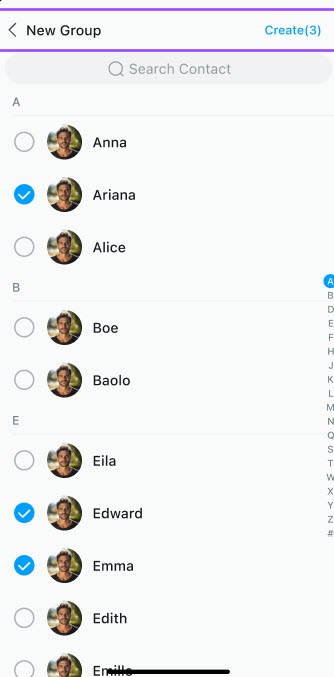

# Contact list

`EaseContactsListFragment` is used to display the address book list, including contact search, adding contacts, friend request list entry, group list entry, and contact list.

Nicknames can be sorted by the first letter.


## Usage example

```kotlin
class ContactListActivity: AppCompactActivity() {
    override fun onCreate(savedInstanceState: Bundle?) {
        super.onCreate(savedInstanceState)
        setContentView(R.layout.activity_contact_list)

        EaseContactsListFragment.Builder()
                        .build()?.let { fragment ->
                            supportFragmentManager.beginTransaction()
                                .replace(R.id.fl_fragment, fragment).commit()
                        }
    }
}
```

## Customize the contact list page

You can customize the contact page title bar, header, and items.

### Customize settings through `EaseContactsListFragment.Builder`

The `EaseContactsListFragment.Builder`  method is provided for configuring custom settings. The following settings are currently provided: 

```kotlin
EaseContactsListFragment.Builder()
  .useTitleBar(true)
  .setTitleBarTitle("title")
  .enableTitleBarPressBack(true)
  .setTitleBarBackPressListener(onBackPressListener)
  .useSearchBar(false)
  .setSearchType(EaseSearchType.USER)
  .setListViewType(EaseListViewType.VIEW_TYPE_LIST_CONTACT)
  .setSideBarVisible(true)
  .setHeaderItemVisible(true)
  .setHeaderItemList(mutableListOf<EaseCustomHeaderItem>())
  .setOnHeaderItemClickListener(OnHeaderItemClickListener)
  .setOnUserListItemClickListener(OnUserListItemClickListener)
  .setOnItemLongClickListener(onItemLongClickListener)
  .setOnContactSelectedListener(OnContactSelectedListener)
  .setEmptyLayout(R.layout.layout_conversation_empty)
  .setCustomAdapter(customAdapter)
  .setCustomFragment(myContactsListFragment)
  .build()
```

| Method | Description |
|:---:|:---:|
| `useTitleBar()` | Whether to use the default title bar (`EaseTitleBar`). Set to `true` for yes, `false` (default) for no. |
| `setTitleBarTitle()` | Set the title of the title bar. |
| `enableTitleBarPressBack()` | Set whether to display the back button. Set to `true` for yes, `false` (default) for no. |
| `setTitleBarBackPressListener()` | Set the listener for clicking the back button in the title bar. |
| `useSearchBar()` | Set whether to use the search bar. Set to `true` for yes, `false` (default) for no. |
| `setSearchType()` | Set the `EaseSearchType` search type: `USER`, `SELECT_USER`, `CONVERSATION`. |
| `setListViewType()` | Set the `EaseListViewType` list type. `LIST_CONTACT`: The default contact list without checkboxes. `LIST_SELECT_CONTACT`: The contact list with checkboxes. |
| `setSideBarVisible()` | Set whether to show the alphabetical index toolbar. Set to `true` (default) for yes, `false` for no. |
| `setHeaderItemVisible()` | Set whether to display the list header layout. |
| `setHeaderItemList()` | Set the data object of the list header items. |
| `setOnHeaderItemClickListener()` | Set the click event listener for the header item. |
| `setOnUserListItemClickListener()` | Set the item click event listener. |
| `setOnItemLongClickListener()` | Set the item long-press event listener. |
| `setOnContactSelectedListener()` | Set the item selection event listener. |
| `setEmptyLayout()` | Set a blank page for the contact list. |
| `setCustomAdapter()` | Set a custom adapter. The default is `EaseContactListAdapter`. |
| `setCustomFragment()` | Set a custom chat fragment by inheriting from `EaseContactsListFragment`. |

### Set the title bar

The title bars of the chat page, conversation list page, contact list page, group details page, and contact details page use `EaseTitleBar`. If the title bar does not meet your needs, you can customize it. For details about the title bar, avatar, background color, and button image, see [Conversation list](conversation-list.md).

### Customize the contact list header

The custom header in this section is based on  `EaseContactsListFragment`.

You can set the header data source through `setHeaderItemList` in `EaseContactsListFragment#Builder`.

The sample code is as follows:

```kotlin
     EaseContactsListFragment.Builder().setHeaderItemList(mutableListOf(
        EaseCustomHeaderItem(
            headerId = "", // Unique itemId
            order = 0, // Sorting order
            headerIconRes = -1, // Icon resource
            headerTitle = "", // Title
            headerContent = "", // Content
            headerEndIconRes = -1, // End icon resource
            headerItemDivider = true, // Whether to display the dividing line
            headerItemShowArrow = false // Whether to display the tail icon
        )
     ))
```

Add the header item click event:

```kotlin

    EaseContactsListFragment.Builder().setOnHeaderItemClickListener(object : OnHeaderItemClickListener{
            override fun onHeaderItemClick(v: View, itemIndex: Int, itemId: Int?) {
                        
            }
    })
```

### Add a custom contact layout

Inherit from `EaseContactListAdapter` to implement your own `CustomContactListAdapter` and then set it with `EaseContactsListFragment#Builder#setCustomAdapter`.

1. Inherit from `EaseContactListAdapter` to create `CustomContactListAdapter`, then override the `getViewHolder` and `getItemNotEmptyViewType` methods:

   ```kotlin
   class CustomContactListAdapter : EaseContactListAdapter() {
       override fun getItemNotEmptyViewType(position: Int): Int {
            // Set a custom itemViewType based on the message type.
            // If the default itemViewType is used, return super.getItemNotEmptyViewType(position).
           return CUSTOM_YOUR_CONTACT_TYPE
       }
   
       override fun getViewHolder(parent: ViewGroup, viewType: Int): ViewHolder<EaseUser> {
            // Return the corresponding ViewHolder according to the returned viewType.
            // Return a custom ViewHolder or use the default super.getViewHolder(parent, viewType)
           return CUSTOM_YOUR_VIEW_HOLDER()
       }
   }
   ```
   
1. Add `CustomContactListAdapter` to `EaseContactsListFragment#Builder`:

   ```kotlin
   builder.setCustomAdapter(CustomContactListAdapter)
   ```
   
### Set a selectable contact list

For example, if a user needs to add multiple users when creating a group, they can click the checkboxes next to the contacts to select them.

```kotlin
builder.setSearchType(EaseSearchType.SELECT_USER)  
```



## Event listening

```kotlin
EaseContactsListFragment.Builder()
  .setOnHeaderItemClickListener(OnHeaderItemClickListener)
  .setOnUserListItemClickListener(OnUserListItemClickListener)
  .setOnItemLongClickListener(onItemLongClickListener)
  .setOnContactSelectedListener(OnContactSelectedListener)
  .build()
```

| Method | Description |
|:---:|:---:|
| `setOnHeaderItemClickListener()` | Set the event listener for a header item click. |
| `setOnUserListItemClickListener()` | Set the event listener for a list item click. |
| `setOnItemLongClickListener()` | Set the event listener for an item long press. |
| `setOnContactSelectedListener()` | Set the item selection event listener. |

## Other settings

Other methods marked as open can be overridden to implement a custom logic. 

### Get the number of unread friend requests 

You can get the number of unread friend requests shown on the top of contact list page:

```kotlin
val systemConversation = EaseNotificationMsgManager.getInstance().getConversation() 
systemConversation.let { cv->
    newRequestCount = cv.unreadMsgCount
}
```

