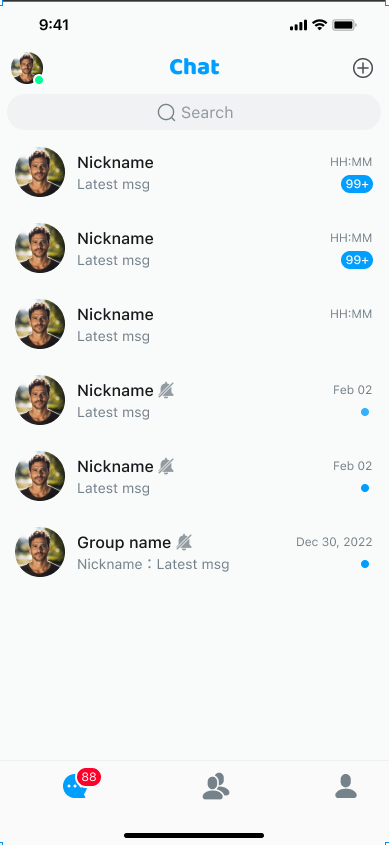
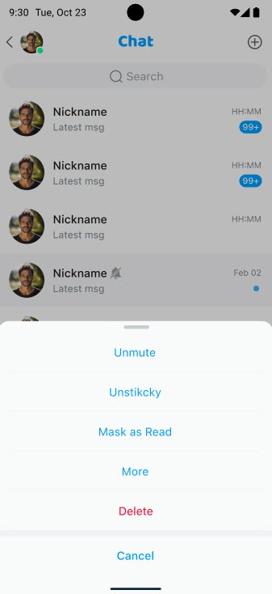

# Conversation list

`EaseConversationListFragment` is used to display all conversations of the current user, including one-to-one chats and group chats. It provides conversation search, deletion, pinning, and do not disturb functions, specifically:

- Click **Search** to go to the search page and search for conversations.
- Click a conversation list item to jump to the conversation details page.
- Click the expand button in the title bar and select **New conversation** to start a conversation.
- Long-press a conversation in the list to display the menu, where you can delete the conversation, pin the conversation, or disable messages.

A single conversation displays the conversation name, the last message, the time of the last message, the pinned and muted status, and other information.

For one-to-one chats, the name displayed in the conversation is the nickname of the other user. If the other user has not set a nickname, then their user ID is displayed. The conversation avatar is the other user's avatar. If not set, then the default avatar is used.

For group chats, the conversation name is the name of the current group and the avatar is the default avatar.

For details about the features related to the conversation list, see [Product features](./overview/product-features.md).



## Usage examples

```kotlin
class ConversationListActivity: AppCompactActivity() {
    override fun onCreate(savedInstanceState: Bundle?) {
        super.onCreate(savedInstanceState)
        setContentView(R.layout.activity_conversation_list)

        EaseConversationListFragment.Builder()
                        .build()?.let { fragment ->
                            supportFragmentManager.beginTransaction()
                                .replace(R.id.fl_fragment, fragment).commit()
                        }
    }
}
```

## Customize the conversation list page

You can configure the title bar and the list items on the conversation list page.

### Customize settings through EaseConversationListFragment.Builder

The `EaseConversationListFragment.Builder` construction method is provided for custom settings. The currently provided settings are as follows:

```kotlin
EaseConversationListFragment.Builder()
    .useTitleBar(true)
    .setTitleBarTitle("title")
    .enableTitleBarPressBack(true)
    .setTitleBarBackPressListener(onBackPressListener)
    .useSearchBar(false)
    .setItemClickListener(onItemClickListener)
    .setOnItemLongClickListener(onItemLongClickListener)
    .setOnMenuItemClickListener(onMenuItemClickListener)
    .setConversationChangeListener(conversationChangeListener)
    .setEmptyLayout(R.layout.layout_conversation_empty)
    .setCustomAdapter(customAdapter)
    .setCustomFragment(myConversationListFragment)
    .build()
```

`EaseConversationListFragment#Builder` provides the following methods:

| Method | Description |
|:---:|:---:|
| `useTitleBar()` | Set whether to use the default title bar (`EaseTitleBar`). Set to `true` for yes, `false` (default) for no. |
| `setTitleBarTitle()` | Set the title of the title bar. |
| `enableTitleBarPressBack()` | Set whether to display the back button. Set to `true` for yes, `false` (default) for no. |
| `setTitleBarBackPressListener()` | Set the event listener for clicking the back button in the title bar. |
| `setItemClickListener()` | Set the click event listener. |
| `setOnItemLongClickListener()` | Set the long-press event listener. |
| `setOnMenuItemClickListener()` | Set the menu click event listener. |
| `setConversationChangeListener()` | Set the conversation change event listener. |
| `setEmptyLayout()` | Set a blank page for the conversation list. |
| `setCustomAdapter()` | Set a custom adapter. The default is `EaseConversationListAdapter`. |
| `setCustomFragment()` | Set a custom chat fragment. Inherit from `EaseConversationListFragment`. |

### Add a custom conversation layout

Inherit from `EaseConversationListAdapter` to implement your own `CustomConversationListAdapter` and then set it with `CustomConversationListAdapter`.

1. Create a custom adapter `CustomConversationListAdapter`, inherit from `EaseConversationListAdapter`, and override the `getViewHolder` and `getItemNotEmptyViewType` methods.

   ```kotlin
   class CustomConversationListAdapter : EaseConversationListAdapter() {
   override fun getItemNotEmptyViewType(position: Int): Int {
   // Set a custom itemViewType according to the message type
   // If you use the default itemViewType, return super.getItemNotEmptyViewType(position)
   return CUSTOM_YOUR_CONVERSATION_TYPE
   }
   
   override fun getViewHolder(parent: ViewGroup, viewType: Int): ViewHolder<EaseConversation> {
   // Return the corresponding ViewHolder according to the returned viewType
   // Return a custom ViewHolder or use the default super.getViewHolder(parent, viewType)
   return CUSTOM_YOUR_VIEW_HOLDER()
   }
   }
   ```
   
1. Add `CustomConversationListAdapter` to `EaseConversationListFragment#Builder`.

   ```kotlin
   builder.setCustomAdapter(customConversationListAdapter);
   ```
   
1. Customize by inheriting `EaseConversationListFragment`

   Create a custom `CustomConversationListFragment`, inherit from `EaseConversationListFragment`, and set it with `EaseConversationListFragment#Builder`.

    ```kotlin
    builder.setCustomFragment(customConversationListFragment);
    ```

### Configure the title bar

The title bars of the conversation list page, chat page, contact list page, group details page, and contact details page use `EaseTitleBar`. If the title bar does not meet your needs, you can customize it.

The title bar of the conversation list page contains three areas: Left, center, and right. This section describes how to configure these areas when using `EaseConversationListFragment`.

- Configure whether to enable the title bar:

    ```kotlin
    
    //Whether to use the default title bar (EaseTitleBar): true: Yes; (default) false: No.
    EaseConversationListFragment.Builder().useTitleBar()
        
    ```

- Configure the avatar on the left:
    
    ```kotlin
    //Use binding?.titleConversations to directly get EaseTitleBar
    
    binding?.titleConversations?.let { titlebar->
        // Get logoView
        titlebar.getLogoView()
        // Set the avatar
        titlebar.setLogo()
        // Get StatusView
        titlebar.getStatusView()
        // Set the user status
        titlebar.setLogoStatus()
        // Set the outer spacing of the user status
        titlebar.setLogoStatusMargin()
        // Set the user status icon size
        titlebar.setLogoStatusSize()
    }
        
    ```

- Configure the click event for the avatar and text area:

    ```kotlin
    // Logo icon click event
    binding?.titleConversations?.setLogoClickListener {}
    // Logo status text area click event
    binding?.titleConversations?.setTitleClickListener {}
        
    ```

- Configure the title:

    ```kotlin
    // Text settings
    EaseConversationListFragment.Builder().setTitleBarTitle("title")
    //Image settings
    binding?.titleConversations?.setTitleEndDrawable(R.drawable.conversation_title)   
    ```

- Configure the icon on the right.

   Generally, the right side will support setting multiple icons. Use the menu setting method to set it.

    `EaseConversationListFragment` has a default implementation of the `defaultMenu()` method. If the default menu does not meet your needs, you can replace it with your own menu and rewrite the `defaultMenu()` method.   

    ```kotlin
        // Add menu
        override fun defaultMenu() {
            // Customize the menu file to meet your needs
            binding?.titleConversations?.inflateMenu(R.menu.my_menu)
        }
    
        // Set the menu click event
        override fun setMenuItemClick(item: MenuItem): Boolean {
            when(item.itemId) {
                R.id.action_my_menu -> {
                    // todo: implement the logic processing after clicking the specified menu
                    return true
                }
                else -> return false
            }
        }
    
        // Support setting menu icon color through tint attribute
        setMenuIconTint(@ColorInt colorInt: Int)
        // Support setting menu text color
        setMenuTitleColor(@ColorInt colorInt: Int)
        // Support setting hide/show specified menu item
        setMenuIconVisible(id:Int,visible:Boolean)
    

- Configure the back button and the event listener:

    ```kotlin
    
    //Set whether to support displaying the back button: true: Yes; (default) false: No.   
    EaseConversationListFragment.Builder().enableTitleBarPressBack()
    //Set the listener for clicking the back button in the title bar.
    EaseConversationListFragment.Builder().setTitleBarBackPressListener() 
        
    ```

- Configure the background color of the title bar:
    
    ```kotlin
    
    binding?.titleConversations?.setBackgroundColor(ContextCompat.getColor(mContext,R.color.blue))
        
    ```

### Configure the search area

- Set whether to use the search function:

    ```kotlin
    
    // Whether to use the default search function (jump to EaseSearchActivity. The search page currently supports searching users, conversations, messages, and blacklisted users.
    // true: yes; (default) false: no.
    EaseConversationListFragment.Builder().useSearchBar(true)
    ```

- Configure custom search.

    If the default search does not meet user needs, you can modify the jump route through `setCustomActivityRoute` to jump to your own search page.
    
    ```kotlin
    EaseIM.setCustomActivityRoute(object : EaseCustomActivityRoute {
        override fun getActivityRoute(intent: Intent): Intent? {
            intent.component?.className?.let {
                 when(it) {
                    EaseSearchActivity::class.java.name -> {   
                        intent.setClass(context, MySearchActivity::class.java)    
                    }
                    else -> {
                        return intent
                    }
                 }
            }
        }
    })
    ```

### Configure the conversation list item

To configure the content of a conversation list item, get the `EaseConversationListLayout` object, which provides more detailed settings:

```kotlin
        binding?.listConversation?.let{
            it.setItemBackGround() //Set the background of the item.
            it.setItemHeight() //Set the height of the item.
            it.setAvatarDefaultSrc() //Set the default avatar of the entry.
            it.setAvatarSize() //Set the size of the entry avatar.
            it.setAvatarShapeType() //Set the style of the entry avatar, which is divided into three styles: default ImageView style, circular style and rectangular style.
            it.setAvatarRadius() //Set the corner radius of the entry avatar. This is valid when the style is set to rectangle.
            it.setAvatarBorderWidth() //Set the width of the entry avatar border.
            it.setAvatarBorderColor() //Set the color of the entry avatar border.
            it.setNameTextSize() //Set the text size of the session entry title.
            it.setNameTextColor() //Set the text color of the session entry title.
            it.setMessageTextSize() //Set the text size of the session entry content.
            it.setMessageTextColor() //Set the text color of the session entry content.
            it.setDateTextSize() //Set the text size of the session entry date.
            it.setDateTextColor() //Set the text color of the session entry date.
    
            it.setListAdapter() //Set a custom session list adapter.
            it.getListAdapter() //Get the session list adapter.
            it.addHeaderAdapter() //Add the adapter for the header layout of the session list.
            it.addFooterAdapter() //Add the adapter for the footer layout of the session list.
            it.addItemDecoration() //Add decorator for session list.
            it.removeItemDecoration() //Remove the decorator of the session list.
            it.addItemMenu() //Add a long press item.
            it.clearMenu() //Clear the long press menu item.
            it.findItemVisible() //Set whether the specified menu item is visible.   
        }
```

For details on setting the chat avatar and nickname, see [User-defined information](user-defined-information.md).

## Default functions implemented in EaseConversationListFragment

`EaseConversationListFragment` implements the conversation do not disturb mode, conversation pinning, marking a conversation read, and conversation deletion features by default.

### Do Not Disturb

Use the following methods provided in `EaseConversationListViewModel` to set the Do Not Disturb (DND) mode:

- `makeSilentForConversation`: Set a conversation to DND.
- `cancelSilentForConversation`: Cancel DND.

### Pin a conversation

Use the following methods provided in `EaseConversationListViewModel` to pin a conversation to the top:

- `pinConversation`: Pin a conversation.
- `unpinConversation`: Unpin the conversation.

### Mark a conversation read

Mark a conversation as read using the `makeConversionRead` method provided in `EaseConversationListViewModel`.

### Delete a conversation

Use the `deleteConversation` method provided in `EaseConversationListViewModel` to delete a conversation.



## Event listening

The following event listening is provided in `EaseConversationListFragment#Builder`:

```kotlin
EaseConversationListFragment.Builder()
    .setTitleBarBackPressListener()
    .setItemClickListener(onItemClickListener)
    .setOnItemLongClickListener(onItemLongClickListener)
    .setOnMenuItemClickListener(onMenuItemClickListener)
    .setConversationChangeListener(conversationChangeListener)
    .build()
```

| Method | Description |
|:---:|:---:|
| `setTitleBarBackPressListener()` | Set the click event listener for the back button in the title bar. |
| `setItemClickListener()` | Set the item click event listener. |
| `setOnItemLongClickListener()` | Set the item long-press event listener. |
| `setOnMenuItemClickListener()` | Set the item menu click event listener. |
| `setConversationChangeListener()` | Set the conversation change event listener. |