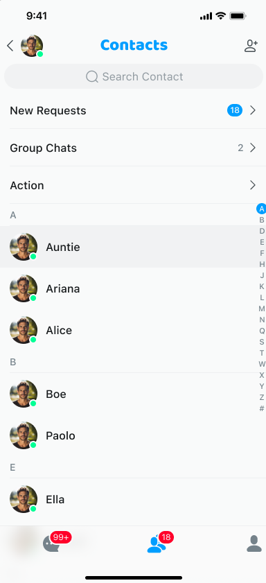
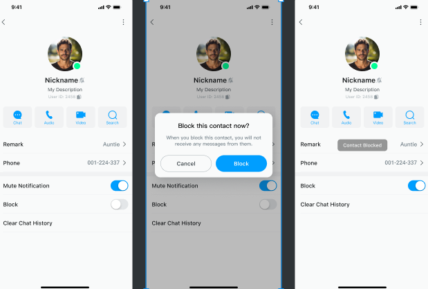
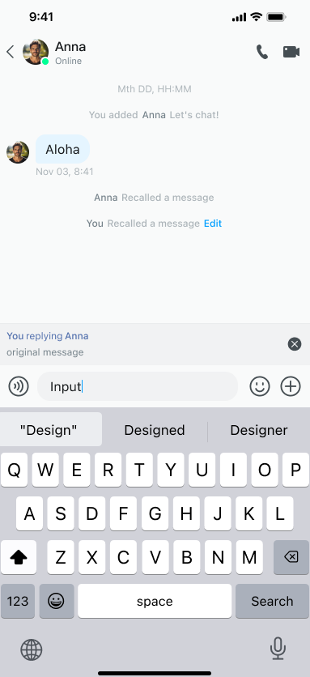

# Product features

This page introduces the common UIKit features for the one-to-one and group chat.

## General

This section covers general features related to conversations, group chats, one-to-one chats, and contacts. 

### Conversation list

The conversation list presents all ongoing conversations of the logged-in user, helping them quickly find the one 
they need.


### Message chat

The message chat allows users to communicate with each other in real time. This is usually carried out in the form of a 
one-to-one or group chat.


### Start a conversation

A user initiates communication with one or more users by starting a conversation.


### Create a group chat

A group chat is a conversation that allows multiple users to join. Users can invite other users to join the group and 
manage it.


### Manage a group chat

Group chat administrators have all permissions to the group, which includes adding or deleting members, 
modifying the group name, description, and avatar, banning or deleting group members, and others.


### User list

The user list displays the logged-in user's contacts, group members, blacklist, and so on.



### File sharing

File sharing allows users to exchange documents, pictures, videos, and other files through an instant messaging 
application.


### Unread messages

Unread messages are messages that the logged-in user has received but hasn't yet viewed.


### Message sent receipt

A sent receipt informs the sender whether the message has been sent successfully to the server or 
recipient.


### Message read receipt

A read receipt informs the sender that the receiver has read the message.


### Contact card

A contact card contains detailed information about a contact, usually including their profile picture and nickname. 
Users can quickly add a contact or start a conversation through the contact card.



### Voice message

Users can send and receive voice messages in addition to text ones. 


### Message reporting

Messages sent by users are examined to determine whether they comply with the platform's 
community guidelines, terms of service, and relevant laws and regulations.


### Local search

Users can search contacts (with or without a selection box), conversations, message history, and blacklists, with support for keyword matching. 


UIKit provides an encapsulated `EaseSearchActivity` search page. After the user enters keywords, the search data is searched according to `EaseSearchType` and the search results are displayed.

Jump to the `EaseSearchActivity` page and enter the required parameters according to the type of search you need. UIKit will match the keywords and display the search results according to `EaseSearchType`: `USER`, `SELECT_USER`, `CONVERSATION`, `MESSAGE`, and `BLOCK_USER`.

For example, the sample code for searching the blacklist is as follows:

```kotlin
private val returnSearchClickResult: ActivityResultLauncher<Intent> = registerForActivityResult(
        ActivityResultContracts.StartActivityForResult()
    ) { result -> onClickResult(result) }
    returnSearchClickResult.launch(
        ChatSearchActivity.createIntent(
            context = mContext,
            searchType = ChatSearchType.BLOCK_USER
        )
    )
    private fun onClickResult(result: ActivityResult) {
        if (result.resultCode == Activity.RESULT_OK) {
            result.data?.getSerializableExtra("user")?.let {
                if (it is ChatUser) {
                    // Search result
                }
            }
        }
    }
```

UIKit also provides a search base class `EaseBaseSearchFragment`, which you can inherit and extend for a different implementation. Use the `initAdapter()implement` method in `EaseBaseSearchFragment` to implement your own adapters for data processing and display.

## Conversation-related 

This section covers specific features related to managing conversations. 


### Conversation marked as read

Shows whether the user has read a conversation with unread messages. The user can long-press a conversation to open a context menu and mark the conversation as read.

### Pin a conversation (sticky conversation)

The user can long-press a conversation to open a context menu and pin it to the top for easy access.

### Do not disturb

The user can long-press a conversation to open a context menu and turn on the DND mode. 

### Delete a conversation

The user can long-press a conversation to open a context menu and delete the conversation.

## Message-related

This section covers specific features related to managing messages.

### Copy a message

Users can copy a message to the clipboard to save it somewhere else or paste it into other applications.


### Delete a message

Users can delete messages that they do not want to keep.


### Recall a message

Users can recall messages that have been sent by mistake.


### Edit a sent message

Users can edit sent messages to correct mistakes. 


### Quote a message

Users can quote a specific message to reply to it or emphasize its importance. 



The message quoting UI and logic structure are as follows:

- `EaseChatMessageReplyView`: The custom view for the quoted message.
- `EaseChatExtendMessageReplyView`: The custom view for the quoted message displayed above the bottom input box 
  component.
- `EaseChatMessageReplyController`: The controls for the display, hiding, scrolling, and other logic of the quoting feature.

The quoting feature is enabled by default in `EaseChatConfig`, that is, the default value of `enableReplyMessage` 
is `true`. To disable this feature, set it to `false`.

The sample code is as follows:

```kotlin
EaseIM.getConfig()?.chatConfig?.enableReplyMessage
```

### Translate a message

Users can translate messages into other languages for easier communication. The UI and logic structure are as follows:

- The UI layout of message translation is a custom `EaseChatMessageTranslationView` layout.
- The logic for adding views to the message bubble and showing and hiding the translation layout is in the 
  `addTranslationViewToMessage` method in `EaseChatAddExtendFunctionViewController`.
- The logic for showing and hiding the translation menu that pops up when long-pressing a message bubble is in 
  `EaseChatMessageTranslationController`.

1. Enable message translation

  The message translation feature is disabled by default, that is, the default value of 
     `enableTranslationMessage` in 
  `EaseChatConfig` is `false`. To enable this feature, set is to `true`. The sample code is as follows:
  
  ```kotlin
  EaseIM.getConfig()?.chatConfig?.enableTranslationMessage
  ```

1. Set the target language

  The `EaseChatFragment.Builder` object provides the `setTargetTranslation` method. If the target language is not set, 
  English is used by default. For more translation target languages, refer to [Translation Language Support](https://learn.microsoft.com/zh-cn/azure/ai-services/translator/language-support).
  
  The sample code is as follows: 

  ```kotlin
  val builder = EaseChatFragment.Builder
  builder.setTargetTranslation(ChatTranslationLanguageType.English)
  ```

### Reply with emoji

Users can long-press a single message to open the context menu and reply with an emoji. Emoji replies 
(reactions) can help express emotions or attitudes, conduct surveys or votes. 


The structure of the reaction UI and logic is as follows:

- `EaseChatMessageReactionView` implements a custom reaction layout in the message list. 
- `EaseMessageMenuReactionView` implements a custom layout in the message long-press menu `RecyclerView`.
- The reaction popup window `EaseChatReactionsDialog` is inherited from `EaseBaseSheetFragmentDialog`.
- Reaction member list is `EaseReactionUserListFragment`.

The logic for adding views to message bubbles and showing and hiding React layouts is in the 
`addReactionViewToMessage` method in `EaseChatAddExtendFunctionViewController`.

The emoji reply feature is disabled by default. That is, the default value of `enableMessageReaction` in `EaseChatConfig` is `false`. To enable this feature, set it to `true`. The sample code is as follows:

```kotlin
EaseIM.getConfig()?.chatConfig?.enableMessageReaction
```

### Message thread

Users can create a message thread based on a message in a group chat, to have a topic-specific discussion.

The thread page is implemented in `EaseChatThreadActivity`. Call `EaseChatThreadActivity.actionStart` and pass in the required parameters.

The message thread feature is disabled by default. That is, the default value of `enableChatThreadMessage` in 
`EaseChatConfig` is `false`. To enable this feature, set it to `true`. The sample code is as follows:

```kotlin
EaseIM.getConfig()?.chatConfig?.enableChatThreadMessage
```

You can add your own logic by inheriting `EaseChatThreadActivity`. For example:

```kotlin
class ChatThreadActivity:EaseChatThreadActivity() {
    override fun setChildSettings(builder: EaseChatFragment.Builder) {
        super.setChildSettings(builder)
    }
}
```

### Forward a message

Users can forward a single or multiple combined messages to other users. 

The UI and logic structure are as follows:

- `Forward EaseChatMultipleSelectMenuView`: The bottom menu view.
- `Forward EaseChatMessageMultipleSelectController`: Handles the UI layout changes (hiding/showing `EaseChatInputMenu` in `EaseChatLayout`) and logic for forwarding and deleting.
- `Forward EaseChatMessageMultiSelectHelper`: The message selection helper class used to record the selected message information and provide acquisition methods.

The message forwarding feature is enabled by default. That is, the default value of `enableSendCombineMessage` in
`EaseChatConfig` is `true`. To disable, set it to `false`. The sample code is as follows:

```kotlin
EaseIM.getConfig()?.chatConfig?.enableSendCombineMessage
```

### Pin a message

Users can pin important messages to the top of a conversation. This feature is particularly useful for handling urgent matters or ongoing projects, helping to efficiently manage important matters.

The UI and logic structure are as follows:

- `EaseChatPinMessageListViewGroup`: A custom View for the message pinning area.
- `EaseChatPinMessageController`: Controls the display, hiding, scrolling, and other logic of the pinned message.
- `EaseChatPinMessageListAdapter`: The message pinned list adapter.
- `EaseChatPinDefaultViewHolder`: The default display style of pinned messages.
- `EaseChatPinTextMessageViewHolder`: The text type display style of the pinned message.
- `EaseChatPinImageMessageViewHolder`: The display style of the pinned message image type.

The message pinning feature is enabled by default. That is, the default value of `enableChatPingMessage` in
`EaseChatConfig` is `true`. To disable this feature, set it to `false`. The sample code is as follows:

```kotlin
EaseIM.getConfig()?.chatConfig?.enableChatPingMessage

// Define the controller of the pin message
val chatPinMessageController:EaseChatPinMessageController by lazy {
  EaseChatPinMessageController(mContext,this@EaseChatLayout, conversationId, viewModel)
}
// Initialize the controller that contains pin list entries and built-in click event listening callbacks
// When the original message exists, the list scrolls to the original message position by default
chatPinMessageController.initPinInfoView()
// Display pin message list
// Get the pin message data from the server
chatPinMessageController.fetchPinnedMessagesFromServer()
// After successful acquisition, call the setData method to set the data source for the controller value: MutableList<ChatMessage>?
override fun onFetchPinMessageFromServerSuccess(value: MutableList<ChatMessage>?) {
  if (value.isNullOrEmpty()){
    chatPinMessageController.hidePinInfoView()
  }else{
    chatPinMessageController.setData(value)
  }
}
// Actively operate pin messages
// Setting isPinned to true pins the message to the top, setting to false cancels the pin
chatPinMessageController.pinMessage(message,true)

// Update the pinned message
// Add the message listening callback
private val chatMessageListener = object : EaseMessageListener() {
  // Pinned message change callback
  override fun onMessagePinChanged(
          messageId: String?,
          conversationId: String?,
          pinOperation: ChatMessagePinOperation?,
          pinInfo: ChatMessagePinInfo?
  ) {
    // Get the local message object based on messageId. If there is no local message object, get it from the server
    val message = ChatClient.getInstance().chatManager().getMessage(messageId)
    message?.let{
      // Update the pinned message list 
      // pinInfo?.operatorId() manages the ID of the pinned message
      chatPinMessageController.updatePinMessage(it,pinInfo?.operatorId())
    }?:kotlin.run{
      chatPinMessageController.fetchPinnedMessagesFromServer()
    }
  }
}

EaseIM.addChatMessageListener(chatMessageListener)

// Show pin view
chatPinMessageController.showPinInfoView()
// Hide pin view
chatPinMessageController.hidePinInfoView()
```

### Input status indication

The input status indicator helps users understand whether the other party is replying in real time.


The UI and logic structure of the input status indication are as follows:

- The `subtitle` control in `EaseChatNavigationBar` displays the user's status and the input status. If received, the input status is displayed first. If you disable the input status indication, only the user's status will be displayed.

- The input-status-related callbacks and methods are as follows:

  - The input status is delivered as a transparent message. After receiving the transparent message, the input status of the other party is monitored through the `setOnPeerTypingListener` method provided in `EaseChatFragment.Builder`.
  - The input status callback is `onPeerTyping(action: String?)`, where `action` represents the `EaseChatLayout.ACTION_TYPING_BEGI| EaseChatLayout.ACTION_TYPING_END` state .

The input status indication feature is enabled by default in `EaseIM.getConfig()?.chatConfig?.enableChatTyping`. That is, the default value of `enableChatTyping` is `true`. To disable, set this parameter to `false`.

This feature can also be set via the `builder.turnOnTypingMonitor(true|false)` API provided in `EaseChatFragment.Builder`, which has a higher priority.

The sample code is as follows:

```kotlin
EaseIM.getConfig()?.chatConfig?.enableChatTyping = true
```