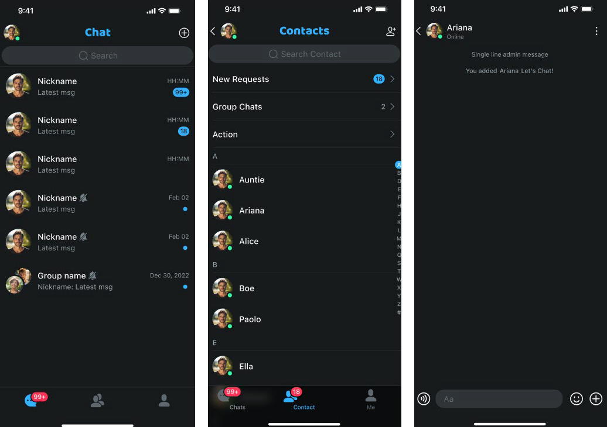

# Theme

UIKit has built-in light (default) and dark themes. 

- Light theme

  

- Dark theme

  


## Switch to a built-in theme

To switch from the current theme to the built-in light or dark theme, use the following method:

```dart
ChatUIKitTheme.instance.setColor(ChatUIKitColor.light());
```


## Switch to a custom theme

When customizing a theme, refer to the theme colors in the design guide to define the hue values of the following five theme colors.

All colors in UIKit are defined using the HSLA color model, which is a way of representing a color using hue, saturation, brightness, and alpha.

- H (Hue): The basic attribute of color, ranging from `0` to `360` on the color wheel. `0` is red, `120` is green, and `240` is blue.

- S (Saturation): The intensity or purity of a color. The higher the saturation, the more vivid the color; the lower the saturation, the closer the color is to gray. Saturation is expressed as a percentage value ranging from `0%` to `100%`. `0%` represents grayscale and `100%` represents a full color.

- L (Lightness): Lightness is the brightness or darkness of a color. The higher the lightness, the lighter the color; the lower the lightness, the darker the color. Lightness is expressed as a percentage value ranging from `0%` to `100%`. `0%` represents black and `100%` represents white.

- A (Alpha): Alpha is the transparency of the color. A value of `0` means completely opaque and `1` means completely transparent.

By adjusting the hue value of the HSLA model, you can achieve precise color control.

```dart
ChatUIKitTheme.instance.setColor(ChatUIKitColor.light(
  primaryHue: 200,
  secondaryHue: 200,
  neutralHue: 200,
  neutralSpecialHue: 200,
));
```

