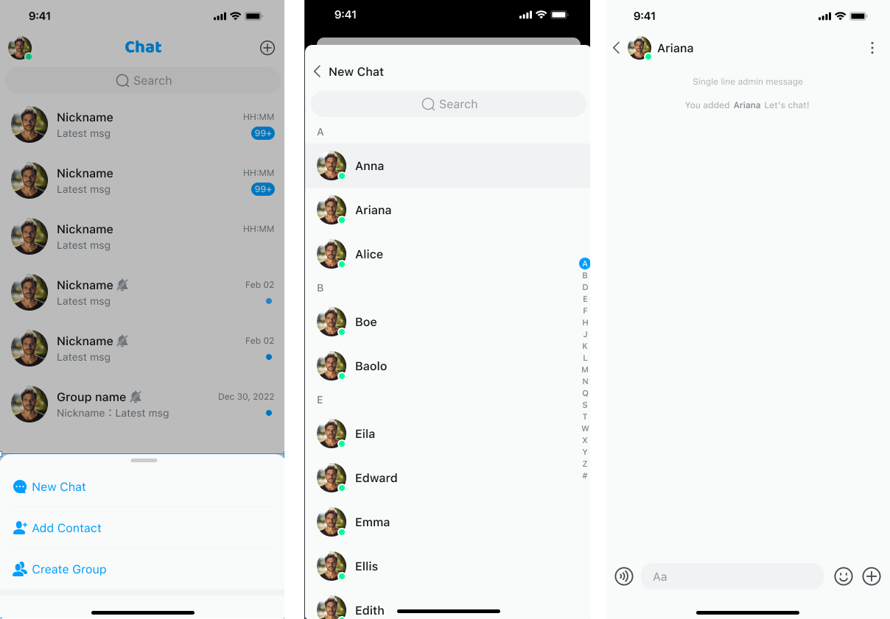
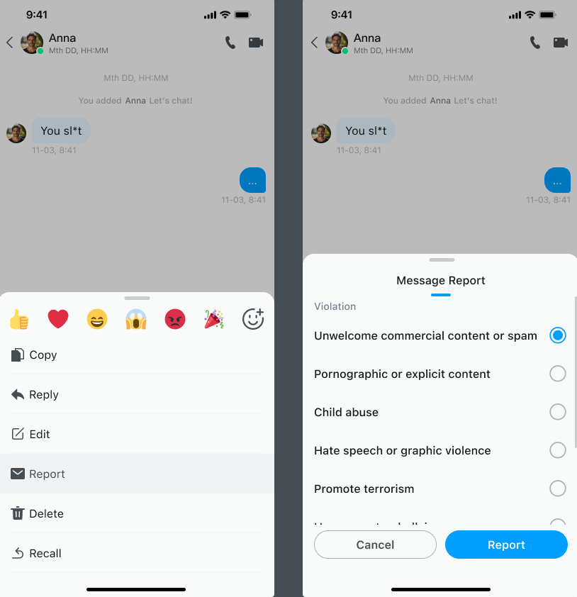

# Product features

This page introduces the common UIKit features for the one-to-one and group chat.

## General

This section covers general features related to conversations, group chats, one-to-one chats, and contacts. 

### Conversation list

The conversation list presents all ongoing conversations of the logged-in user, helping them quickly find the one 
they need.


### Message chat

Message chat allows users to communicate with each other in real time. This is usually carried out in the form of a 
one-to-one conversation or a group chat.


### Start a conversation

A user initiates communication with one or more users by starting a conversation.



### Create a group chat

A group chat is a conversation that allows multiple users to join. Users can invite other users to join the group and 
manage it.


### Manage a group chat

Group chat administrators have all permissions to the group, which includes adding or deleting members, 
modifying the group name, description, and avatar, banning or deleting group members, and others.


### User list

The user list displays the logged-in user's contacts, group members, blacklist, and so on.


### File sharing

File sharing allows users to exchange documents, pictures, videos, and other files through an instant messaging 
application.


### Unread messages

Unread messages are messages that the logged-in user has received but hasn't yet viewed.


### Sent receipt

A sent receipt informs the sender whether the message has been sent successfully to the server or 
recipient.


### Message read receipt

A read receipt informs the sender that the receiver has read the message.


### Contact card

A contact card contains detailed information about a contact, usually including their avatar and nickname. 
Users can quickly add a contact or start a conversation through the contact card.


### Voice message

Users can send and receive voice messages in addition to text ones. 


### Message reporting

Messages sent by users are examined to determine whether they comply with the platform's 
community guidelines, terms of service, and relevant laws and regulations.



### Local message search

The local message search feature allows users to quickly search for messages within a conversation, supporting keyword matching. This helps users efficiently find the information they need, improving work efficiency and the convenience of information management.


On the message search page, enter keywords to search for messages in the current conversation. If there are any results, they will be returned in the form of a list. Click the search result to jump to the location of the message.

### Group mention

The group mention feature allows users to directly mention specific members in a group chat using the `@` symbol, and the mentioned members will receive a special notification. This feature facilitates the efficient delivery of important information and ensures that key messages receive timely attention and response.

## Conversation-related 

This section covers specific features related to managing conversations. 


### Conversation marked as read

Shows whether the user has read a conversation with unread messages. The user can swipe a conversation left/right or
long-press it to open a context menu and mark the conversation as read.

### Pin a conversation (sticky conversation)

The user can swipe an important conversation left/right or long-press it to open a context menu and pin it to the 
top for easy access.

### Do not disturb

The user can swipe a conversation left/right or long-press it to open a context menu and turn on the DND 
mode. 

### Delete a conversation

The user can swipe a conversation left/right or long-press it to open a context menu and delete the conversation.

## Message-related

This section covers specific features related to managing messages.

### Copy a message

Users can copy a message to the clipboard to save it somewhere else or paste it into other applications.


### Delete a message

Users can delete messages that they do not want to keep.


### Recall a message

Users can recall messages that were sent by mistake. 


The message recall feature is enabled by default, that is, the default value of `ChatUIKitSettings.enableMessageRecall` is `true`. To disable, set this parameter to `false`. 

The sample code is as follows:

```dart
ChatUIKitSettings.enableMessageRecall = false;
```

You can also configure the duration of showing the recall option. The default is 120 seconds. Upon expiration, the option will no longer be available after long-pressing a message.

```dart
ChatUIKitSettings.recallExpandTime = 120;
```

### Edit a sent message

Users can edit sent messages to correct mistakes. 


The message editing feature is enabled by default, that is, the default value of `ChatUIKitSettings.enableMessageEdit` is `true`. To disable, set this parameter to `false`. The sample code is as follows:

```dart
ChatUIKitSettings.enableMessageEdit = false;
```

### Quote a message

Users can quote a specific message to reply to it or emphasize its importance. 


The message quoting UI and logic structure are as follows:

- `ChatUIKitQuoteWidget`: A custom View for the quoted message of the message bubble.
- `ChatUIKitReplyBar`: A custom View for the quoted message displayed above the bottom input box.

The quoting feature is enabled by default, that is, the default value of `ChatUIKitSettings.enableMessageReply` 
is `true`. To disable this feature, set it to `false`.

The sample code is as follows:

```dart
ChatUIKitSettings.enableMessageReply = false;
```

### Translate a message

Users can translate messages into other languages for easier communication. 

The UI layout of message translation is in `ChatUIKitTextMessageWidget`.

1. Enable message translation

  `ChatUIKitSettings` provides a `ChatUIKitSettings.enableMessageTranslation` setting to enable message translation. The message translation feature is disabled by default. To enable this feature, set it to `true`. The sample code is as follows:
  
  ```dart
  ChatUIKitSettings.enableMessageTranslation = true;
  ```

1. Set the target language

  `ChatUIKitSettings` provides a `translateTargetLanguage` property to set the target translation language. If the target language is not set, English is used by default. For more translation target languages, refer to [Translation Language Support](https://learn.microsoft.com/zh-cn/azure/ai-services/translator/language-support).
  
  The sample code is as follows: 

  ```dart
  ChatUIKitSettings.translateTargetLanguage = 'zh-Hans';
  ```

### Reply with emoji

Users can long-press a single message to open the context menu and reply with an emoji. Emoji replies 
(reactions) can help express emotions or attitudes, conduct surveys or votes. 


The structure of the reaction UI and logic is as follows:

- `ChatUIKitMessageReactionsRow` implements a custom UI layout in the message list. 
- `ChatUIKitMessageReactionInfo` shows a pop-up window with the emoji list.

`ChatUIKitSettings` provides an `enableMessageReaction` property to enable reactions. This feature is disabled by default. To enable, set it to `true`. The sample code is as follows:

```dart
ChatUIKitSettings.enableMessageReaction = true;
```

### Message thread

Users can create a message thread based on a message in a group chat, to have a topic-specific discussion.

UIKit provides a `ChatUIKitSettings.enableChatThreadMessage` switch. The message thread feature is disabled by default. To enable this feature, set it to `true`. The sample code is as follows:

```dart
ChatUIKitSettings.enableMessageThread = true;
```

### Forward multiple messages

Users can forward multiple combined messages to other users. 

`ForwardMessageSelectView` is the page to select the recipients of the forwarded messages. The message forwarding feature is switched on and off in `ChatUIKitSettings.enableMessageMultiSelect`, with the default value of `true`. To disable, set this parameter to `false`.

The sample code is as follows:

```dart
ChatUIKitSettings.enableMessageMultiSelect = true;
```

### Forward a single message

Users can forward a single message to other users. 

`ForwardMessageSelectView` is the page to select the recipients of the forwarded messages. The message forwarding feature is switched on and off in `ChatUIKitSettings.enableMessageForward`, with the default value of `true`. To disable, set this parameter to `false`.

The sample code is as follows:

```dart
ChatUIKitSettings.enableMessageForward = false;
```

### Pin a message

Users can pin important messages to the top of a conversation. This feature is particularly useful for handling urgent matters or ongoing projects, helping to efficiently manage important matters.

The message pinning feature is enabled by default. That is, the default value of `ChatUIKitSettings.enablePinMsg` is `true`. To disable this feature, set it to `false`. The sample code is as follows:

```dart
ChatUIKitSettings.enablePinMsg = false;
```

### Input status indication

The input status indicator helps users understand whether the other party is replying in real time.


This feature is implemented using the SDK's transparent message transmission. 

The input status indication feature is enabled by default, that is, the default value of `ChatUIKitSettings.enableTypingIndicator` is `true`. To disable this feature, set this parameter to `false`.

The sample code is as follows:

```dart
ChatUIKitSettings.enableTypingIndicator = false;
```
