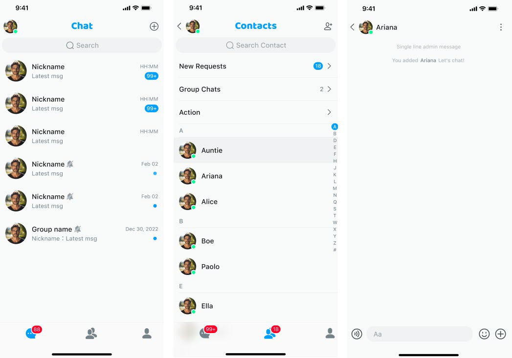
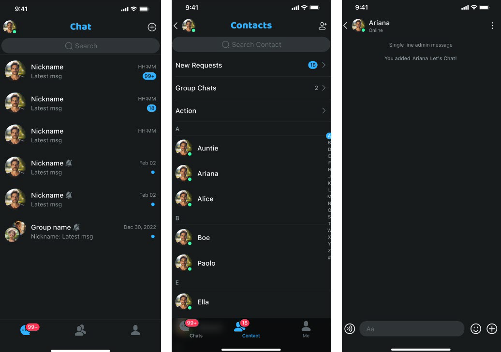

UIKit has built-in light (default) and dark themes. 

- Light theme

  

- Dark theme

  

## Switch to a built-in theme

To switch from the current theme to the other built-in light or dark theme, use the `switchTheme` method. Call it before initializing the UIKit view:

```swift
Theme.switchTheme(style: .dark)
```

```swift
Theme.switchTheme(style: .dark)
```

## Switch to a custom theme

When customizing a theme,  refer to the theme colors in the design guide to define the hue values of the five theme colors.

All colors in UIKit are defined using the HSLA color model, which is a way of representing color using hue, saturation, brightness, and alpha.

- H (Hue): The hue is the basic attribute of color, ranging from `0` to `360` on the color wheel. `0` is red, `120` is green, and `240` is blue.

- S (Saturation): The saturation is the intensity or purity of a color. The higher the saturation, the more vivid the color; the lower the saturation, the closer the color is to gray. The saturation is expressed as a percentage value ranging from `0%` to `100%`. `0%` represents grayscale and `100%` represents a full color.

- L (Lightness): The lightness is the brightness or darkness of a color. The higher the lightness, the lighter the color; the lower the lightness, the darker the color. The lightness is expressed as a percentage value ranging from `0%` to `100%`. `0%` represents black and `100%` represents white.

- A (Alpha): The alpha is the transparency of a color. A value of `0` means completely opaque and `1` means completely transparent.

By adjusting the hue value of the HSLA model, you can achieve precise color control:

```swift
Appearance.primaryHue = 191/360.0
Appearance.secondaryHue = 210/360.0
Appearance.errorHue = 189/360.0
Appearance.neutralHue = 191/360.0
Appearance.neutralSpecialHue = 199/360.0
Theme.switchTheme(style: .custom)
```

## Switch the theme of other views in the app except UIKit

If you want the other parts of the app to use the same theme as UIKit, take the following steps:

1. Register your view in the `Theme` class.

    ```swift
    Theme.registerSwitchThemeViews(view: self)
    ```
   
1. Implement `ThemeSwitchProtocol` in the above view.

    ```swift
    extension YourView: ThemeSwitchProtocol {

    }
    ```
   
1. In the `switchTheme` method, set the corresponding color for your subview according to the theme type (light, dark, or custom).