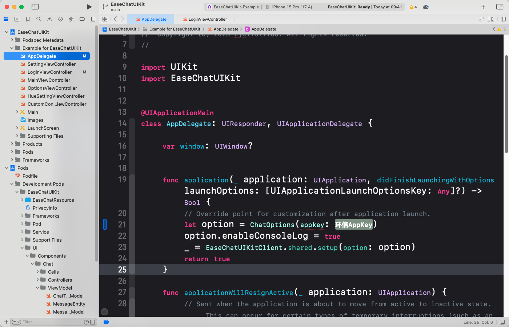

Agora provides an open source sample project that demonstrates how to quickly build a chat page with UIKit. This page explains how to compile and run it. 

## Prerequisites

Before you start, make sure your development environment meets the following conditions:

- Xcode 15.0 or above;
- iOS 13.0 or above;
- A project signed with a developer signature;
- A valid Agora project with users and tokens generated. See [Enable and configure Chat](https://docs.agora.io/en/agora-chat/get-started/enable) and [Secure authentication with tokens](https://docs.agora.io/en/agora-chat/develop/authentication) for details. 

## Implementation

Take the following steps to download and run the sample project:

1. Download the sample code from [GitHub](https://github.com/easemob/easemob-uikit-ios).

1. Run the `pod` command:

   1. Click to open the `chatuikit-ios` folder.

   1. Drag the `Example` folder to the terminal.

   1. Enter the following command in the terminal and click **Enter**:

    ```
    pod install --repo-update
    ```
1. Compile the project

   1. Open the `.xcworkspace` file in Xcode.

   1. Press `cmd+B` on the keyboard to compile. The compilation will result in an error.

        

   1. Fill in the `appKey` field with your app key and re-compile the project.

   1. Log in with the created user ID and token. 

        

1. Test the project

Double-click the `.xcworkspace` file to open the project, and press `cmd+R` on the keyboard to run the project. UIKit supports the x86_64 architecture simulator, but not the M1 simulator, because it uses a static library of FFmpeg that converts audio files into the AMR format.

## Precautions

The sample project is only used to quickly run through the process and experience all the functions of single-group chat UIKit.