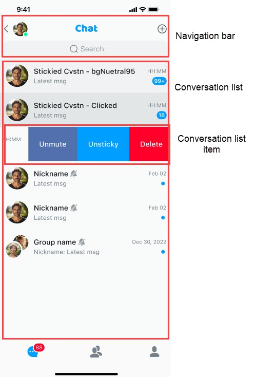

# Customize the conversation list

The conversation list page is used to display all conversations of the current user, including one-to-one chats and group chats. It provides conversation search, deletion, pinning, and do not disturb features:

- Click **Search** to jump to the search page and search for conversations.
- Click a conversation list cell to jump to the conversation details page.
- Click the expand button in the navigation bar and select **New Conversation** to create a new conversation.
- Swipe left, swipe right, or long-press a conversation to trigger the conversation extended function menu, where you can delete the conversation, pin the conversation, or turn on the do not disturb mode.

A single conversation displays the conversation name, the last message, the time of the last message, the pinned and muted status, and others.

- For one-on-one chats, the name displayed in the conversation is the nickname of the other user. If the other user has not set a nickname, the other user's ID is displayed. The conversation avatar is the other user's avatar. If not set, the default avatar is used.
- For group chats, the conversation name is the name of the current group and the avatar is the default avatar.

For details about the conversation list features, see [Product features](../overview/product-features.md).

You can configure the navigation bar and conversation list cells on the conversation list page. See [ ConversationListController.swift](https://github.com/AgoraIO-Usecase/AgoraChat-UIKit-ios/blob/SwiftUIKit/Sources/EaseChatUIKit/Classes/UI/Components/Conversation/Controllers/ConversationListController.swift) for details.



## Customize the header navigation bar 

The navigation bars of the conversation list page, chat page, contact list page, group details page, and contact details page use `ChatNavigationBar`. If the navigation bar does not meet your needs, you can customize it by overriding the method and passing in the customized navigation class.

1. In the demo, inherit the `ChatNavigationBar` class in `ChatUIKit` to create your own page navigation bar. For example, `CustomConversationNavigationBar`.

1. Override the `createNavigation()` method and return the object you have created using `CustomConversationNavigationBar`. The sample code is as follows:

    ```swift
    override func createNavigationBar() -> ChatNavigationBar {
                CustomConversationNavigationBar(showLeftItem: false,rightImages: [UIImage(named: "add", in: .chatBundle, with: nil,hiddenAvatar: false)])
            }
    ```

The header navigation bar consists of three areas: left, center, and right. This section describes how to configure them.

### Set the navigation bar editing mode

Set `editMode` to `true` to hide the back button on the left and the three buttons on the right, but display the cancel button.

### Set the background color

Set the navigation background color with `self.navigation.backgroundColor = .red`. You can also modify the internal components in this way, but after switching the theme, it will switch to the default color of the theme.

### Set the avatar

Set the `hiddenAvatar` parameter to determine whether to display the avatar on the left side of the navigation bar. Modify the navigation avatar with `self.navigation.avatarURL = "https://xxx.xxx.xxx"`.

### Set the title

Set the navigation title with `self.navigation.title = "Chats".chat.localize` and the subtitle with `self.navigation.subtitle = "xxx"`. If both need to be modified, set the subtitle first in order to update the corresponding layout position in the navigation.

### Customize the button image

Set the `rightImages` parameters to customize the look of the button on the right. The order is `0`, `1`, and `2`.

### Customize the menu displayed when clicking the button at the top

Use `Appearance.conversation.listMoreActions = value` to customize the menu displayed by clicking the **+** button at the top right. You can add or delete menu items. The sample code is as follows:

```swift
   //Add a new menu item
        Appearance.conversation.listMoreActions.append(ActionSheetItem(title: "new list item", type: .destructive, tag: "custom"))
        //Remove a menu item
        Appearance.conversation.listMoreActions.removeAll { $0. tag == "you want remove" }
```

### Set up click listener events

To set the click events in the navigation bar, override the `navigationClick` method in the conversation list page, and then perform the processing according to the corresponding click area. The sample code is as follows:

```swift
override func navigationClick(type: ChatNavigationBarClickEvent, indexPath: IndexPath?) {
               switch type {
               case .back: self.backAction()
               case .avatar: self.avatarAction()
               case .title: self.titleAction()
               case .subtitle: self.subtitleAction()
               case .rightItems: self.rightItemsAction(indexPath: indexPath)
               default:
                   break
               }
           }
```

## Customize the conversation list

To customize the conversation list `TableView`, override the `createList` method in the conversation list page and return the class object that you inherited from `ConversationList` class in `chat-uikit`. Find and take a closer look at the `ConversationList.swift` class to implement the business logic. The sample code is as follows:

```swift
override open func createList() -> ConversationList {
            CustomConversationList(frame: CGRect(x: 0, y: self.search.frame.maxY+5, width: self.view.frame.width, height: self.view.frame.height-NavigationHeight-BottomBarHeight-(self.tabBarController?.tabBar.frame.height ?? 49)), style: .plain)
        }
```

## Customize the conversation list cell

To customize the contents of the list cells, take the following steps:
 
1. Create a new custom class `CustomConversationCell` by inheriting the `ConversationCell` class in `chat-uikit` and set it up with the following code:

    ```swift
    ComponentsRegister.shared.ConversationCell = CustomConversationCell.self
    ```

1. In the `CustomConversationCell` class, override the corresponding method. If you need to reuse the existing logic and add new logic on this basis, override the method and call `super.xxx` in it. For example:

    ```swift
    override open func refresh(info: ConversationInfo) {
                       super.refresh(info:info)
                       // Continue with your new logic
                    }
    ```

    If you need to make changes to the previous logic, copy the code from the previous `refresh` method and make changes without calling `super.xxxx`. Initialization methods and some UI creation methods can be overridden.

### Set the row height of the conversation list cell

Use `Appearance.conversation.rowHeight = value` to set the row height of the conversation list.

### Set a chat avatar

1. Set the rounded corners of the chat avatar with `Appearance.avatarRadius = value`. There are four levels of avatar corner rounding: Very small, small, medium, and large. 

1. Set `Appearance.conversation.singlePlaceHolder = value` to display avatar placeholders for one-to-one and group chats.
   
### Set the left and right swipe menu items

Set left and right swipe menus for conversation list items with `Appearance.conversation.swipeLeftActions = value` and `Appearance.conversation.swipeRightActions = value`, respectively. 

By default, the left-swipe menu includes muting, pinning, and deleting conversations, and the right-swipe menu includes marking conversations as read and calling up more menus. As an enumeration array, it only supports deleting menu items, not adding them.

```swift
     //Remove
     Appearance.conversation.swipeLeftActions.removeAll { $0 == .more }
```

### Set more conversation actions

Use `Appearance.conversation.moreActions = value` to set the menu that appears after a user swipes right and clicks **...**. You can add or delete menu items. The sample code is as follows:

```swift
//Add menu item
Appearance.conversation.moreActions.append(ActionSheetItem(title: "new list item", type: .destructive, tag: "custom"))
//Delete menu item
Appearance.conversation.moreActions.removeAll { $0. tag == "you want remove" }
```

Get the click event of an item in the array:

```swift
        if let item = Appearance.conversation.listMoreActions.first(where: { $0.tag == "xxx" }) {
            item.actionClosure = { [weak self] item,object in
                //do something
            }
        }
        if let item = Appearance.conversation.listMoreActions.first(where: { $0.tag == "xxx" }) {
            item.actionClosure = { [weak self] item,object in
                //do something
            }
        }
```

### Set the conversation time

Set the conversation time using two parameters:

- `Appearance.conversation.dateFormatToday = value`: Set the conversation time for the day in the `HH:mm` format.
- `Appearance.conversation.dateFormatOtherDay = value`: Set the date other than today in the `MM:dd` format.

### Intercept the original component click event

You need to fully implement the business and UI refresh logic after interception. It is recommended that you register new events by inheriting the original ones.

The conversation list events are as follows:

- `swipeAction`: Slide event.
- `longPressed`: Long-press event.
- `didSelected`: Click event.

The following sample code is a conversation long-press event:

```swift
ComponentViewsActionHooker.shared.conversation.longPressed = { [weak self] indexPath,info in 
    //Process your business logic.
}
```

## Other settings

All other methods marked as **open** can be overridden to implement a custom business logic. For more configurable items, see [General configurable items](general_configurable_items.md). 

