This page introduces the common UIKit features for the one-to-one and group chat.

## General

This section covers general features related to conversations, group chats, one-to-one chats, and contacts. 

### Conversation list

The conversation list presents all ongoing conversations of the logged-in user, helping them quickly find the one 
they need.


### Message chat

Message chat allows users to communicate with each other in real time. This is usually carried out in the form of a 
one-to-one conversation or a group chat.

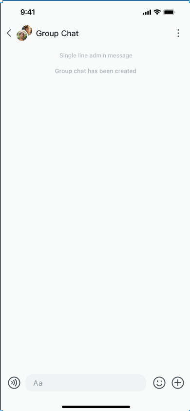

### Start a conversation

A user initiates communication with one or more users by starting a conversation.

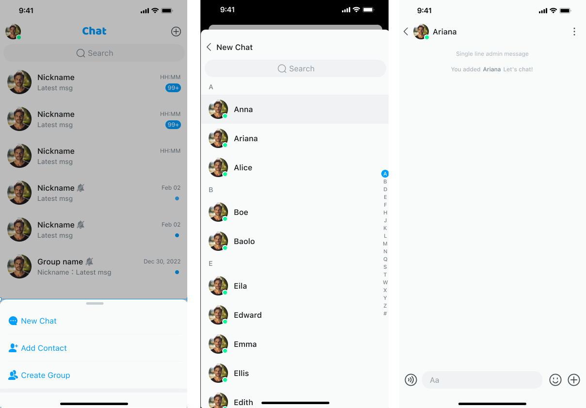

### Create a group chat

A group chat is a conversation that allows multiple users to join. Users can invite other users to join the group and 
manage it.

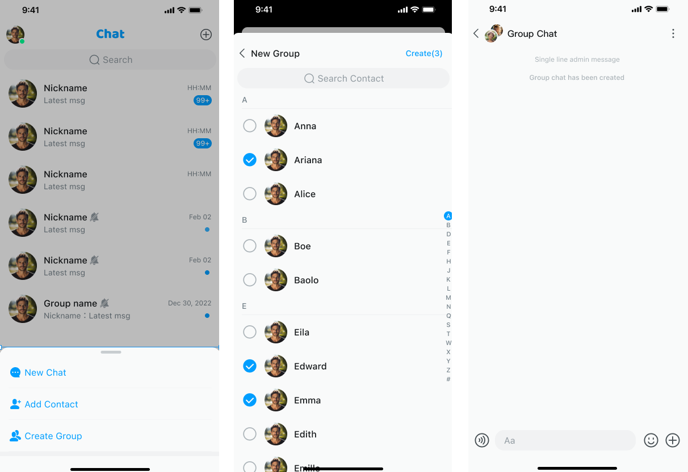

### Manage a group chat

Group chat administrators have all permissions to the group, which includes adding or deleting members, 
modifying the group name, description, and avatar, banning or deleting group members, and others.

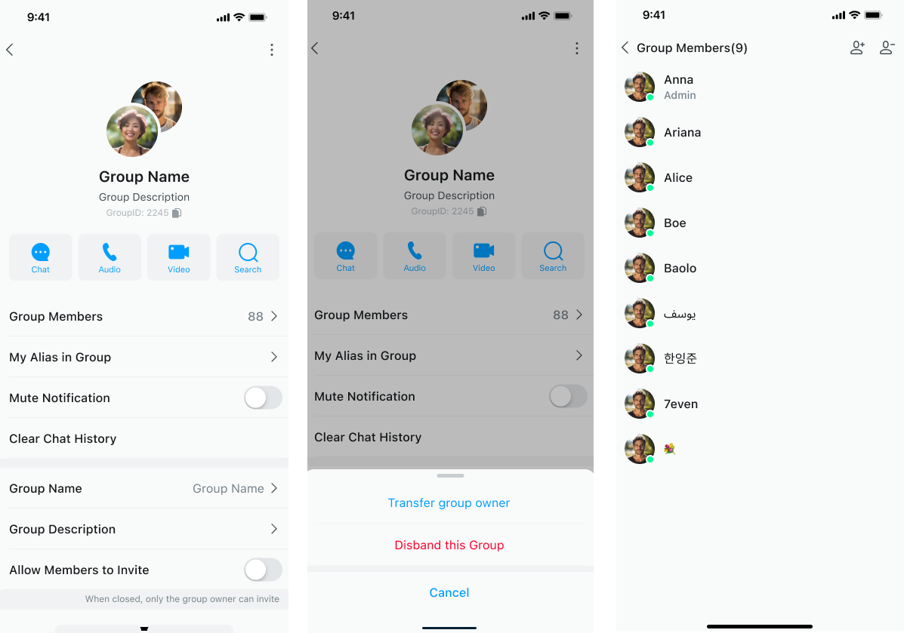

### User list

The user list displays the logged-in user's contacts, group members, blacklist, and so on.

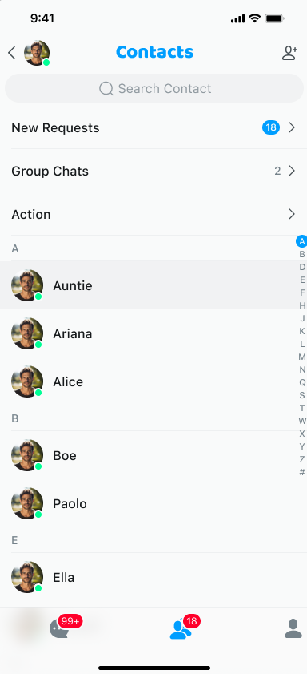

### File sharing

File sharing allows users to exchange documents, pictures, videos, and other files through an instant messaging 
application.

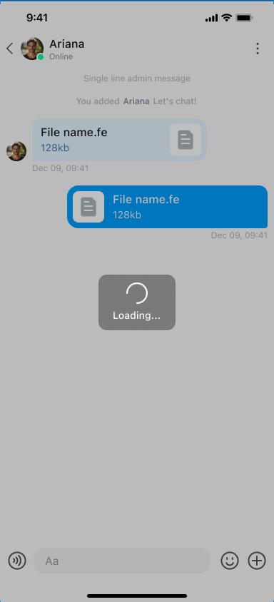

### Unread messages

Unread messages are messages that the logged-in user has received but hasn't yet viewed.

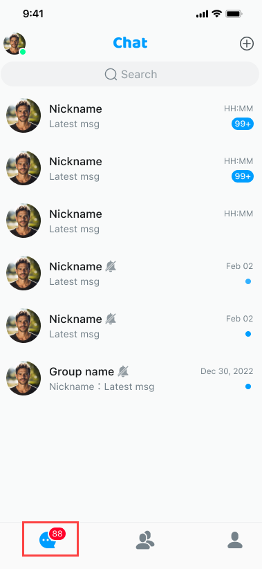

### Sent receipt

A sent receipt informs the sender whether the message has been sent successfully to the server or 
recipient.

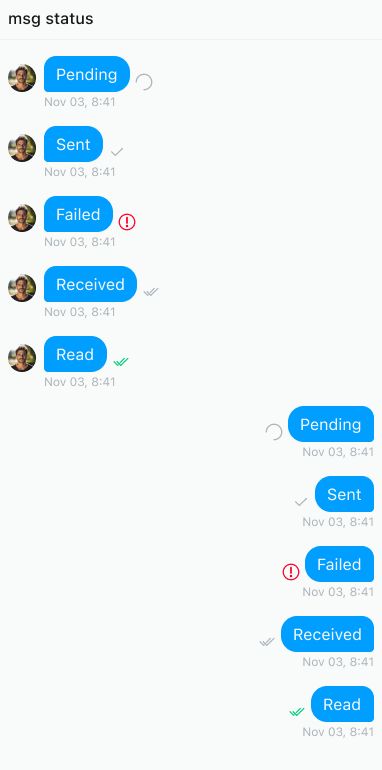

### Message read receipt

A read receipt informs the sender that the receiver has read the message.


### Contact card

A contact card contains detailed information about a contact, usually including their profile picture and nickname. 
Users can quickly add a contact or start a conversation through the contact card.

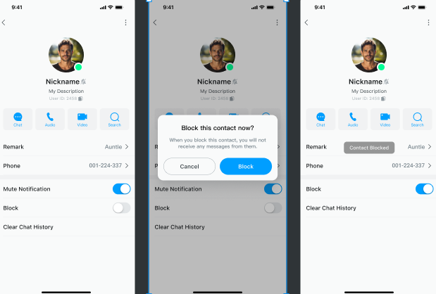

### Voice message

Users can send and receive voice messages in addition to text ones. 

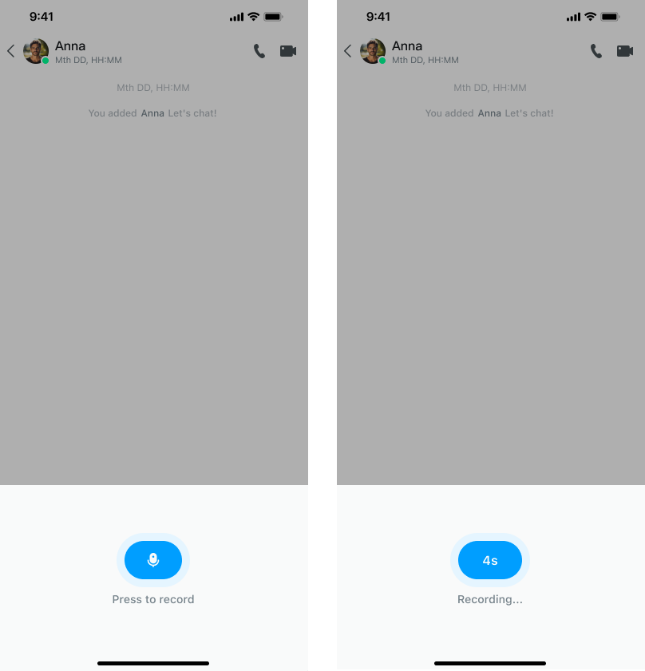

### Message reporting

Messages sent by users are examined to determine whether they comply with the platform's 
community guidelines, terms of service, and relevant laws and regulations.

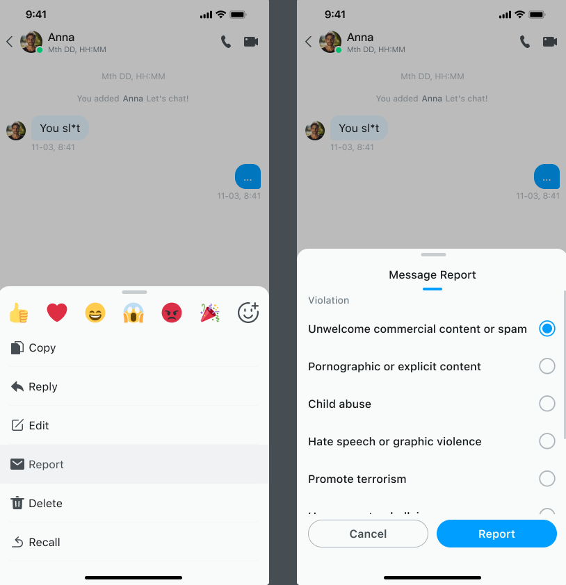

## Input status indication

The input status indicator helps users understand whether the other party is replying in real time.

The UI and logic structure of the input status indication are as follows:

- The `subtitle` control in `EaseChatNavigationBar` displays the user's status and input status indication. After receiving the input status, the input status will be displayed first. After the user cancels the input status, the user's status will be displayed and the input status will disappear.
- Input status-related callbacks and methods are as follows:
  - The input status is delivered as a transparent message. After receiving the transparent message, the input status is updated through the `MessageListViewModel#notifyTypingState()` callback.
  - The input state callback is `MessageListViewModel#onOtherPartyTypingText`.

The input status indication feature is enabled by default in `Appearance.chat.enableTyping`, that is, the default value of `Appearance.chat.enableTyping` is `true`. To disable, set this parameter to `false`.

The sample code is as follows:

```swift
    Appearance.chat.enableTyping = false

```

This feature is implemented using the SDK's transparent message transmission. Monitor the transparent message callback to process navigation-related effects.

## Local search

Users can search for messages within a conversation, with support for keyword matching.

The UI and logic of the local message search are as follows:

- `SearchHistoryMessagesViewController`: The search page. After the user enters a keyword, the keyword will be matched in the message history and the search results will be displayed.
- `SearchResultMessagesController`: The search results page.
- `SearchHistoryMessageCell`: The cell for searching the message history.

To implement local search, jump to the `SearchHistoryMessagesViewController` page. The input parameter is the conversation ID. After entering the keyword, it will be matched and the search results will be displayed.

The local message search feature is enabled by default in contact details and group details. `Appearance.contact.detailExtensionActionItems` contains `ContactListHeaderItem(featureIdentify: "SearchMessages", featureName: "SearchMessages".chat.localize, featureIcon: UIImage(named: "search_history_messages", in: .chatBundle, with: nil))`. If you don't need the search feature, delete this item.

The sample code is as follows:

```swift
    Appearance.contact.detailExtensionActionItems.removeAll { $0.featureIdentify == "SearchMessages" }

```

## Group mentions

Uses can directly mention specific members in a group chat using the @ symbol, and the mentioned members will receive a special notification. 

The UI and logic of the group mention feature are as follows: Enter the `@` character in `MessageInputBar` of `MessageListView` of  `MessageListController`. This will inform `ViewModel` and `Controller` that the user has entered the `@` character. After selecting the user with the `@` character, the name or nickname of that user will be displayed in the input box.

The group mention feature is enabled by default. To disable it, ignore the `MessageListController#onInputBoxEventsOccur` method. Override this method without handling the mention event.

The sample code is as follows:

```swift
    public func onInputBoxEventsOccur(action type: MessageInputBarActionType, attributeText: NSAttributedString?) {
        switch type {
        case .audio: self.audioDialog()
        case .mention: self.mentionAction()
        case .attachment: self.attachmentDialog()
        default:
            break
        }
  }
```

## Conversation-related 

This section covers specific features related to managing conversations. 

### Conversation marked as read

Shows whether the user has read a conversation with unread messages. The user can swipe a conversation left/right or 
long-press it to open a context menu and mark the conversation as read. 

### Pin a conversation (sticky conversation)

The user can swipe an important conversation left/right or long-press it to open a context menu and pin it to the 
top for easy access.

### Do not disturb

The user can swipe a conversation left/right or long-press it to open a context menu and turn on the DND 
mode. 

### Delete a conversation

The user can swipe a conversation left/right or long-press it to open a context menu and delete the conversation.

## Message-related

This section covers specific features related to managing messages. For message quoting, translation, threads, and forwarding, you can turn the feature on or off.

The message cell contains the following display modules:

- Quoted message
- User avatar
- User nickname
- Message time
- Message thread
- Emoji reply

If a module is not displayed, it can be hidden. The sample code is as follows: 

```swift
// Display module contained in message cell
  @objc public enum MessageContentDisplayStyle: UInt {
  case withReply = 1
  case withAvatar = 2
  case withNickName = 4
  case withDateAndTime = 8
  case withMessageThread = 16
  case withMessageReaction = 32
}
// If it is not displayed, it can be hidden.
Appearance.chat.contentStyle: [MessageContentDisplayStyle] = [.withReply,.withAvatar,.withNickName,.withDateAndTime,.withMessageThread,.withMessageReaction]

    if hiddenTopic {
    Appearance.chat.contentStyle.removeAll { $0 == .withMessageThread }
    }
    if hiddenReaction {
    Appearance.chat.contentStyle.removeAll { $0 == .withMessageReaction }
    }
```

### Copy a message

Users can copy a message to the clipboard to save it somewhere else or paste it into other applications.

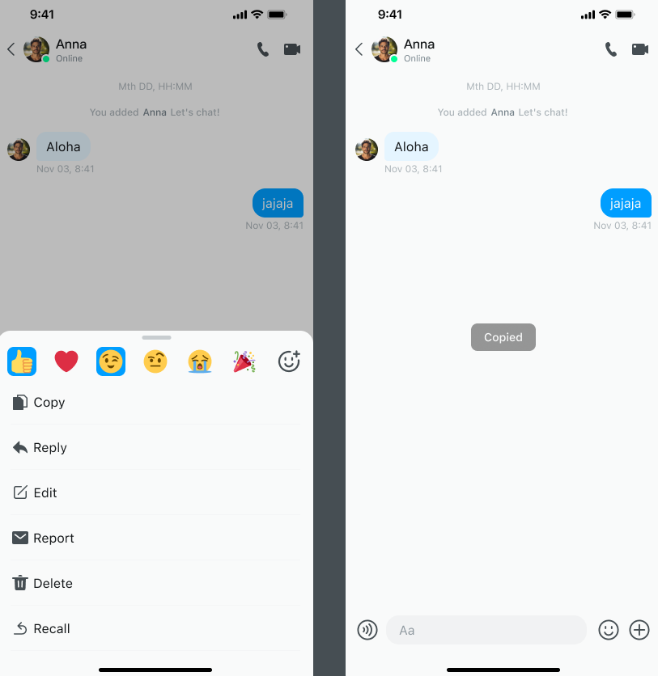

### Delete a message

Users can delete messages that they do not want to keep.

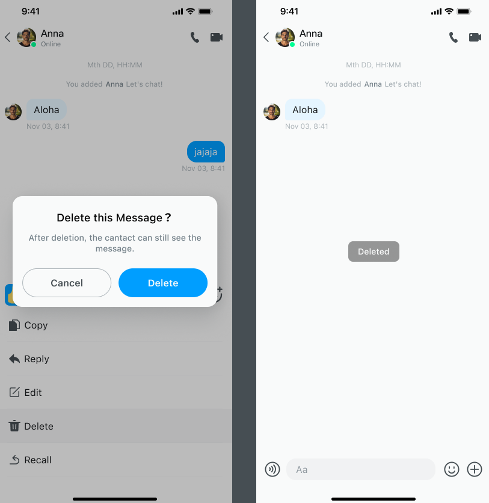

### Recall a message

Users can recall messages that were sent by mistake.

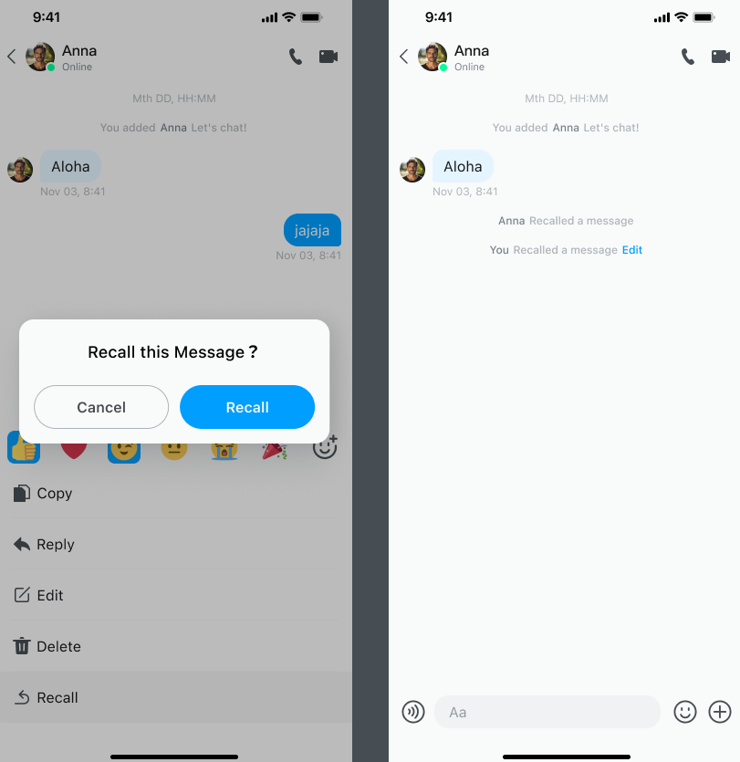

### Edit a sent message

Users can edit sent messages to correct mistakes. 

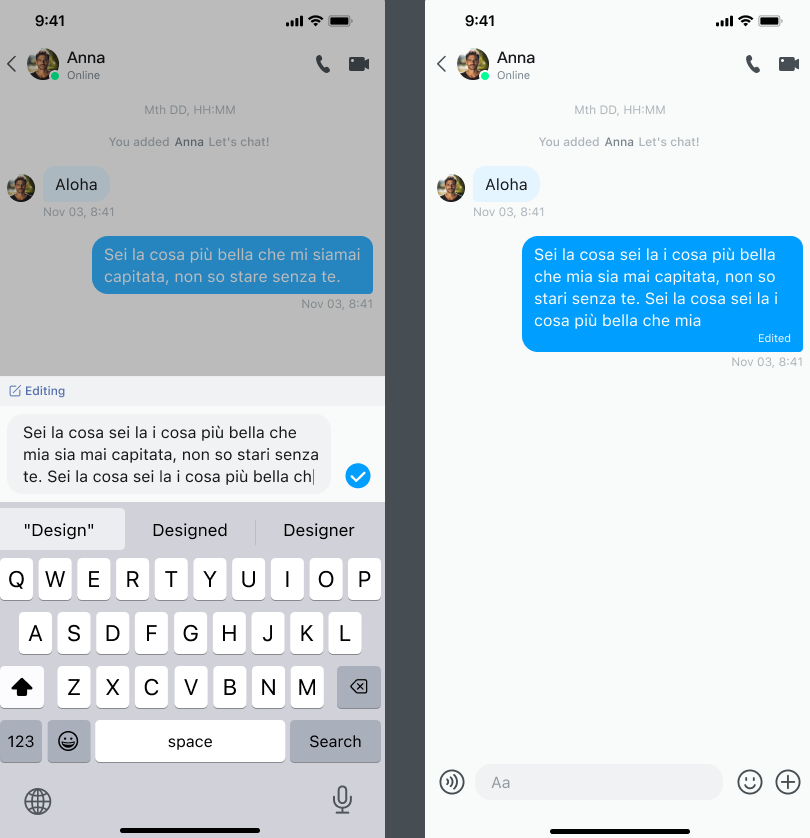

### Quote a message

Users can quote a specific message to reply to it or emphasize its importance. The quoting feature is enabled by default.

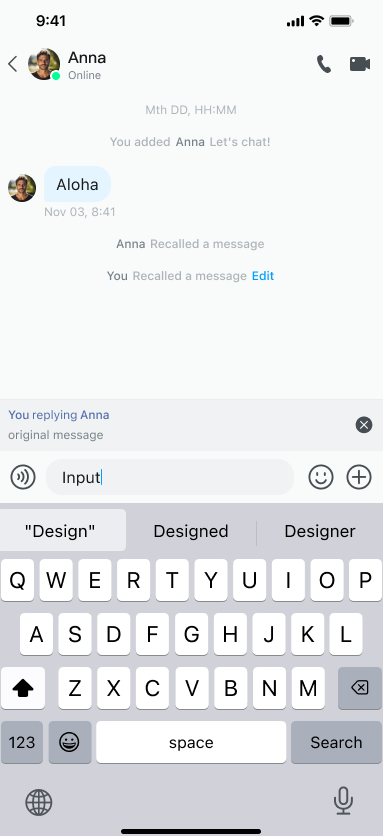

The sample code is as follows:

```swift
Appearance.chat.contentStyle: [MessageContentDisplayStyle] = [.withReply,.withAvatar,.withNickName,.withDateAndTime,.withMessageThread,.withMessageReaction]

    if hiddenTopic {
      Appearance.chat.contentStyle.removeAll { $0 == .withReply }
    }
```

### Translate a message

Users can translate messages into other languages for easier communication. The UI and logic structure are in 
`Appearance.swift`:

1. Enable message translation

  The message translation feature is disabled by default, that is, the default value of `Appearance.chat.enableTranslation` in 
  `Appearance.swift` is `false`. To enable this feature, set is to `true`. The sample code is as follows:

1. Set the target language

  `Appearance.swift` provides the `Appearance.chat.targetLanguage` function to set the target language. If the target 
  language is not set, English is used by default. For more translation target languages, refer to [Translation Language Support](https://learn.microsoft.com/zh-cn/azure/ai-services/translator/language-support).
  
  The sample code is as follows: 

  ```swift
  Appearance.chat.enableTranslation = true
  Appearance.chat.targetLanguage = .English
  ```

### Reply with emoji

Users can long-press a single message to open the context menu and reply with an emoji. Emoji replies 
(reactions) can help express emotions or attitudes, conduct surveys or votes. Currently, the UIKit supports 
reactions only for group chats, which can be turned on and off in `Appearance.swift`.

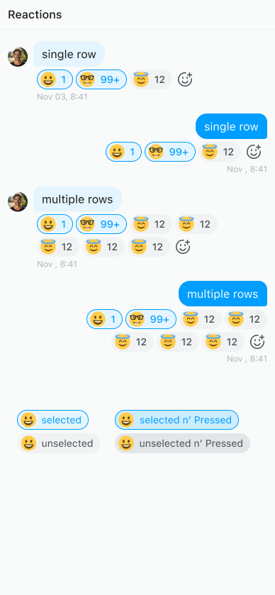

The emoji reply feature is disabled by default in `Appearance.swift`. That is, `.withMessageReaction` is not 
included in `Appearance.chat.contentStyle` by default. Make sure **not to include it repeatedly** when enabling.

```swift
Appearance.chat.contentStyle.append(.withMessageReaction)
```

### Message thread

Users can create a message thread based on a message in a group chat, to have a topic-specific discussion.

The message thread feature is disabled by default in `Appearance.swift`. That is, `.withMessageThread` is not
included in `Appearance.chat.contentStyle` by default. Make sure **not to include it repeatedly** when enabling. 
The sample code is as follows:

```swift
Appearance.chat.contentStyle.append(.withMessageThread)
```

### Forward a message

Users can forward a single or multiple combined messages to other users. 

The UI and logic structure are as follows:

- `MessageMultiSelectedBottomBar.swift`: Bottom menu View.
- `MessageListController.swift`: Handles UI layout changes and logic for forwarding and deleting.
- `MessageListController.swift`: The message selection helper class used to record the selected message information and provide acquisition methods.

### Pin a message

Users can pin important messages to the top of a conversation. This feature is particularly useful for handling urgent matters or ongoing projects, helping to efficiently manage important matters.

The UI and logic structure are as follows:

- `Appearance.chat.enablePinMessage`: Controls the display and hiding of the message pin feature.
- `Appearance.chat.messageLongPressedActions`: Contains all items in the long-press menu of the message. If you do 
  not need the ability to pin messages, delete the corresponding item. 
- `MessageListController#showPinnedMessages`: Display the pinned message list.

The message pinning feature is enabled by default in `Appearance.chat`. That is, the default value of 
`enablePinMessage` is set to `true`. To disable this feature, set it to `false`. The sample code is as follows:

```swift
Appearance.chat.enablePinMessage = false
Appearance.chat.messageLongPressedActions.removeAll { $0.tag == "Pin" }
```