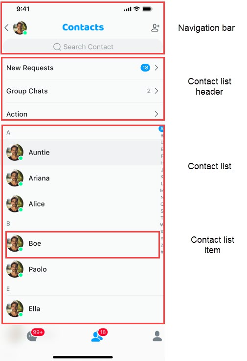

The `ContactList` component displays and manages the contact list. By default, it provides the features of adding contacts, deleting contacts, and adding contact notes.

Contacts are sorted by the first letter of their names. If there is no nickname, the user ID is used.



The default usage examples are as follows:

```typescript
import type { NativeStackScreenProps } from "@react-navigation/native-stack";
type Props = NativeStackScreenProps<RootScreenParamsList>;
export function ContactListScreen(props: Props) {
  const { navigation } = props;

  return (
    <SafeAreaView
      style={{
        flex: 1,
      }}
    >
      <ContactList
        contactType={"contact-list"}
        onClickedSearch={() => {
          navigation.navigate("SearchContact", {
            params: { searchType: "contact-list" },
          });
        }}
        onClickedItem={(data) => {
          if (data?.userId) {
            navigation.push("ContactInfo", { params: { userId: data.userId } });
          }
        }}
        onClickedGroupList={() => {
          navigation.navigate("GroupList", {
            params: {},
          });
        }}
        onClickedNewRequest={() => {
          navigation.navigate("NewRequests", {
            params: {},
          });
        }}
      />
    </SafeAreaView>
  );
}
```

## Customize your contact list

The core properties of the `ContactList` component are as follows:

| property | type | Required | describe |
|:---:|:---:|:---:|:---:|
| containerStyle | object | no | Modify the component style. |
| onSort | Function | no | Customize the list sorting strategy. |
| onInitListItemActions | Function | no | Customize individual list items in the contact list component. By default, it includes contact application list and group list. |
| groupId | string | no | This parameter is only used in add-group-membercontact lists of type. |
| onClickedNewRequest | Function | no | Callback for clicking on contact notification list. Routing may be used. |
| onClickedGroupList | Function | no | Callback for clicking the group list. |
| ListItemRender | Function | no | A component for customizing contact list items. You can modify the layout, style, visibility, etc. |
| ListItemHeaderRender | Function | no | A component for customizing the header of contact list items. You can modify the layout, style, visibility, etc. |
| onStateChanged | Function | no | List component status notification, including: loading failure, list is empty, etc. |
| propsRef | reference | no | The reference object of the list component can actively add, modify, and delete session list items. Pay attention to the operating conditions. |
| onForwardMessage | Function | no | Forwarded callback notification. May use routing. |
| onChangeRequestCount | Function | no | Callback notification for new notification quantity changes. Routing may be used. |
| getFullLetter | Function | no | Get callback notification for category sorting. For example: return the full pinyin of a Chinese character. Routing may be used. |
| indexList | array | no | List of index headers. Defaults toABCDEFGHIJKLMNOPQRSTUVWXYZ# |
| visibleEmptyIndex | boolean | no | Whether to display empty index categories. By default, they are not displayed. |

## Avatar and nickname

There is no default value in the `ContactList` component for the avatar and nickname that need to be provided by the user. If not provided, the default avatar and user ID will be displayed.

Avatars and nicknames can be provided in the following ways:

- Register callbacks: Use the `onUsersHandlerproperty` property of the `Container` component.
- Active call: Use the `ChatService.updateDataList` method. Calling this method will trigger internal event distribution. You can also customize the distribution handle and refresh the loaded component page.

Regardless of the update method, the cached data will be updated, and active updates will also trigger UI component refreshes.

## Event notification

Event notifications have been implemented in the list, and the list will be updated when the corresponding event is received. 