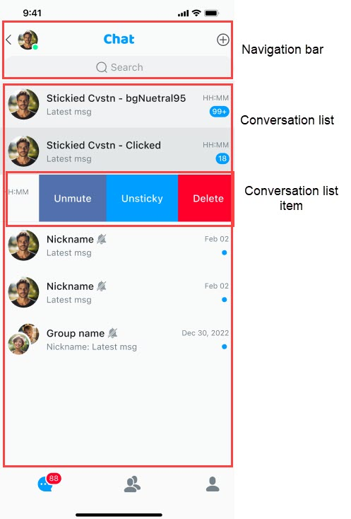

The `ConversationList` component handles display and management of the conversation list. By default, the component provides features such as creating a new conversation, deleting a conversation, setting the DND mode, and pinning conversations to the top, specifically:

- Click **Search** to go to the search page and search for conversations.
- Click a conversation list item to jump to the conversation details page.
- Click the expand button in the navigation bar and select **New Conversation** to create a new conversation.
- Long-press a conversation list item to display the menu, where you can delete the conversation, pin the conversation, or disable messages.
- A single conversation displays the conversation name, the last message, the time of the last message, the pinned and muted status, and so on.

The displayed name of the conversation depends on its type:

For one-on-one chats, the name displayed in the conversation is the nickname of the other user. If the other user has not set a nickname, the other user's ID is displayed. The conversation avatar is the other user's avatar. If not set, the default avatar is used.

For group chats, the conversation name is the name of the current group and the avatar is the default avatar.

For details about the features related to the conversation list, see [Product features](../overview/product-features.md).



The following is a sample code using the default parameters:

```typescript
import type { NativeStackScreenProps } from "@react-navigation/native-stack";
type Props = NativeStackScreenProps<RootScreenParamsList>;
export function ConversationListScreen(props: Props) {
  const { navigation } = props;

  return (
    <SafeAreaView
      style={{
        flex: 1,
      }}
    >
      <ConversationList
        onClickedSearch={() => {
          // Jump to search page
          navigation.push("SearchConversation", {});
        }}
        onClickedItem={(data) => {
          // Jump to the conversation details page
          if (data === undefined) {
            return;
          }
          const convId = data?.convId;
          const convType = data?.convType;
          const convName = data?.convName;
          navigation.push("ConversationDetail", {
            params: {
              convId,
              convType,
              convName: convName ?? convId,
            },
          });
        }}
        onClickedNewConversation={() => {
          // Jump to the create a new conversation page
          navigation.navigate("NewConversation", {});
        }}
      />
    </SafeAreaView>
  );
}
```

## Customize the conversation list

The core properties provided by the `ConversationList` component are as follows:

| Property | Type | Required/Optional | Description |
|:---:|:---:|:---:|:---:|
| `containerStyle` | object | Optional | Modify the component style. |
| `onSort` | Function | Optional | Customize the list sorting strategy. |
| `onClickedNewConversation` | Function | Optional | Callback for clicking the create new conversation button. Routing may be used. |
| `onClickedNewGroup` | Function | Optional | Callback for clicking the create group button. Routing may be used. |
| `onClickedNewContact` | Function | Optional | Callback for clicking the add contact button. Routing may be used. |
| `ListItemRender` | Function | Optional | A component for customizing conversation list items. You can modify the layout, style, visibility, and others. |
| `onStateChanged` | Function | Optional | List component status notification, including the loading failure, the list is empty, and others. |
| `propsRef` | reference | Optional | The reference object of the list component that can actively add, modify, and delete conversation list items. Pay attention to the operating conditions. |
| `onInitNavigationBarMenu` | Function | Optional | Customize the list navigation bar to modify the style, event behavior, and others. |
| `onInitBottomMenu` | Function | Optional | Register menu items and customize menus. |
| `filterEmptyConversation` | Function | Optional | Whether to filter empty conversations. |
| `onChangeUnreadCount` | Function | Optional | Callback notification for changes in the total number of unread messages. |

## Avatar and nickname

`ConversationList` items are divided into users and groups. For avatars and nicknames, the priority is given to the data provided by the user. Otherwise, default avatars and IDs are used. For groups, the default avatar and ID are used by default. 

Avatars and nicknames can be provided in the following ways:

- Register callbacks: Use the `onUsersHandler` and `onGroupsHandler` properties of the `Container` component.
- Active call: Use the `ChatService.updateDataList` method. Calling this method will trigger internal event distribution. You can also customize the distribution handle and refresh the loaded component page.

Regardless of the update method, the cached data will be updated, and active updates will also trigger UI component refreshes.

## Event notifications

Event notifications have been implemented in the list, and the list will be updated when the corresponding event is received. 