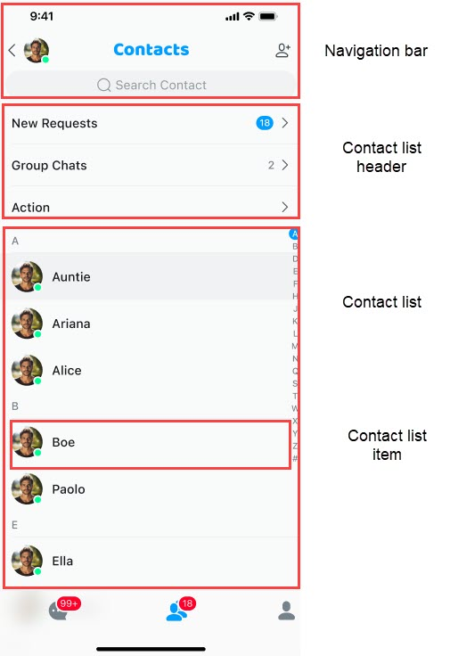

# Contact list

The contact list component displays and manages the contact list. By default, it provides the features of adding contacts, deleting contacts, and adding contact notes.

Contacts are sorted by the first letter of their nicknames. If there is no nickname, the user ID is used.



The default usage examples are as follows:

```typescript
import type { NativeStackScreenProps } from "@react-navigation/native-stack";
type Props = NativeStackScreenProps<RootScreenParamsList>;
export function ContactListScreen(props: Props) {
  const { navigation } = props;

  return (
    <SafeAreaView
      style={{
        flex: 1,
      }}
    >
      <ContactList
        contactType={"contact-list"}
        onClickedSearch={() => {
          navigation.navigate("SearchContact", {
            params: { searchType: "contact-list" },
          });
        }}
        onClickedItem={(data) => {
          if (data?.userId) {
            navigation.push("ContactInfo", { params: { userId: data.userId } });
          }
        }}
        onClickedGroupList={() => {
          navigation.navigate("GroupList", {
            params: {},
          });
        }}
        onClickedNewRequest={() => {
          navigation.navigate("NewRequests", {
            params: {},
          });
        }}
      />
    </SafeAreaView>
  );
}
```

## Core properties of the contact list page

The `ContactList` component provides the following core properties:

| Property | type | Required/Optional | Description |
|:---:|:---:|:---:|:---:|
| `containerStyle` | object | Optional | Modify the component style. |
| `onSort` | Function | Optional | Customize the list sorting strategy. |
| `onInitListItemActions` | Function | Optional | Customize individual list items in the contact list component. By default, it includes a contact application list and a group list. |
| `groupId` | string | Optional | Used only in the contact lists for adding group members. |
| `onClickedNewRequest` | Function | Optional | The callback for clicking the contact notification list. Routing may be used. |
| `onClickedGroupList` | Function | Optional | The callback for clicking the group list. |
| `ListItemRender` | Function | Optional | The component for customizing contact list items. You can modify the layout, style, visibility, and other elements. |
| `ListItemHeaderRender` | Function | Optional | The component for customizing the header of contact list items. You can modify the layout, style, visibility, and other elements. |
| `onStateChanged` | Function | Optional | The list status notification, including loading failure, list is empty, and others. |
| `propsRef` | reference | Optional | The reference object of the list component that can actively add, modify, and delete conversation list items. Pay attention to the operating conditions. |
| `onForwardMessage` | Function | Optional | The message forwarding callback. Routing may be used. |
| `onChangeRequestCount` | Function | Optional | The callback for changes in the number of new notifications. Routing may be used. |
| `getFullLetter` | Function | Optional | Get the callback for category sorting. Routing may be used. |
| `indexList` | array | Optional | The list of index headers. Defaults to `ABCDEFGHIJKLMNOPQRSTUVWXYZ#`. |
| `visibleEmptyIndex` | boolean | Optional | Whether to display empty index categories. By default, they are not displayed. |

## Customize the navigation bar

The navigation bar component is a common component with the left-center-right layout. The customization method is similar to the conversation list. For details, see [Conversation list](conversation-list.md).

## Customize the contact list header

Customize the header list items. You can add, delete, and modify list items, as well as modifying its style, layout, color, and other attributes.

```typescript
export const MyCustomItemView = (props: ContactItemProps) => {
  const {} = props;
  return <View style={{ width: 100, height: 44, backgroundColor: 'red' }} />;
};

export type MyContactListScreenProps = {};
function MyContactListScreen(props: MyContactListScreenProps) {
  const {} = props;

  return (
    <ContactList
      contactType={'contact-list'}
      onInitListItemActions={(
        defaultItems: React.ReactElement<ContactItemProps>[]
      ) => {
        defaultItems.push(<MyCustomItemView name={'custom item'} />);
        return defaultItems;
      }}
    />
  );
}
```

## Whether to display the alphabetical index table and the alphabetical navigation list

```typescript
export type MyContactListScreenProps = {};
function MyContactListScreen(props: MyContactListScreenProps) {
  const {} = props;

  return (
    <ContactList
      contactType={'contact-list'}
      isVisibleIndex={false}
      isVisibleItemHeader={false}
    />
  );
}
```

## Custom list item styles

You can customize list items by modifying the avatar, nickname, style (for example, the height and background color of the list item), layout, and other elements.

```typescript
export type MyContactListScreenProps = {};
function MyContactListScreen(props: MyContactListScreenProps) {
  const {} = props;

  return (
    <ContactList
      contactType={'contact-list'}
      ListItemRender = {() => (
        <View style={{ height: 20, backgroundColor: 'red' }} />
      )}
    />
  );
}
```

## Avatar and nickname

UIKit components provide the opportunity to modify nickname and avatar. This is mainly done through passive registration and active call.

### Passive registration

Register callbacks through `onUsersHandler` and `onGroupsHandler` during the initialization phase. When calling, pass the default value and return the new value to complete the customization.

```typescript
  const onUsersHandler = React.useCallback(
    async (data: Map<string, DataModel>) => {
      const ret = new Promise<Map<string, DataModel>>((resolve, reject) => {
        // todo: if success
        resolve(new Map());
        // todo: if fail
        reject(new Map());
      });
      return ret;
    },
    []
  );
  const onGroupsHandler = React.useCallback(
    async (data: Map<string, DataModel>) => {
      if (data.size === 0) return data;
      const ret = new Promise<Map<string, DataModel>>((resolve, reject) => {
        // todo: if success
        resolve(new Map());
        // todo: if fail
        reject(new Map());
      });
      return ret;
    },
    []
  );
```

### Active call

Where needed, update the custom data through `ChatService.updateDataList` and notify the concerned components.

## Event notification

Event notifications have been implemented in the list, and the list will be updated when the corresponding event is received. 