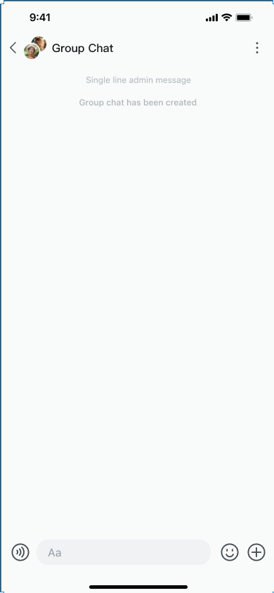

Agora UIKit for one-to-one chats and group chats is an instant messaging UI component library developed based on 
Agora Chat SDK. It provides various components to implement features such as a conversation list, chat interface, 
contact list and interface, and others. This helps you to quickly build instant messaging applications based 
on the particular business needs.

To access the source code, [click here](https://github.com/easemob/react-native-chat-library).

## UIKit basic project structure

```
├── CHANGELOG.md // Update log
├── CODE_OF_CONDUCT.md // Code of Conduct
├── CONTRIBUTING.md // Contribution Guide
├── LICENSE // Open Source Agreement
├── README.md // Project Introduction
├── README.zh.md // Project Introduction
├── lib // Compiled files, type definitions
│ ├── commonjs // commonjs
│ ├── module // esm
│ └── typescript // typescript
├── node_modules // Dependencies
├── package.json // Project configuration
├── src // Source code
│ ├── assets // Static resources
│ ├── biz // Business code
│ ├── chat // Chat SDK encapsulation, providing basic services
│ ├── config // Configuration components
│ ├── config.local.ts // Local configuration
│ ├── const.tsx // Constants
│ ├── container // Container component, program entry component
│ ├── error // Error handling
│ ├── hook // Custom hook
│ ├── i18n // Internationalization
│ ├── index.tsx // Source code entry
│ ├── services // Service components
│ ├── theme // Theme components
│ ├── types.tsx // Type definitions
│ ├── ui // Basic UI components, providing basic services for business components
│ ├── utils // Tool functions
│ └── version.ts // Chat UIKit SDK version information
├── tsconfig.build.json // Compile configuration
└── tsconfig.json // Compile configuration
```

## Features

The business-related UI controls are mainly included in the following three Views:

- `ConversationDetail` provides a view of all chats.

    

- `ConversationList` provides a list of conversations.

    

- `ContactList` provides contacts, groups, and their details.

    