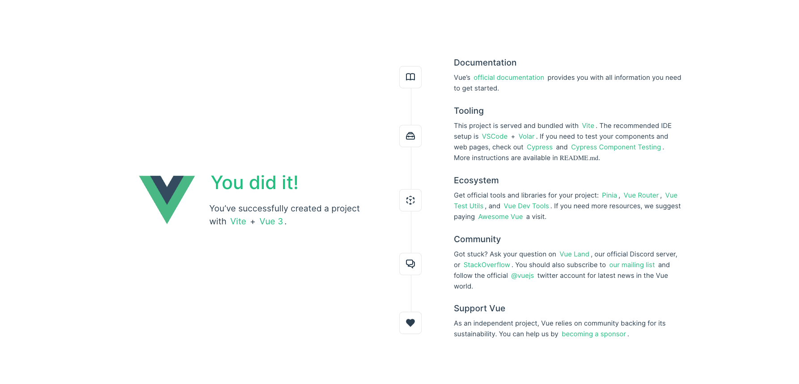
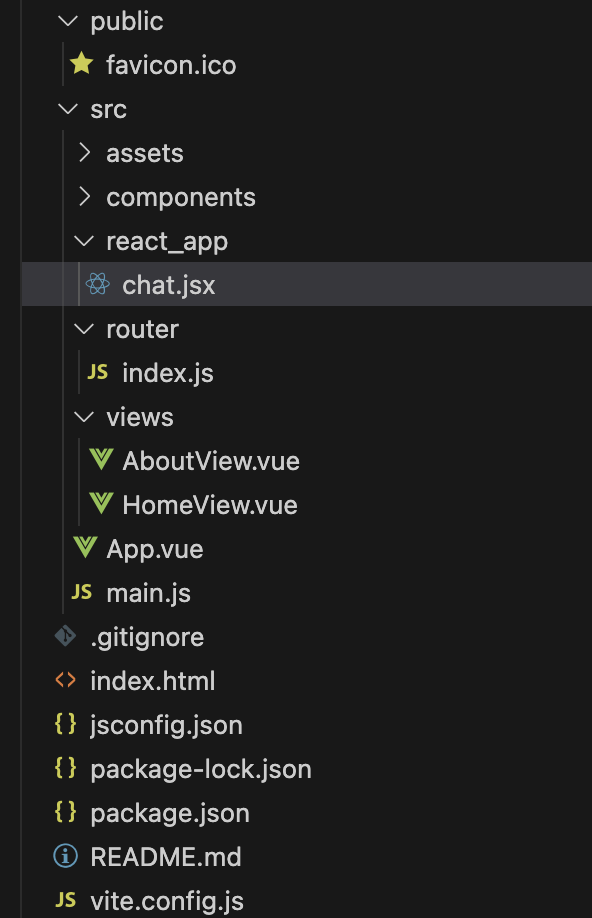

Before using UIKit, you need to integrate it into your app. This page explains how to integrate it into a Vue project.

## Prerequisites

Before you start, make sure your development environment meets the following conditions:

- [Node.js](https://nodejs.org/en)

## Integrate UIKIt

Take the following steps:

1. Create a Vue project

    Vue provides a convenient command line tool to quickly build applications. Make sure your current working directory is the directory where you created the project.
    
    Run the following command in the command line to create the project:

    ```
    npm init vue@latest
    ```
   
    The above command will walk you through the options when creating a new project. The settings used in this tutorial are listed below.

    ```
   Vue.js - The Progressive JavaScript Framework
   
   ✔ Project name: … vue-project
   ✔ Add TypeScript? … No
   ✔ Add JSX Support? … Yes
   ✔ Add Vue Router for Single Page Application development? … Yes
   ✔ Add Pinia for state management? … No
   ✔ Add Vitest for Unit Testing? … No
   ✔ Add an End-to-End Testing Solution? › No
   ✔ Add ESLint for code quality? … No
   ✔ Add Vue DevTools 7 extension for debugging? (experimental) … No
    ```
   
    Run in the development mode:

    ```
   cd vue-project
   npm install
   npm run dev
    ```
   
   After successful operation, open "http://localhost:5173/" and you can see the interface shown below:

    

1. Install and configure Veaury

    [Veaury](https://github.com/gloriasoft/veaury#readme) is a tool library based on React and Vue, mainly used in scenarios where React and Vue are used together in a project. Veaury is suitable for Vue 3 and Vue 2.

    1. Install Veaury from npm using the following command:

       ```
       npm i veaury
       ```
       
    1. Install the `@vitejs/plugin-react` plugin: 

    ```
    npm i @vitejs/plugin-react
    ```
   
    1. In order for your Vue application to be able to import and render React components, update the files in your project `vite.config.js` to use the Veaury plugin.

    ```javascript
    import { fileURLToPath, URL } from "node:url";
    import { defineConfig } from "vite";
    import vue from "@vitejs/plugin-vue";
    import vueJsx from "@vitejs/plugin-vue-jsx";
    // >= veaury@2.1.1
    import veauryVitePlugins from "veaury/vite/index.js";
    // If it is vite 6, you should use `veaury/vite/esm`
    // import veauryVitePlugins from 'veaury/vite/esm'
    
    // https://vitejs.dev/config/
    export default defineConfig({
      plugins: [
        // Close vue and vuejsx plugins
        // vue(),
        // vueJsx(),
        // When type is set to vue, all .jsx files in the directory named `react_app` will be compiled by react jsx, and .jsx in other directories will be compiled by vue jsx.
        veauryVitePlugins({
          type: "vue"
        })
      ],
      resolve: {
        alias: {
          "@": fileURLToPath(new URL("./src", import.meta.url))
        }
      }
    });
    ```
   
    1. Any React components can be added to the `react_app` directory, which can then be imported into the `.vue` file and rendered in a standard Vue component.

1. Integrate React components in the Vue project

     Create a new React component in `react_app`. This component is responsible for importing, configuring, and rendering UIKit.

    1. Install UIKit:

        ```javascript
        npm i easemob-chat-uikit --save;
        ```

    1. Create a  `react_app/chat.jsx` file, import UIKit, and initialize UIKit using the app key and user information.

       

       The code is as follows:

       ```javascript
       // Import react_app/chat.jsx component
       import { UIKitProvider, Chat, ConversationList } from "easemob-chat-uikit";
       // Introduce UIKit styles
       import 'easemob-chat-uikit/style.css'
       
       const appKey = "your appkey";
       const userId = "userId";
       const password = "password";
       
       const EaseChat = (props) => {
         // The theme attribute passed in by the parent component
         const { theme } = props;
         return (
           <UIKitProvider
             initConfig={{
               appKey,
               userId,
               password
             }}
             theme={{
               mode: theme
             }}
           >
             <div className="chat-wrap">
               <div className="conversation-list">
                 <ConversationList></ConversationList>
               </div>
               <div className="chat">
                 <Chat></Chat>
               </div>
             </div>
           </UIKitProvider>
         );
       };
       
       export default EaseChat;
       ```
   
1. Add UIKit to the Vue page

    Add `EaseChat` to the Vue page, delete all code in `views/HomeView.vue`, and add the following:

    ```javascript
    <script setup>
    import { ref } from "vue";
    import { applyPureReactInVue } from "veaury";
    import EaseChat from "../react_app/chat";
    import Logo from "../assets/logo.svg";
    
    const Chat = applyPureReactInVue(EaseChat);
    
    const theme = ref("light");
    
    const switchTheme = () => {
      theme.value = theme.value === "light" ? "dark" : "light";
    };
    </script>
    
    <template>
      <header>
        <div class="header">
          
          <span class="theme" @click="switchTheme">Switch Theme: {{ theme }}</span>
        </div>
      </header>
      <main>
        <Chat :theme="theme" />
      </main>
    </template>
    
    <style>
    .chat-wrap {
      width: 100%;
      height: calc(100vh - 50px);
      display: flex;
      box-sizing: border-box;
    }
    
    .conversation-list {
      width: 300px;
      flex-shrink: 0;
    }
    
    .chat {
      width: 100%;
    }
    </style>
    
    <style scoped>
    .header {
      display: flex;
      height: 50px;
      font-size: 20px;
      background: #4faeea;
      padding: 0 20px;
      align-items: center;
      justify-content: space-between;
    }
    
    .theme {
      cursor: pointer;
    }
    
    .logo {
      width: 45px;
    }
    </style>
    
    ```
   
    The code does the following:
    
    1. Import the Veaury and `EaseChat` components.
    1. Use Veaury's `applyPureReactInVue` function to convert the React component into a Vue component.
    1. Define theme variables and pass them to the `EaseChat` component to switch the UIKit theme.
    1. Add some styles to beautify the interface.

    Delete the irrelevant code in `App.vue` and keep only `RouterView`. When you visit http://localhost:5173, the `template` interface is as follows:

    Click **Switch Theme** in the upper right corner to switch the theme.