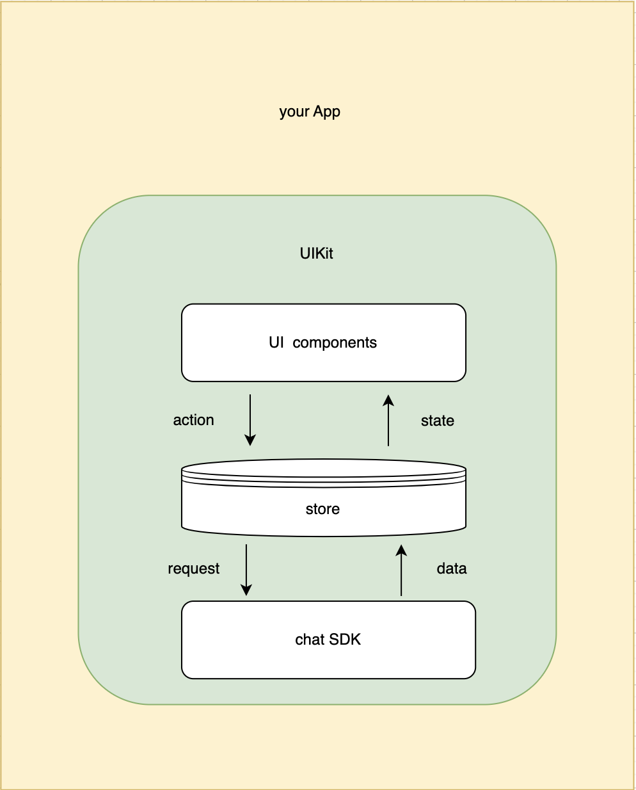

Agora UIKit for one-to-one chats and group chats is an instant messaging React UI component library developed based on 
Agora Chat SDK. It provides various components to implement features such as a conversation list, chat interface, 
contact list, group settings, and others. The CHat SDK is integrated into a component, which helps you to quickly build instant messaging applications including UI interfaces based on the particular business needs. There is no need to worry about internal implementation and data management.

To access the source code, [click here](https://github.com/easemob/chatuikit-android).

## Understand the tech

Agora Chat UIKit integrates the Chat SDK and Agora server connection to implement functions such as sending and receiving messages. UIKit uses the React Context API to manage internal states. Users can use the web hooks provided by UIKit to obtain the required information from the global data, or use custom hooks to obtain methods to operate on these data.

## Functions

The following components are currently provided:

- Container components: `Provider`, `Chat`, `ConversationList`, `ContactList`.
- Module components: `BaseMessage`, `AudioMessage`, `FileMessage`, `VideoMessage`, `ImageMessage`, `TextMessage`, `CombinedMessage`, `UserCardMessage`, `GroupDetail`, `UserSelect`, `Header`, `Empty`, `MessageList`, `ConversationItem`, `MessageInput`, `MessageStatus`, `Typing`.
- Pure UI components: `Avatar`, `Badge`, `Button`, `Checkbox`, `Icon`, `Modal`, `Tooltip`, `ScrollList`, `Switch`, `UserItem`, `Broadcast`, `Dropdown`.

The business-related UI controls UIKit are mainly included in the following three components:

- `Chat`: Provides a container for all chat views.
- `ConversationList`: Provides a conversation list container.
- `ContactList`: Provides containers for contacts, groups, and their details.