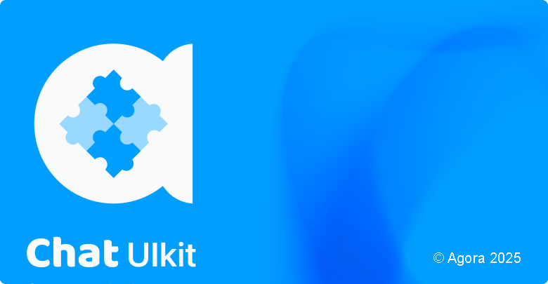

# Agora Chat UIKit 2.0

Refer to the following design guides:

## 1-to-1 and Group Chats

Agora UIKit for one-to-one and group chats is an instant messaging UI component library developed based on Agora Chat SDK. It provides various components to implement features such as a conversation list, chat UI, and contact list. To quickly build instant messaging applications based on the particular business needs, refer to the documentation for your development platform.

Android

- About
    - [Product overview](1-to-1-and-group-chats/android/overview/product-overview.md)
    - [Product features](1-to-1-and-group-chats/android/overview/product-features.md)
- Get started
    - [Quickstart](1-to-1-and-group-chats/android/get-started/quickstart.md)
- Integrate
    - [Advanced usage](1-to-1-and-group-chats/android/integrate/advanced-usage.md)
    - [Message chat](1-to-1-and-group-chats/android/integrate/chat-messages.md)
    - [Contact details](1-to-1-and-group-chats/android/integrate/contact-details.md)
    - [Contact list](1-to-1-and-group-chats/android/integrate/contacts.md)
    - [Conversation list](1-to-1-and-group-chats/android/integrate/conversation-list.md)
    - [Group details](1-to-1-and-group-chats/android/integrate/group-details.md)
    - [Integrate UIKit](1-to-1-and-group-chats/android/integrate/integrate-ui-kit.md)
    - [Internationalization](1-to-1-and-group-chats/android/integrate/internationalization.md)
    - [Theme](1-to-1-and-group-chats/android/integrate/theme.md)
    - [User-defined information](1-to-1-and-group-chats/android/integrate/user-defined-information.md)

iOS

- About
    - [Product overview](1-to-1-and-group-chats/ios/overview/product-overview.md)
    - [Product features](1-to-1-and-group-chats/ios/overview/product-features.md)
- Get started
    - [Integrate UIKit](1-to-1-and-group-chats/ios/get-started/integrate-ui-kit.md)
    - [Quickstart](1-to-1-and-group-chats/ios/get-started/quickstart.md)
    - [Run the sample project](1-to-1-and-group-chats/ios/get-started/run-sample-project.md)
- Integrate
    - [Advanced usage](1-to-1-and-group-chats/ios/integrate/advanced-usage.md)
    - [Implement a new type of custom message cell](1-to-1-and-group-chats/ios/integrate/custom-message-cell.md)
    - [Customize the contact details](1-to-1-and-group-chats/ios/integrate/customize-contact-details.md)
    - [Customize the contact list](1-to-1-and-group-chats/ios/integrate/customize-contact-list.md)
    - [Customize the conversation list](1-to-1-and-group-chats/ios/integrate/customize-conversation-list.md)
    - [Customize the group details](1-to-1-and-group-chats/ios/integrate/customize-group-details.md)
    - [Customize the message chat](1-to-1-and-group-chats/ios/integrate/customize-message-chat.md)
    - [Overridable methods in the ViewModel of main pages](1-to-1-and-group-chats/ios/integrate/event-listening.md)
    - [General configurable items](1-to-1-and-group-chats/ios/integrate/general-configurable-items.md)
    - [Intercept the main page click jump event](1-to-1-and-group-chats/ios/integrate/intercept-main-page-click-jump-event.md)
    - [Internationalization](1-to-1-and-group-chats/ios/integrate/internationalization.md)
    - [General configurable items](1-to-1-and-group-chats/ios/integrate/optional-items.md)
    - [Theme](1-to-1-and-group-chats/ios/integrate/theme.md)

Web

- About
    - [Product overview](1-to-1-and-group-chats/web/overview/product-overview.md)
    - [Product features](1-to-1-and-group-chats/web/overview/product-features.md)
- Get started
    - [Integrate UIKit with Vue](1-to-1-and-group-chats/web/get-started/integrate-with-vue.md)
    - [Integrate UIKit with React](1-to-1-and-group-chats/web/get-started/integrate-with-react.md)
    - [Quickstart](1-to-1-and-group-chats/web/get-started/quickstart.md)
- Integrate
    - [Audio and video calls](1-to-1-and-group-chats/web/integrate/audio-and-video-calls.md)
    - [Message chat](1-to-1-and-group-chats/web/integrate/chat-messages.md)
    - [Contacts](1-to-1-and-group-chats/web/integrate/contacts.md)
    - [Conversation list](1-to-1-and-group-chats/web/integrate/conversation-list.md)
    - [Event listeners](1-to-1-and-group-chats/web/integrate/event-listeners.md)
    - [Global context](1-to-1-and-group-chats/web/integrate/global-context.md)
    - [Internationalization](1-to-1-and-group-chats/web/integrate/internationalization.md)
    - [Log in to UIKit](1-to-1-and-group-chats/web/integrate/log-in.md)
    - [Theme](1-to-1-and-group-chats/web/integrate/theme.md)
    - [User information](1-to-1-and-group-chats/web/integrate/user-information.md)

Flutter

- About
    - [Product overview](1-to-1-and-group-chats/flutter/overview/product-overview.md)
    - [Product features](1-to-1-and-group-chats/flutter/overview/product-features.md)
- Get started
    - [Integrate UIKit](1-to-1-and-group-chats/flutter/get-started/integrate-ui-kit.md)
    - [Quickstart](1-to-1-and-group-chats/flutter/get-started/quickstart.md)
    - [Run the sample project](1-to-1-and-group-chats/flutter/get-started/run-sample-project.md)
- Integrate
    - [Advanced usage](1-to-1-and-group-chats/flutter/integrate/advanced-usage.md)
    - [Chat messages](1-to-1-and-group-chats/flutter/integrate/chat-messages.md)
    - [Contact details](1-to-1-and-group-chats/flutter/integrate/contact-details.md)
    - [Contacts](1-to-1-and-group-chats/flutter/integrate/contacts.md)
    - [Conversation list](1-to-1-and-group-chats/flutter/integrate/conversation-list.md)
    - [Group details](1-to-1-and-group-chats/flutter/integrate/group-details.md)
    - [Internationalization](1-to-1-and-group-chats/flutter/integrate/internationalization.md)
    - [Theme](1-to-1-and-group-chats/flutter/integrate/theme.md)
    - [User information](1-to-1-and-group-chats/flutter/integrate/user-information.md)

React

- About
    - [Product overview](1-to-1-and-group-chats/react/overview/product-overview.md)
    - [Product features](1-to-1-and-group-chats/react/overview/product-features.md)
- Get started
    - [Integrate UIKit](1-to-1-and-group-chats/react/get-started/integrate-ui-kit.md)
    - [Quickstart](1-to-1-and-group-chats/react/get-started/quickstart.md)
    - [Run the sample project](1-to-1-and-group-chats/react/get-started/run-sample-project.md)
- Integrate
    - [Advanced usage](1-to-1-and-group-chats/react/integrate/advanced-usage.md)
    - [Chat messages](1-to-1-and-group-chats/react/integrate/chat-messages.md)
    - [Contact details](1-to-1-and-group-chats/react/integrate/contact-details.md)
    - [Contacts](1-to-1-and-group-chats/react/integrate/contacts.md)
    - [Conversation list](1-to-1-and-group-chats/react/integrate/conversation-list.md)
    - [Group details](1-to-1-and-group-chats/react/integrate/group-details.md)
    - [Internationalization](1-to-1-and-group-chats/react/integrate/internationalization.md)
    - [Theme](1-to-1-and-group-chats/react/integrate/theme.md)
    - [User information](1-to-1-and-group-chats/react/integrate/user-information.md)

[**Design guide**](1-to-1-and-group-chats/design-guide.md)

**Figma assets:**
- [Web](https://www.figma.com/community/file/1462016929921662608/agora-chat-uikit-for-web)
- [Mobiles](https://www.figma.com/community/file/1462018524524243606/agora-chat-uikit-for-mobiles)

## Chat Room
Agora UIKit for Chat Room provides various components to quickly build chat room applications for your particular business needs. Through this UIKit, users in the chat room can interact in real time and send messages, gifts, and global broadcasts. Refer to the following documentation for your development platform.

Android

- About
    - [Product overview](chat-room/android/overview.md)
    - [Product features](chat-room/android/product-features.md)
- Get started
    - [Integrate UIKit](chat-room/android/integrate-ui-kit.md)
    - [Quickstart](chat-room/android/quickstart.md)
    - [Run the sample project](chat-room/android/run-sample-project.md)
- Integrate
    - [Best practices](chat-room/android/best-practices.md)
    - [Configurable items](chat-room/android/configurable-items.md)
    - [Theme](chat-room/android/theme.md)
    

iOS

- About
    - [Product overview](chat-room/ios/overview.md)
    - [Product features](chat-room/ios/product-features.md)
- Get started
    - [Integrate UIKit](chat-room/ios/integrate-ui-kit.md)
    - [Quickstart](chat-room/ios/quickstart.md)
    - [Run the sample project](chat-room/ios/run-sample-project.md)
- Integrate
    - [Best practices](chat-room/ios/best-practices.md)
    - [Configurable items](chat-room/ios/configurable-items.md)
    - [Customizations](chat-room/ios/customizations.md)
    - [Theme](chat-room/ios/theme.md)

Web

- About
    - [Product overview](chat-room/web/overview.md)
    - [Product features](chat-room/web/product-features.md)
- Get started
    - [Integrate UIKit](chat-room/web/integrate-ui-kit.md)
    - [Quickstart](chat-room/web/quickstart.md)
- Integrate
    - [Best practices](chat-room/android/best-practices.md)
    - [Configurable items](chat-room/web/configurable-items.md)
    - [Customize UIKit](chat-room/web/customize.md)
    - [Theme](chat-room/web/theme.md)

Flutter

- About
    - [Product overview](chat-room/flutter/overview.md)
    - [Product features](chat-room/flutter/product-features.md)
- Get started
    - [Integrate UIKit](chat-room/flutter/integrate-ui-kit.md)
    - [Quickstart](chat-room/flutter/quickstart.md)
    - [Run the sample project](chat-room/flutter/run-sample-project.md)
- Integrate
    - [Best practices](chat-room/flutter/best-practices.md)
    - [Configurable items](chat-room/flutter/configurable-items.md)
    - [Theme](chat-room/flutter/theme.md)

React

- About
    - [Product overview](chat-room/react/overview.md)
    - [Product features](chat-room/react/product-features.md)
- Get started
    - [Integrate UIKit](chat-room/react/integrate-ui-kit.md)
    - [Quickstart](chat-room/react/quickstart.md)
    - [Run the sample project](chat-room/react/run-sample-project.md)
- Integrate
    - [Best practices](chat-room/react/best-practices.md)
    - [Configurable items](chat-room/react/configurable-items.md)
    - [Theme](chat-room/react/theme.md)

[**Design guide**](chat-room/design-guide.md)

**Figma assets:**
- [Web and mobiles](https://www.figma.com/community/file/1462020408049722010/agora-chat-chatroom-uikit-for-mobiles-and-web)
