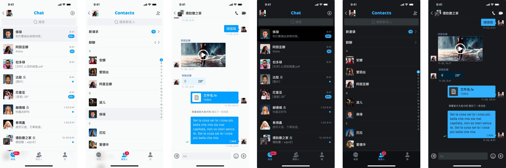
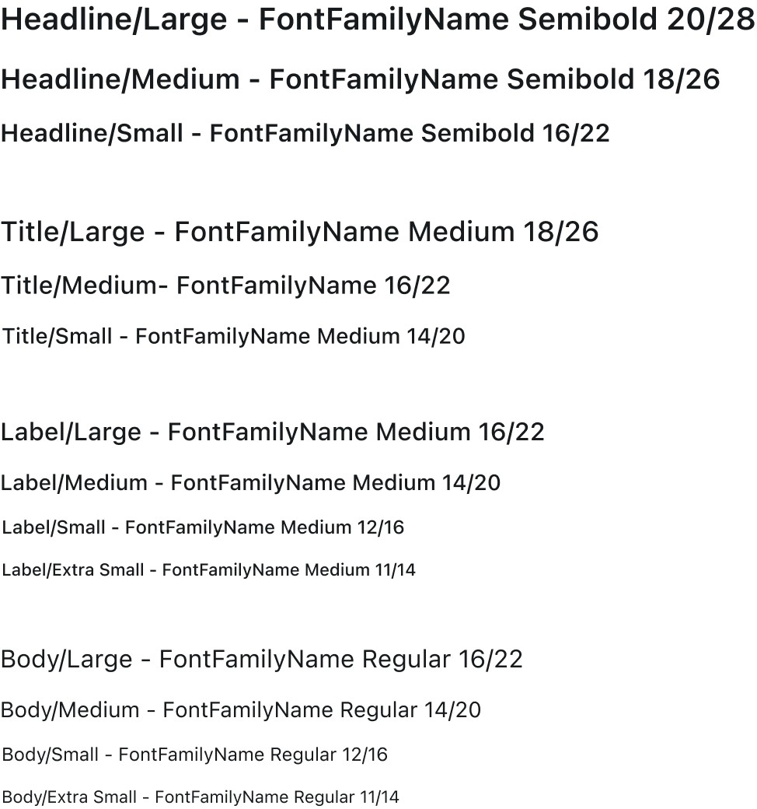
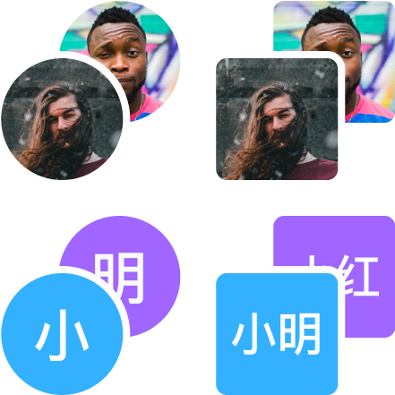

# Mobile Single/Group Chat Human-Computer Interaction Interface Toolkit Design Guide


## General Design Principles

**Universal Functions and Behaviors**

Incorporate universal and common functions and behaviors into the design to ensure consistency and ease of use.

**Customizability**

Enable easy customization of styles to allow users to tailor the interface to their preferences.


**User Autonomy**

Avoid making decisions on behalf of users regarding business models or preferences, allowing them full control over their choices.

## 1. Global Style (Style)

### 1.1. UIkit Color Specification

#### 1.1.1. Color Configuration Instructions

##### 1.1.1.1. Color Categories

Colors are categorized into eight types:

- **Theme Colors**: Primary, Secondary, Error
- **Primary Gradients**: Eight variations
- **Transparent Colors**: Alpha colors for Light and Dark modes
- **Neutral Colors**: Neutral and Neutral Special

##### 1.1.1.2. Color Mode (HSLA Model)

Colors are specified using the HSLA model, visualized as a cylinder:

- **Hue**: Circumference of the cylinder (0°-360°)
- **Saturation**: Radius of the cylinder (0% to 100%)
- **Lightness**: Height of the cylinder (0% to 100%)


#### 1.1.2. Theme Colors

##### 1.1.2.1. Hue Value

Users can set the Hue (0-360) to adjust the theme colors. The Hue value changes the color to fit user scenarios.


##### 1.1.2.2. Saturation

The saturation values are fixed:

- **Primary, Secondary, Error**: 100%
- **Neutral**: 8%
- **Neutral Special**: 36%


##### 1.1.2.3. Lightness Level

Lightness is available in thirteen levels:
0(0%) to 100(100%)


##### 1.1.2.4. Example

Setting Primary Hue to 203, Secondary Hue to 155, and Error Hue to 350 generates 39 theme colors.


#### 1.1.3. Primary Gradient Color

##### 1.1.3.1. Start Color

The Start Color should match the Primary class color.


##### 1.1.3.2. End Color

Users can configure the End Color hue. Brightness is fixed.


##### 1.1.3.3. Gradient Configuration

Users can configure the End Color hue for gradient effects.

##### 1.1.3.4. Example

End Color Hue = 233 with gradient direction "↓" produces the following effect:


#### 1.1.4. Transparent Color (Alpha)

##### 1.1.4.1. Alpha Colors

Used for modal background and light prompt background. Two classes: Alpha onlight and Alpha ondark.


### 1.1.5. Neutral Colors

#### 1.1.5.1. Neutral

Neutral color has one configurable item: Hue. Saturation is fixed at 8%.


#### 1.1.5.2. Example

If Primary Hue is 203 and Neutral Hue is also 203, users get the following color options:


### 1.1.6. Neutral Special

#### 1.1.6.1. Example

For a Primary hue of 203 and Neutral Special Hue of 220:


## 1.2. Theme

There are two themes: Rounded and Hard, each with Light and Dark modes.

### 1.2.1. Rounded Theme

Uses larger rounded corners for a soft, light appearance.


### 1.2.2. Hard Theme

Avoids large rounded corners for a tough, solid look.



## 1.3. Icon

### 1.3.1. Icon Template

Icons follow the Material Icon Font template with a 24-grid base and a 1.5-grid stroke.


### 1.3.2. Icon Naming

Icons should be named descriptively and avoid fixed operational behaviors.


## 1.4. Typography

### 1.4.1. Font Family

#### 1.4.1.1. iOS Font Family

- **Western**: SF Pro
- **Right-to-Left**: SF Arabic, SF Hebrew
- **Chinese**: PingFang (SC, TC, HK)

#### 1.4.1.2. Android Font Family

- **Western**: Roboto
- **Right-to-Left**: Noto Sans Arabic, Noto Sans Hebrew
- **Chinese**: Noto Sans (SC, TC, HK)

#### 1.4.1.3. Web Font Family

- **Western**: Roboto
- **Right-to-Left**: Noto Sans Arabic, Noto Sans Hebrew
- **Chinese**: Noto Sans (SC, TC, HK)

### 1.4.2. Font Size

#### 1.4.2.1. Minimum Font Size

- **Mobile**: 11
- **Web**: 12

#### 1.4.2.2. Size Rules

Increase font size in increments of 2: 11, 12, 14, 16, 18, 20

### 1.4.3. Font Weight

Divided into Regular (400), Medium (510), and Semibold (590). Use approximate values if exact weights are not supported.

### 1.4.4. Line Height

Line heights are fixed per font size:

- **11**: 14
- **12**: 16
- **14**: 20
- **16**: 22
- **18**: 26
- **20**: 28

### 1.4.5. Font Role

Roles include Headline, Title, Label, and Body. Use based on component context and information importance.

### 1.4.6. Font Token

Set font typesetting tokens as shown:



## 1.5. Effects

### 1.5.1. Background Blur

Used for components with Alpha color backgrounds to reduce interference.

```css
/* Background Blur */
backdrop-filter: blur(20);
```

## 1.5.2. Shadow

Shadows are applied to alerts, pop-ups, drawers, etc., to distinguish levels and highlight focused components.

### 1.5.2.1. Shadow Size

Shadows are categorized into three types: small, medium, and large. The general principle is: the smaller the component, the more recommended it is to use a small shadow, and vice versa. Additionally, the size of the rounded corners affects the shadow recommendation.

### 1.5.2.2. Shadow Token

To ensure the shadow effect is natural and soft, each shadow has two layers with different offsets, blurriness, and transparency values. There are also two sets of shadows for light and dark modes.

#### Shadow on Light

```css
/* shadow/onlight/large */
box-shadow: 0 24px 36px rgba(Neutral3, 0.15), 8px 0 24px rgba(Neutral1, 0.1);

/* shadow/onlight/medium */
box-shadow: 0 4px 4px rgba(Neutral3, 0.15), 2px 0 8px rgba(Neutral1, 0.1);

/* shadow/onlight/small */
box-shadow: 0 1px 3px rgba(Neutral3, 0.15), 1px 0 2px rgba(Neutral1, 0.1);
```

#### Shadow on Dark

```css
/* shadow/ondark/large */
box-shadow: 0 24px 36px rgba(Neutral4, 0.15), 8px 0 24px rgba(Neutral1, 0.1);

/* shadow/ondark/medium */
box-shadow: 0 4px 4px rgba(Neutral4, 0.15), 2px 0 8px rgba(Neutral1, 0.1);

/* shadow/ondark/small */
box-shadow: 0 1px 3px rgba(Neutral4, 0.15), 1px 0 2px rgba(Neutral1, 0.1);
```


## 1.6. Radius

### 1.6.1. General Rounded Corners

Rounded corners are categorized into six values: None (r=0), Extra Small (r=4), Small (r=8), Medium (r=12), Large (r=16), and Extra Large (r=½ Height). Typically, all four corners of a component share the same radius.


#### 1.6.1.1. Extra Small (r=4)

Typically applies to:

- Button (Small Radius)
- Input (Small Radius)
- Float (Small Radius)
- Message Bubble (Small Radius)
- Avatar (Small Radius)
- Popover
- Global Broadcast (Small Radius)

#### 1.6.1.2. Small (r=8)

Typically applies to:

- Alert (Small Radius)
- Drawer (Small Radius)

#### 1.6.1.3. Medium (r=12)

Typically applies to:

- This case is not involved

#### 1.6.1.4. Large (r=16)

Typically applies to:

- Input Area (Large Radius)
- Alert (Large Radius)
- Drawer (Large Radius)
- Float (Large Radius)

#### 1.6.1.5. Extra Large (r=½ Height)

Typically applies to:

- Input Area (Large Radius)
- Alert (Large Radius)
- Drawer (Large Radius)
- Message Bubble (Large Radius)

### 1.6.2. Special Rounded Corners

Special rounded corners are applied to IM chat message components with background color:

- Message Bubble (Large Radius)


## 2. Widgets

Widgets are basic visual interaction modules.

### 2.1. Button (Bottom)

Button components come in three types: normal button, text button, and icon button. Each button has five states: Enabled, Hovered (only for web), Pressed, Loading, and Disabled. There are also three button sizes: large, medium, and small to fit different containers.

### 2.1.1. Normal Button

Ordinary buttons are divided into two types: primary and secondary.

#### 2.1.1.1. Primary Operation

Used for recommended actions. Typically, the background color is the theme color (Primary5/Primary6) or a gradient theme color. It appears grayed out when disabled. Rounded corners can be configured, and icons can be added as needed.


#### 2.1.1.2. Secondary Operations

Used to assist primary operations. They usually do not appear alone. The background color is typically light (Neutral98) or dark (Neutral1) and includes a stroke. They appear grayed out when disabled. Rounded corners can be configured, and icons can be added as needed.


### 2.1.2. Text Button (Text)

Text buttons only have foreground color and are divided into primary and secondary operations. They are used for more frequent routine actions (e.g., form steps, message display) or as secondary actions when a normal button is present on the page.


### 2.1.3. Icon Button (Icon)

Icon buttons are used when space is limited but buttons are necessary, such as for keyboard switching, top bar operations, form actions, or clearing inputs.


Note: On the web, icon buttons should be used with Popover to explain their specific function clearly.


### 2.2. Input Box

Used for entering short text. It comes in three sizes: large, medium, and small. The style includes options for background color, stroke color, rounded corners, and six status types: out of focus not filled, out of focus filled, focused not filled, focused filled, disabled filled, and disabled not filled.


### 2.3. Input Area

Used for entering larger amounts of text, such as in forms or content publishing. The style includes options for background color, stroke color, rounded corners, and maximum character count display. The status is divided into six types: out of focus unfilled, out of focus filled, focused unfilled, focused filled, disabled filled, and disabled unfilled.


### 2.4. Checkboxes and Radios

Single and multiple selectors allow users to choose one or more items from a list. There are four states: selected, unselected, selected disabled, and unselected disabled.

### 2.5. Switch

A switch allows users to toggle a list item on and off. There are four states: closed, open, closed and disabled, and open and disabled. Switches should not be automatically toggled; user action is required.

The style uses the iOS or Material default style, with the enabled color matching the KeyColor value of Primary5/Primary6.

### 2.6. Slider

Sliders enable users to set numerical values precisely. Configurable items include icons on both sides or values on one side, and the slider can be in either a disabled or enabled state.

### 2.7. PopMenu

The PopMenu displays non-recurring options or lists. It supports configuration for whether an icon appears on the left of the operation item.

### 2.8. Avatar

Avatars display user or operation item information. They are often placed on personal info pages or related list items. The corner radius can be Extra Small (r=4) or Extra Large (r=½ Height). The size of the avatar can be configured, but the ratio remains 1:1.

#### 2.8.1. Picture Avatar

Displays a picture when user avatar information is available.


#### 2.8.2. Character Avatar

Displayed when the user has not uploaded an avatar. Character avatars can be single-character or double-character.


#### 2.8.3. Combined Avatars

Automatically generated avatars for group chats when no user avatar data is available.



#### 2.8.4. Icon Avatar

Used for empty states when no user avatar information is available or for form items with icons.


#### 2.8.5. Avatar Badge

Avatars can include badges to reflect online and offline status. Badges can be placed in the lower right or upper right corner.


### 2.9. Badge

Badges are used in navigation items, list items, and avatars to display status, notifications, and counts. Configuration options include count visibility, size (standard or small), and the presence of an icon.


### 2.10. Emojis

#### 2.10.1. Twemoji [↗](https://github.com/twitter/twemoji)

Twemoji, an open-source emoji set free for commercial use, is used as the base for emojis. By default, 52 emojis are built-in. Users can replace, add, or remove emojis from the 3,245 available in Twemoji.


#### 2.10.2. Emoji Template

For custom emojis or replacing Twemoji, use the provided templates.


#### 2.10.3. Expression Component State

Expression components have four states: Enabled, Hovered (web only), Pressed, and Focused. On hover, the background color darkens; when pressed, it lightens; and on focus, it changes to the Key Color.


### 2.11. Toast

Provides simple feedback on the current operation. Toasts come in two types: with icon and without icon.

### 2.12. Modal Background (Modal)

Modals are temporary pop-ups with critical information requiring user action to exit. The modal background color can be any AlphaColor, and background blur effects can be set.

### 2.13. Index

The Index is used on contact pages to quickly find contacts by category.

#### 2.13.1. Section Index

The directory index is located on the far right of the contact or member list and acts as a scroll bar to locate related contacts by letter.

#### 2.13.2. Index In List

Used to separate contacts into alphabetical categories. Configuration options include whether to display a bottom separator line.

### 2.14. Bottom Tab Bar (BottomTabs)

The bottom navigation bar allows switching between different views on mobile devices, with at least two items. If there are more than five items, they are displayed in pages.

### 2.15. Top Tab Bar (TopTabs)

The top navigation bar is used to switch between different views on mobile devices, with a minimum of one item and paged display when there are more than five items.

## 3. Components

### 3.1. Top Bar

The top bar displays the current view title and provides overall control over the current page. 

- **Left Side:** Configurable for return operations, avatar (with/without), subtitle (with/without).
- **Right Side:** Supports 1 to 3 actions.

### 3.2. Search Bar

The search bar allows users to search for items on the current page. Configurable items include:

- Return icon on the left
- Display of the cancel button

### 3.3. Bottom Bars

#### 3.3.1. Bottom Operation Bar (navigation_bar)

Used for operations on the current view. Supports:

- At least one item, and at most three items
- Configurable as a text button or an icon button

#### 3.3.2. Input Bar

The input bar is used for message publishing, such as on the conversation details page. Configurable items include:

- Action buttons on the left (Action1, Action2, Action3)
- Send button on the right (configurable as a text button or an icon button)
- Top dividing line
- Input box rounded corner style

#### 3.3.3. Recording Model

The recording pop-up window controls recording and sending voice messages.

### 3.4. EmojisPick

The emoji keyboard allows sending emojis built into the app. It supports:

- Increasing or decreasing the number of emojis
- Send and backspace buttons with configurable rounded corners
- Access to third-party emoji/sticker libraries

**Note:** Emojis entered through this component will not synchronize with the system's emojis but will display as built-in app emojis. Ensure to use emojis that are open source and free for commercial use to meet legal requirements.


### 3.5. List Item

#### 3.5.1. Form List Item (FromItem)

Used on contact/group details pages or app settings pages. Supports:

- Click events
- Configurable buttons on the right
- Data display, switches, sliders, single/multi-selectors
- Configurable left avatar, subtitle, category title (Headline), and annotation (postil)

#### 3.5.2. ConversationItem

The conversation list item provides access to conversation details and displays:

- Contact avatar (Avatar)
- Contact nickname (Title)
- Latest message (Subtitle)
- New message notification (Badge)
- New message timestamp (Time)

Style options include large/small rounded corners for avatars and dividing lines for list items.

#### 3.5.3. ContactsItem

The contact list item provides access to contact details and displays:

- Contact avatar (Avatar)
- Contact nickname (Title)
- Contact status (Subtitle)

Style options include large/small rounded corners for avatars and dividing lines for list items.

### 3.6. Pop-up Window (Alert)

Pop-up notifications are modal prompts for key information or user actions. Configurable items include:

- Description
- Input box
- Up to three operation items

Style options include matching rounded corners of the input box and operation buttons with the pop-up window.


### 3.7. Action Sheet

The action sheet displays multiple operation items in a modal form. Each item has four states: Enabled, Pressed, Disabled, Destructive, and a special Cancel type. Configurable items include:

- Display of icons
- Presence of dividing lines (strokes)

This component is available only on mobile devices.


## 4. Message Bubble

### 4.1. Text Messages (TextsMsg)

Text messages use a bubble style for sending characters and emoji expressions.

### 4.2. Audio Message (AudioMsg)

Audio messages use a bubble style for sending voice messages. The width of the bubble changes with the length of the voice message and supports click-to-play with animation during playback.

### 4.3. File Message (FileMsg)

File messages use a bubble style for sending files. Displayed fields include:

- File icon
- File name (Title)
- File size (Subtitle)

### 4.4. Contact Message (ContactMsg)

Contact messages use a bubble style to display contacts and support click events. Displayed fields include:

- Contact Avatar
- Contact Nickname (Title)

### 4.5. Thumbnail Message (ImgMsg)

Thumbnail messages use a bubble style for sending picture and video messages.

**Display Rules:** 

### 4.6. Additional Message at the Top (DescantMsg)

Top additional messages display attached information, such as replies to messages. Supports click events.

### 4.7. Message Long Press Action List (MsgActionSheet)

Supports operations such as copying, editing, withdrawing, and replying to the current message.

## 5. Module View

### 5.1. Conversation View

#### 5.1.1. Conversation List

The conversation view includes conversation search and conversation list items.

#### 5.1.2. New Session (NewMsg)

Options in the upper right corner of the conversation for initiating a conversation, creating a group, and adding contacts.

##### 5.1.2.1. Start Conversation

Calls up the contact list. Users can click or search for a contact to enter the conversation details page and initiate a conversation by sending a message.

##### 5.1.2.2. Create Group (CreateGroup)

Calls up a contact list in multi-select state. Users select group members and click Create to enter the group conversation details page.

##### 5.1.2.3. Add Contact (Addcontact)

Calls up a contact addition pop-up window. Users enter the contact ID to be added and send the add message.

### 5.2. Contacts View

The contact view includes contact search and contact list items.

#### 5.2.2. New Request List (NewRequest)

Displays requests to add contacts. Users can process requests through the add operation.

#### 5.2.3. Group List (GroupList)

Displays all groups the user has joined. Users can process group addition requests through the add operation.

### 5.3. Conversation Detail View (ConversationDetailView)

Displays details of group chats or individual conversations. The page is divided into:

- **Header:** Displays session title information, contact/group avatar, nickname/group name, online/offline status, and session-related operations.
- **Body:** Arranges messages chronologically from top to bottom.
- **Footer:** Used to send text, voice, attachments, and custom messages.

#### 5.3.1. Top Navigation Bar of the Session (Header)

Displays key conversation information and session-related operations.

#### 5.3.2. Message Bubble List (Body)

Displays messages in chronological order.

#### 5.3.3. Sending Messages (Footer)

Used for sending different types of messages.

### 5.4. Contact Detail View (ContactDetailView)

Displays contact details, including contact avatar, nickname, and ID. Supports operations for contact do-not-disturb and contact deletion. Allows entering message details and other functions.

### 5.5. Group Detail View (GroupDetailView)

Displays group details, including group avatar, name, and ID. Supports group do-not-disturb, exiting the group, and modifying group information. Group owners can transfer ownership and disband groups. Allows entering message details and other functions.

## 6. Design Resources

For design resources, please see [figma link](https://www.figma.com/community/file/1327193019424263350/chat-uikit-for-mobile).
