# UIKit Mobile Design Guide

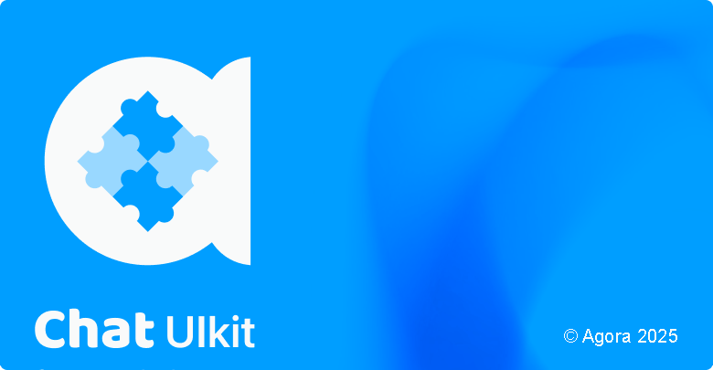

## General design principles

**Universal features and behaviors**

Incorporate universal and common features and behaviors into the design to ensure consistency and ease of use.

**Customizability**

Enable easy customization of styles to allow users to tailor the interface to their preferences.

**User autonomy**

Avoid making decisions on behalf of users regarding business models or preferences, allowing them a full control over their choices.

## 1. Global style (Style)

### 1.1. UIkit color specification

#### 1.1.1. Color configuration instructions

##### 1.1.1.1. Color categories

Colors are categorized into eight types:

- **Theme colors**: Primary, secondary, error
- **Primary gradients**: Eight options
- **Transparent colors**: Alpha colors for the light and dark themes
- **Neutral colors**: Neutral and special neutral

##### 1.1.1.2. Color mode (HSLA model)

Colors are specified using the HSLA model, visualized as a cylinder:

- **Hue**: Circumference of the cylinder (0°-360°)
- **Saturation**: Radius of the cylinder (0% to 100%)
- **Lightness**: Height of the cylinder (0% to 100%)


#### 1.1.2. Theme colors

##### 1.1.2.1. Hue value

Users can set the Hue (0-360) to adjust the theme colors. The Hue value changes the color to fit user scenarios.


##### 1.1.2.2. Saturation

The saturation values are fixed:

- **Primary, secondary, error**: 100%
- **Neutral**: 8%
- **Special neutral**: 36%


##### 1.1.2.3. Lightness

Thirteen levels of lighting are available, ranging from 0 (0%) to 100 (100%).


##### 1.1.2.4. Example

Setting the primary hue to 203, secondary hue to 155, and error hue to 350 generates 39 theme colors.


#### 1.1.3. Primary gradient color

The gradient theme color is a gradient color derived from the primary color. It is a linear gradient with 8 possible directions:


##### 1.1.3.1. Start color

The start color should match the primary color.

 

##### 1.1.3.2. End color

Users can configure the end color hue. The brightness is fixed.

 

##### 1.1.3.3. Gradient configuration

Users can configure the end color hue for gradient effects.

##### 1.1.3.4. Example

End color hue 233 with the downward gradient direction produces the following effect:


#### 1.1.4. Transparent color (Alpha)

##### 1.1.4.1. Alpha colors

Used for the modal background and the light prompt background. There are two categories: Alpha onlight and Alpha ondark.

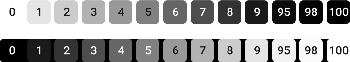

### 1.1.5. Neutral colors

#### 1.1.5.1. Neutral

A neutral color only has hue as a configurable item. The saturation is fixed at 8%.

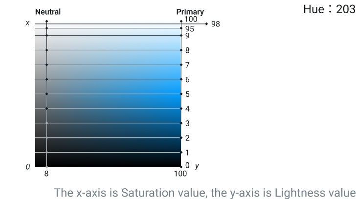

#### 1.1.5.2. Example

If the primary hue is 203 and the neutral hue is also 203, then users get the following color options:


### 1.1.6. Neutral special

Neutral Special is mainly used to emphasize the information that is lower than Primary and Secondary, such as the current page status, the nickname of the message sender, etc. The default Hue value of Neutral Special is similar to that of Primary, and it is recommended that you set a Hue value similar to the theme color to achieve a matching of the theme color and the neutral color system.

#### 1.1.6.1. Example

For a primary hue of 203 and a neutral special hue of 220:


## 1.2. Theme

There are two themes - rounded and hard. Each comes with light and dark modes.

### 1.2.1. Rounded theme

Uses larger rounded corners for a soft, light appearance.

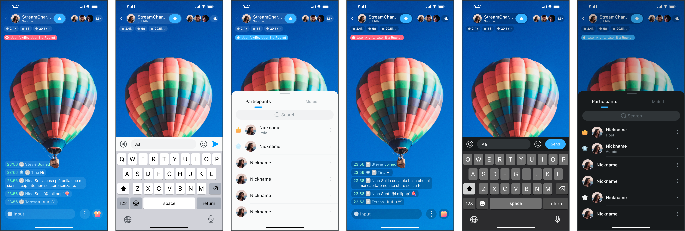

### 1.2.2. Hard theme

Avoids large rounded corners for a tough, solid look.


## 1.3. Icon

### 1.3.1. Icon template

Icons follow the Material Icon Font template with a 24-grid base and a 1.5-grid stroke.


### 1.3.2. Icon naming

Icons should be named descriptively, avoiding fixed operational behaviors.


## 1.4. Typography

### 1.4.1. Font family

#### 1.4.1.1. iOS font family

- **Western**: SF Pro
- **Right-to-Left**: SF Arabic, SF Hebrew
- **Chinese**: PingFang (SC, TC, HK)

#### 1.4.1.2. Android font family

- **Western**: Roboto
- **Right-to-Left**: Noto Sans Arabic, Noto Sans Hebrew
- **Chinese**: Noto Sans (SC, TC, HK)

#### 1.4.1.3. Web font family

- **Western**: Roboto
- **Right-to-Left**: Noto Sans Arabic, Noto Sans Hebrew
- **Chinese**: Noto Sans (SC, TC, HK)

### 1.4.2. Font size

#### 1.4.2.1. Minimum font size

- **Mobile**: 11
- **Web**: 12

#### 1.4.2.2. Size rules

Increase the font size in increments of 2: 10, 12, 14, 16, 18, 20.

### 1.4.3. Font weight

Divided into regular (400), medium (510), and semibold (590). Use approximate values if exact weights are not supported.

### 1.4.4. Line height

Line heights are fixed per font size:

- **11**: 14
- **12**: 16
- **14**: 20
- **16**: 22
- **18**: 26
- **20**: 28

### 1.4.5. Font role

Roles include headline, title, label, and body. Use based on the component context and information importance.

### 1.4.6. Font token

Set font typesetting tokens as shown below:


## 1.5. Effects

### 1.5.1. Background blur

Used for components with Alpha color backgrounds to reduce interference.


```css
/* Background Blur */
backdrop-filter: blur(20);
```

## 1.5.2. Shadow

Shadows are applied to alerts, pop-ups, drawers, and others, to distinguish levels and highlight components in focus.

### 1.5.2.1. Shadow size

Shadows are categorized into three types: Small, medium, and large. The general principle is the following: The smaller the component, the more recommended it is to use a small shadow, and vice versa. Additionally, the size of the rounded corners affects the shadow recommendation.

### 1.5.2.2. Shadow token

To ensure the shadow effect is natural and soft, each shadow has two layers with different offsets, blurriness, and transparency values. There are also two sets of shadows for light and dark modes.

#### Shadow on light

```css
/* shadow/onlight/large */
box-shadow: 0 24px 36px rgba(Neutral3, 0.15), 8px 0 24px rgba(Neutral1, 0.1);

/* shadow/onlight/medium */
box-shadow: 0 4px 4px rgba(Neutral3, 0.15), 2px 0 8px rgba(Neutral1, 0.1);

/* shadow/onlight/small */
box-shadow: 0 1px 3px rgba(Neutral3, 0.15), 1px 0 2px rgba(Neutral1, 0.1);
```

#### Shadow on dark

```css
/* shadow/ondark/large */
box-shadow: 0 24px 36px rgba(Neutral4, 0.15), 8px 0 24px rgba(Neutral1, 0.1);

/* shadow/ondark/medium */
box-shadow: 0 4px 4px rgba(Neutral4, 0.15), 2px 0 8px rgba(Neutral1, 0.1);

/* shadow/ondark/small */
box-shadow: 0 1px 3px rgba(Neutral4, 0.15), 1px 0 2px rgba(Neutral1, 0.1);
```


## 1.6. Radius

### 1.6.1. General rounded corners

Rounded corners are categorized into six values: None (r=0), extra small (r=4), small (r=8), medium (r=12), large (r=16), and extra large (r=½ height). Typically, all four corners of a component share the same radius.

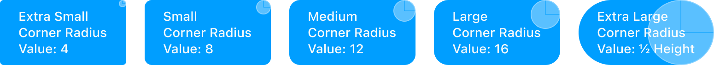

#### 1.6.1.1. Extra small (r=4)

Typically applies to the following:

- Button (small radius)
- Input (small radius)
- Float (small radius)
- Message bubble (small radius)
- Avatar (small radius)
- Popover
- Global broadcast (small radius)

#### 1.6.1.2. Small (r=8)

Typically applies to the following:

- Alert (small radius)
- Drawer (small radius)

#### 1.6.1.3. Medium (r=12)

#### 1.6.1.4. Large (r=16)

Typically applies to the following:

- Input area (large radius)
- Alert (large radius)
- Drawer (large radius)
- Float (large radius)

#### 1.6.1.5. Extra large (r=½ height)

Typically applies to the following:

- Input area (large radius)
- Alert (large radius)
- Drawer (large radius)
- Message bubble (large radius)

### 1.6.2. Special rounded corners

Special rounded corners are applied to chat message components with background color:

- Message bubble (large radius)

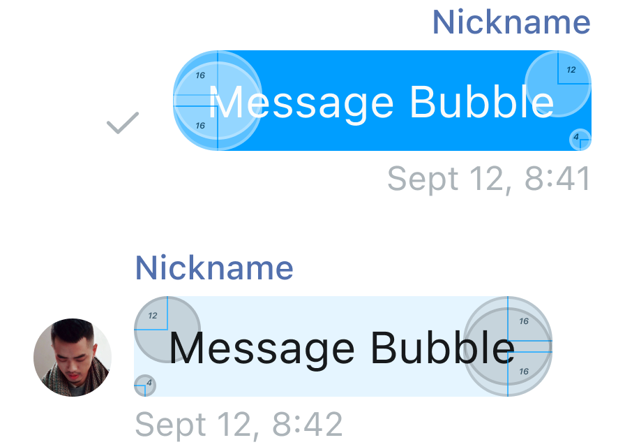

## 2. Widgets

Widgets are basic visual interaction modules.

### 2.1. Button (Bottom)

Button components come in three types: Regular button, text button, and icon button. Each button has five states: Enabled, hovered (only for web), pressed, loading, and disabled. There are also three button sizes: Large, medium, and small to fit different containers.

### 2.1.1. Regular button

Regular buttons are divided into two types: Primary and secondary.

#### 2.1.1.1. Primary button

Used for recommended actions. Typically, the background color is the theme color (Primary5/Primary6) or a gradient theme color. It appears grayed out when disabled. Rounded corners can be configured, and icons can be added as needed.

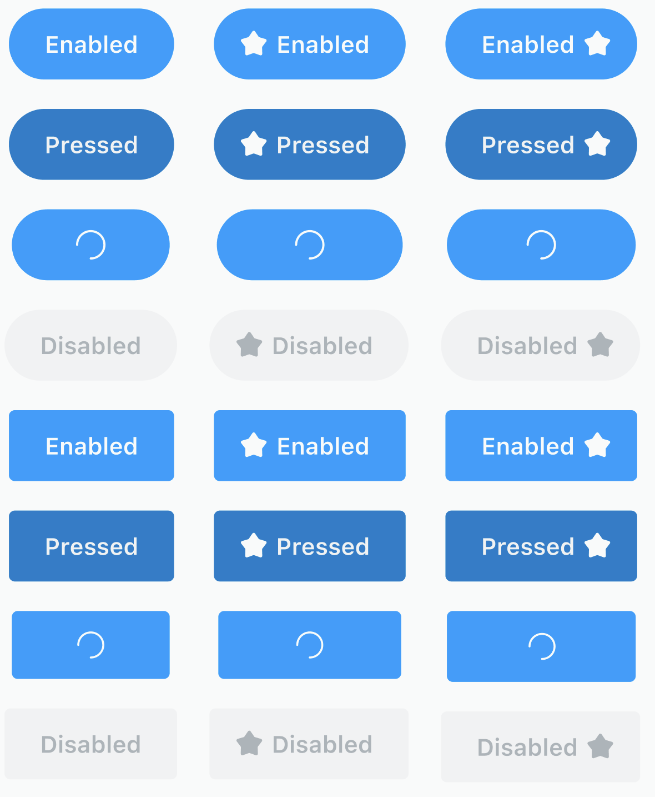

#### 2.1.1.2. Secondary button

Used to assist primary operations. They usually do not appear alone. The background color is typically light (Neutral98) or dark (Neutral1) and includes a stroke. They appear grayed out when disabled. Rounded corners can be configured, and icons can be added as needed.

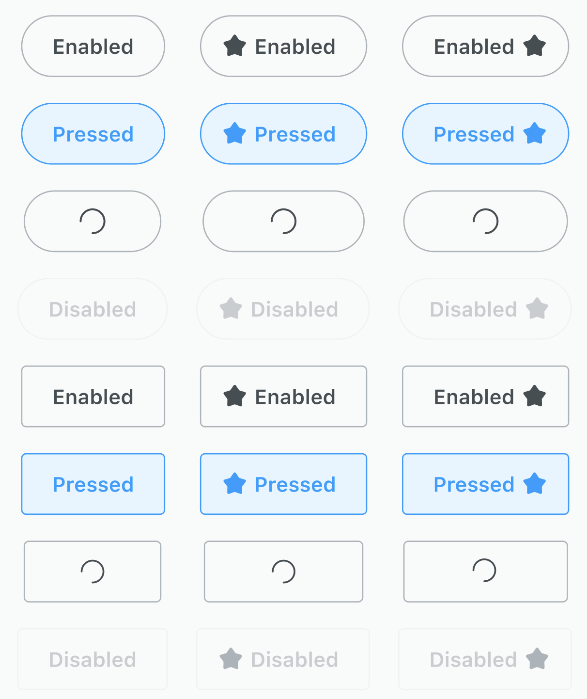

### 2.1.2. Text button (Text)

Text buttons only have foreground color and are divided into primary and secondary. They are used for more frequent routine actions (for example, form steps, message display) or as secondary actions when a regular button is present on the page.


### 2.1.3. Icon button (Icon)

Icon buttons are used when space is limited but buttons are necessary, such as for keyboard switching, top bar operations, form actions, or clearing inputs.


Note: On the web, icon buttons should be used with a popover to explain their specific function clearly.

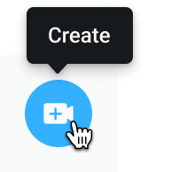

### 2.2. Input box

Used for entering short text. It comes in three sizes: Large, medium, and small. The style includes options for background color, stroke color, rounded corners, and six status types: 

- Out of focus and unfilled,
- Out of focus and filled, 
- Focused and unfilled, 
- Focused and filled, 
- Disabled and filled, 
- Disabled and unfilled.

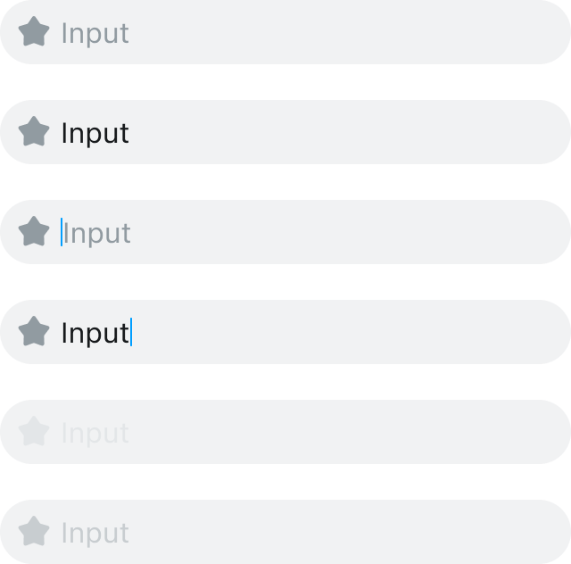

### 2.3. Input area

Used for entering larger amounts of text, such as in forms or content publishing. The style includes options for background color, stroke color, rounded corners, and maximum character count display. The status is divided into six types: 

- Out of focus and unfilled,
- Out of focus and filled, 
- Focused and unfilled, 
- Focused and filled, 
- Disabled and filled, 
- Disabled and unfilled.


### 2.4. Avatar

Avatars display user or operation item information. They are often placed on personal info pages or related list items. The corner radius can be extra small (r=4) or extra large (r=½ height). The size of the avatar can be configured, but the ratio remains 1:1.

#### 2.4.1. Picture avatar

Displays a picture when user avatar information is available.


#### 2.4.2. Character avatar

Displayed when the user has not uploaded an avatar. Character avatars can be single-character or double-character.

#### 2.4.3. Combined avatars

Automatically generated avatars for group chats when no user avatar data is available.


#### 2.4.4. Icon avatar

Used for empty states when no user avatar information is available or for form items with icons.


#### 2.4.5. Avatar badge

Avatars can include badges to reflect online and offline status. Badges can be placed in the lower right or upper right corner.

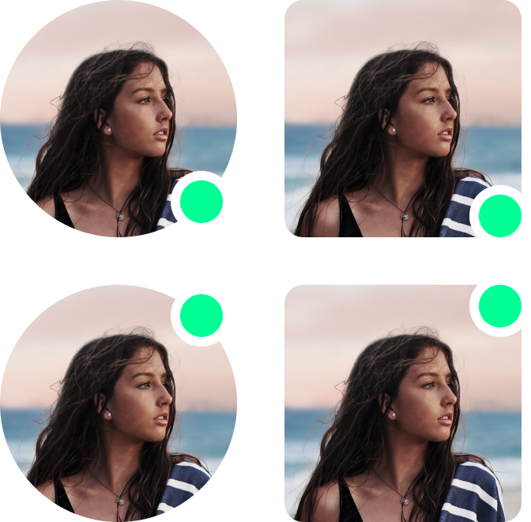

### 2.5. Action sheet

The action sheet displays multiple operation items in a modal form. Each item has four states: Enabled, pressed, disabled, destructive, and a special cancel type. Configurable items include the following:

- Display of icons
- Presence of dividing lines (strokes)

This component is available only on mobile devices.


### 2.6. PopMenu

The PopMenu displays non-recurring options or lists. It supports configuration for whether an icon appears on the left of the operation item.

### 2.7. Popup window (Alert)

Popup notifications are modal prompts for key information or user actions. Configurable items include the following:

- Description
- Input box
- Up to three operation items

Style options include matching rounded corners of the input box and operation buttons with the popup window.


### 2.8. Popover

A floating prompt that is only displayed when the mouse hovers over the relevant component. It supports up to two fields (Title and Subtitle). Because it is a floating prompt, the background color must have a visible contrast with the base color. According to the position of prompt on the page, it is divided into 10 directions (upper left, upper, upper right, upper right, right, lower right, lower right, lower, lower left, lower left, left, upper left).


### 2.9. Emojis

#### 2.9.1. Twemoji [↗](https://github.com/twitter/twemoji)

Twemoji, an open-source emoji set free for commercial use, is used as the base for emojis. By default, 52 emojis are built in. Users can replace, add, or remove emojis from the 3,245 available in Twemoji.


#### 2.9.2. Emoji template

For custom emojis or replacing Twemoji, use the provided templates.


#### 2.9.3. Expression component state

Expression components have four states: 

- Enabled, 
- Hovered (web only), 
- Pressed, 
- Focused. 

On hover, the background color darkens; when clicked, it lightens; and on focus, it changes to the Key Color.

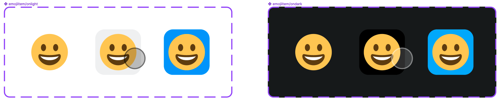

## 3.1 Message component

This case supports sending text (including emoji), gift messages, global broadcasts, and other message types. All configuration items are designed to ensure the readability of the message text.

### 3.1.1. Text message

The display style of text messages can be configured with the following items: Background color (Alpha0-100), foreground color (Neutral0-100), corner radius, font size (body large, body medium, body small), and padding of message bubbles. The display content items that can be made bigger or smaller include: label, badge, and avatar. Title and description are required. The order of display cannot be modified.


### 3.1.2. Audio message

Audio message are currently not supported. 

### 3.1.3. Gift message

Gift messages are divided into two types according to different usage scenarios.

#### 3.1.3.1. Non-resident gift message style

This is a common style for domestic live broadcasting scenes. It can be set to large or small. The default staying time is 3 seconds (configurable). When events are concurrent, they are displayed in a queue. A maximum of 2 gift messages can be displayed at the same time.


#### 3.1.3.2. Permanent gift message style

The style and configurable items are the same as those of text messages, except that stickers are added at the end.


### 3.1.4. Message list

The component style of the messages floating on the live stream after being combined in the chronological order. It is divided into two types of styles.

### 3.1.4.1. Gift messages and text messages displayed separately

The default spacing between messages in this component is 4 (configurable), and the overall height of the text message area to the screen ratio can be configured. Gift non-resident messages are always displayed at the top. The right side of the message column must be reserved to place custom message components, so the left and right spacing of the messages cannot be configured; it is fixed at 16 on the left and 78 on the right.


### 3.1.4.2. Gift message and text message combined 

The default spacing between messages in this component is 4 (configurable), and the overall height of the text message area in the screen ratio can be configured. An area on the right side of the message column must be reserved for custom message components, so the left and right spacing of the messages here cannot be configured; it is fixed at 16 on the left and 78 on the right.


### 3.1.5. Message action

Long-press oa message to pop up the action sheet to display the message-related actions. The title bar at the top displays the details of the message.


#### 3.1.5.1. Report form

The report form is a secondary page for message actions. It provides radio buttons for selecting the reason for the report. The number of options can be increased or decreased. After selecting, the report can be submitted.


### 3.1.6. Global message

Global broadcasts are non-resident messages sent by super administrators that are visible to all live broadcast rooms at the same time. They are divided into three types (specific types need to be defined by the developer) and distinguished by the icon on the left and the background color. The configurable items for style are: Rounded corners, background color, and foreground color. The configurable item for information display is the icon on the left; users can modify the icon resource map when customizing the broadcast type. Messages only support single-row display. If the broadcast content exceeds the display range of one screen, the subtitles will be displayed in the scrolling mode, and the scrolling rate can be configured.


This message usually appears at the top of the video stream on mobile devices; on the web, it appears at the top of the chat window as a floating layer.


## 3.2. Footer bar

The bottom bar is the bottom display area. The configurable style items are background color, foreground color, rounded corners, icons, and whether to add the background blur effect. Sending a message is a required item, gift message is an optional item. Supports up to 4 user-definable actions.


## 3.3. Input bar and audio input

### 3.3.1. Input bar

#### 3.3.1.1. Mobile text input bar

The mobile text input bar includes text input and up to 4 keyboard switching operations (including two configurable items, emoji keyboard, and sending a voice message), and an optional send button in the text or icon form.


When a single line of text cannot fit, the text can be wrapped. The corresponding input area will accumulate line heights and support up to 4 lines of text. When the input text exceeds 4 lines, the text is displayed in pages, and the user can scroll to view the text.


The style supports configuring the dividing line (Stroke), rounded corners, stroke (Stroke), and foreground/background color of the internal input area and the send button.


#### 3.3.1.2. Web page text input bar

The web text input bar includes text input, up to 4 keyboard switching operations (including three optional items: Emoji keyboard, send a voice message, send a gift, and another user-customizable item), and an optional send button in the icon form.


When a single line of text cannot fit, the text can be wrapped. The corresponding input area will accumulate line heights and support up to 4 lines of text. When the input text exceeds 4 lines, the text is displayed in pages, and the user can scroll to view.


## 3.4. Emoji keyboard

The emoji keyboard is a keyboard for sending emojis built in the app. The content supports the increase or decrease of the number of emojis. The send and backspace buttons at the bottom support the modification of the rounded corners. At the same time, it should meet the requirements of accessing third-party emoji/sticker libraries.


This keyboard is different from the system's built-in emoji input keyboard. The emojis entered through this component will not be synchronized with the system's emojis. To meet legal requirements for copyright, please do not use emojis that are not declared open-source and cannot be used for free commercial purposes (not limited to resource images or source code) in the app. For example, integrating Apple emojis in your own app may prevent the app from being listed on the Apple App Store.

## 3.5. Sticker keyboard 

### 3.5.1. Single sticker

A single sticker is used to display a single gift message style, and the displayed information includes the gift picture, gift name (Title), and gift value (Subtitle). If the gift picture is not rendered, the default picture is displayed. The gift value can be configured with a value icon. The status of a single sticker is **Enabled**, **Disabled** (mainly used for slow sending, which needs to be implemented additionally), and **Focused**. When **Focused**, the send button is displayed.


### 3.5.2. Sticker picker

In this case, the sticker keyboard is mainly used to send gift messages. The content supports adding or deleting gift categories (swipe horizontally to switch gift categories) and the number of gifts in a category (swipe up and down to view more gifts).


## 3.6 Member list 

### 3.6.1. List filter (Tab)

The top of the member list supports member category filtering, which can be switched by clicking the tab or sliding the entire list left or right. At least one tab is supported, and left or right sliding is supported when there are more than four tabs.


### 3.6.2. Search bar

The search bar is usually located at the top of the list and is divided into four states: Enabled and unfilled, enabled and filled, focused and unfilled, and focused and filled. The back button on the left and the action button on the right can be configured according to the nature of the list component. The style can be configured with the dividing line, the size of the input box corner radius, the input box background color, and the increase or decrease of the stroke.


### 3.6.3. Member item

The list item displays the current member information. The information that can be displayed includes badge, avatar, user name, and user details. User name is a required item, and other information is configurable. The right side of the list item supports action buttons, and the list item supports click/long-press events.


In terms of style, list items can be configured with a dividing line (Stroke), and avatars support rounded corners.


### 3.6.4. Member list
 
Combine points 3.6.1.-3.6.3. to form an entire list item.

#### 3.6.4.1. Loading the entire list


#### 3.6.4.2. Empty list


#### 3.6.4.3. List pull failed


#### 3.6.4.4. Slide up to load the list


#### 3.6.4.5. Expand the list to full screen


## 4. Design Resources

For design resources, please see the [Figma project](https://www.figma.com/@agora_chat).
