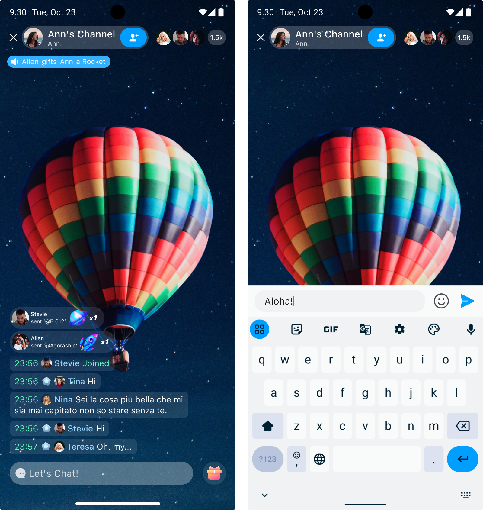

# Quickstart

With UIKit, you can easily implement user interaction in a chat room. This page describes how to implement sending chat room messages.

## Prerequisites

- Agora Chat SDK (included);
- Flutter 3.3.0 or above;
- A valid Agora project with users and tokens generated. See [Enable and configure Chat](https://docs.agora.io/en/agora-chat/get-started/enable) and [Secure authentication with tokens](https://docs.agora.io/en/agora-chat/develop/authentication) for details. 

## Implementation

Take the following steps to implement message sending:

1. Create a project:

    ```
    flutter create --platforms=android,ios room_project
    ```

1. Install UIKit into your project.

    Enter the project and execute the following command:
    
    ```
    flutter pub get add chatroom_uikit
    ```
   
1. Initialize UIKit.

   You can initialize `chatroom_uikit` when your application loads or before using it. During initialization, pass in your app key.

   ```dart
    void main() async {
      assert(appKey.isNotEmpty, 'appKey is empty');
      await ChatroomUIKitClient.instance.initWithAppkey(
        appKey,
      );
      runApp(const MyApp());
    }
   ```

1. Log in to UIKit.

   Before entering the `chatroom_uikit` chat room, you must first log in with your user ID and user token. If you have integrated Chat SDK, the corresponding user IDs can be used to log into UIKit. 

   You can use `userId` and `password` or `userId` and `token` to log in.

   - Log in with `userId` and `password`:

     ```dart
         // ...
            //Set the current user's avatar and nickname
             UserEntity user = UserEntity(userId, nickname: nickname, avatarURL: avatarURL);
            try {
              // Log in with password
              await ChatroomUIKitClient.instance.loginWithPassword(
                userId: userId!,
                password: password,
                userInfo: user,
              );
            
            } on ChatError catch (e) {
              // error.
            }
         ```

   - Log in with `userId` and `token`:
  
     ```dart
         //Set the current user's avatar and nickname
          UserEntity user = UserEntity(userId, nickname: nickname, avatarURL: avatarURL);
         try {
           await ChatroomUIKitClient.instance.loginWithToken(
             userId: userId,
             token: token!,
             userInfo: user,
           );
         
         } on ChatError catch (e) {
           // error.
         }
         ```

1. Set the theme color.

    UIKit provides a light and a dark theme by default. Set it through `ChatUIKitTheme`:

    ```dart
    ChatUIKitTheme(
      child: child,
    ),
    ```
   
    If you need to change the theme color, you can modify the `hue` value of `ChatUIKitColor`:

    ```dart
    ChatUIKitColor({
      this.primaryHue = 203,
      this.secondaryHue = 155,
      this.errorHue = 350,
      this.neutralHue = 203,
      this.neutralSpecialHue = 220,
      this.barrageLightness = LightnessStyle.oneHundred,
      this.isDark = false,
    });
    ```

1. Use the `chatroom_uikit` component

   1. Make sure that the `ChatUIKitTheme` component is in the parent node of your project. It is recommended to put `ChatUIKitTheme` in the root node of the project.

      ```dart
          @override
            Widget build(BuildContext context) {
              return MaterialApp(
                builder: (context, child) {
                  return ChatUIKitTheme(child: child!);
                },
                home: const MyHomePage(title: 'Flutter Demo Home Page'),
                ...
              );
            }
          ```
   
   1. When you need to use `chatroom_uikit`, create `ChatroomController` first, then make `ChatRoomUIKit` the root node of the current page, and make other components to be subcomponents of `ChatRoomUIKit`.

      ```dart
               // roomId: the room id that needs to be added;
               // ownerId: homeowner id;
               ChatroomController controller = ChatroomController(roomId: roomId, ownerId: ownerId);
               
               @override
               Widget build(BuildContext context) {
                 Widget content = Scaffold(
                   resizeToAvoidBottomInset: false,
                   appBar: AppBar(),
                   body: ChatRoomUIKit(
                     controller: controller,
                     child: (context) {
                       // Build pages in subcomponents, such as gift pop-ups, message lists, etc.
                       return ...;
                     },
                   ),
                 );
               
                 return content;
               }
               ```
   
1. Send a message

   Enter the message content at the bottom of the screen and click **Send** to send the message.

   