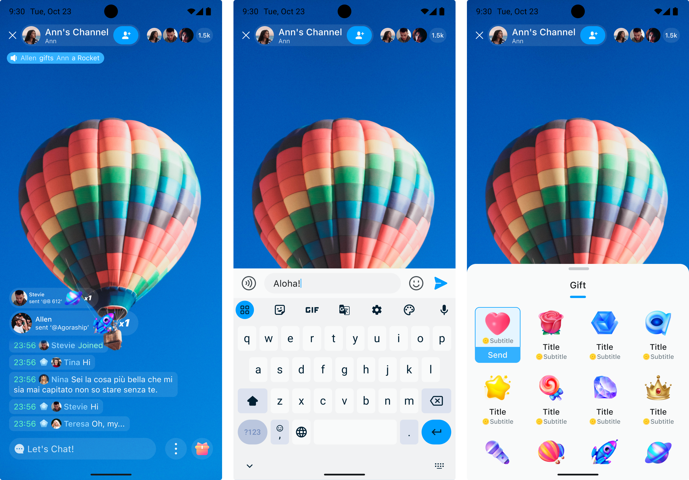

# Theme

UIKit for chatroom has built-in light (default) and dark themes.

- Light

  

- Dark

  


## Switch the theme

Switch the built-in light or dark theme of UIKit in the following way:

```dart
// ...
// Set a theme 
ChatUIKitTheme(
  color: ChatUIKitColor.light() // Light theme, dark theme: ChatUIKitColor.dark()
  child: child, // All chatroom_uikit components need to be child components of the theme component
),
```

If you need to change the theme color, you can modify the `hue` value of `ChatUIKitColor`:

```dart
    ChatUIKitColor({
      this.primaryHue = 203,
      this.secondaryHue = 155,
      this.errorHue = 350,
      this.neutralHue = 203,
      this.neutralSpecialHue = 220,
      this.barrageLightness = LightnessStyle.oneHundred,
      this.isDark = false,
    });
```

See also [Design guide](../design-guide.md) and [design resources](https://www.figma.com/community/file/1322495388317476706/chatroom-uikit). 