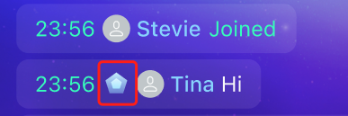

# Configurable items

`Appearance.swift` is the class that holds all the configurable items. Modify the properties before initializing `ChatroomView`.

# Message View

- `Appearance.giftDialogContainerConstraintsSize`: The size of the gift pop-up window.

   

- `Appearance.giftPlaceHolder`: The default gift image.

   

- `Appearance.avatarPlaceHolder`: The default avatar image.

   

- `Appearance.userIdentifyPlaceHolder`: The default image for user identity.

   

- `Appearance.messageDisplayStyle`: The display style of the message area cell. You can choose to display or hide the timestamp, user ID, and user avatar.

   

- `Appearance.notifyMessageIcon`: The default icon on the left side of the global broadcast notification.

   

- `Appearance.defaultMessageActions`: The data source of the pop-up window that pops up after long-pressing the message.

   

- `Appearance.actionSheetRowHeight`: A single `ActionSheet` line height.

   

- `Appearance.reportTags`: The type of illegal information displayed in the message report pop-up window.

   

- `Appearance.messageTranslationLanguage`: The target translation language. You can set the corresponding target translation language according to the language environment of your user's device. Currently, the chat room UIKit supports simplified Chinese, traditional Chinese, English, Russian, German, French, Japanese, and Korean.

## Text input view

- `Appearance.maxInputHeight`: The maximum height of the input box.

   

- `Appearance.inputPlaceHolder`: The default text displayed in the input box. The default value of this option is Aa.

   

- `Appearance.inputBarCorner`: The corner radius of the input box. The default `large` value is half the height of the input box.

   

- `Appearance.emojiMap`: If you want to replace all the emojis, you can configure this map. The key is the fixed string in the code comment, and the value can be passed in different `UIImage` objects.

   

## User list

- `Appearance.defaultOperationUserActions`: Actions that the chat room owner can perform on ordinary members in the member list.

   

## Popups

- `Appearance.pageContainerTitleBarItemWidth`: The width of a single item `PageContainerTitleBar` at the top of each popup page.

  

- `Appearance.pageContainerConstraintsSize`: The size of the `PageContainersDialogController` pop-up window.

  

