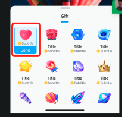
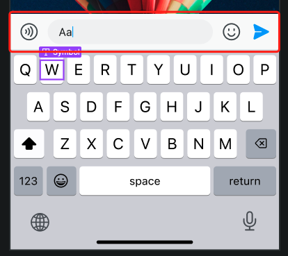
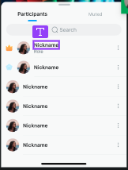

# Customizations

You can customize some controls in `ChatroomUIKit`, add your own business logic, and implement personalized business needs.

## Customizable controls

Currently, the following controls in existing components support customization:

- `GiftMessageCell`: The gift area cell.

  

- `GiftEntityCell`: The gift view cell.

  

- `MessageInputBar`: The chat input box.

  

- `ReportOptionsController`: The message reporting controller.

  
  
- `ParticipantsController`: The chat room member list/blacklist.

  

- `ChatroomParticipantsCell`: The chat room member list/blacklist cell.

  

- `GiftsViewController`: The gift view controller class. 

   The way to customize the gift container is similar to other controls. You need to inherit `GiftsViewController` and create a new class, then pass in an object of the new class when calling `DialogManager.shared.showGiftsDialog(titles: ["Gifts","1231232"], gifts: [self.gift1,self.gift2])`.
   
   Make sure that the gift service on your server is processed before calling the gift message sending API provided by UIKit.
  
## Customization examples

The following is an example of customizing the gift cell. To customize, inherit `GiftMessageCell`, add your own logic, and register the new class in `ChatroomUIKit` to replace the original one.


```swift
class CustomGiftMessageViewCell: GiftMessageCell {
    lazy var redDot: UIView = {
        UIView().backgroundColor(.red).cornerRadius(.large)
    }()
    
    override init(style: UITableViewCell.CellStyle, reuseIdentifier: String?) {
        super.init(style: style, reuseIdentifier: reuseIdentifier)
        self.addSubview(redDot)
    }
    
    override func refresh(item: GiftEntityProtocol) {
        super.refresh(item: item)
        self.redDot.isHidden = item.selected
    }
}
// Call this method before creating a ChatroomView or using other UI components.
ComponentsRegister.shared.GiftMessagesViewCell = CustomGiftMessageViewCell.self
```
