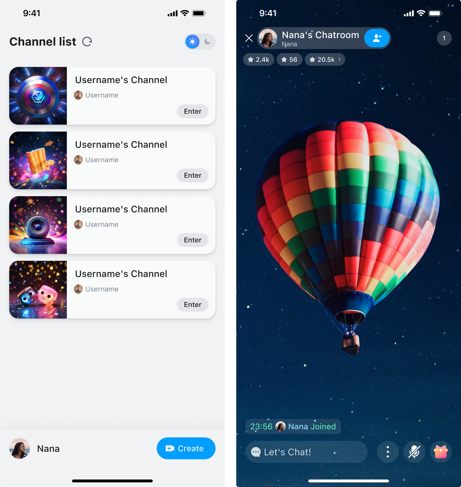
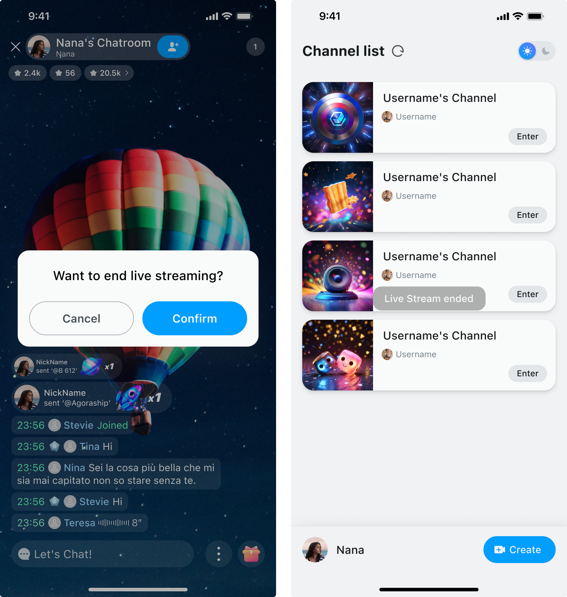
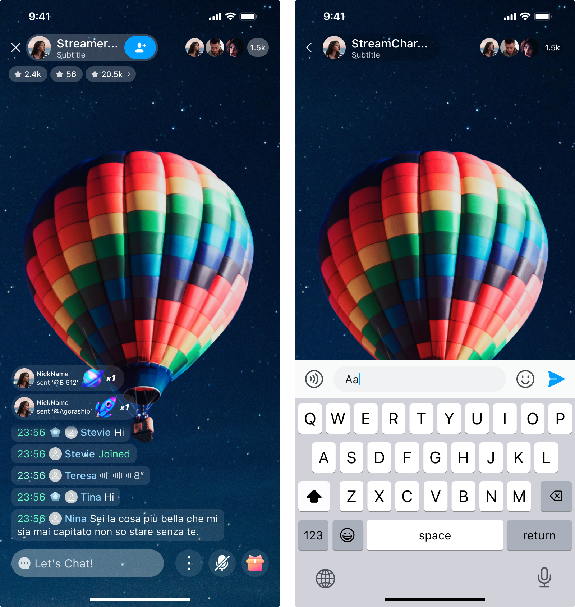
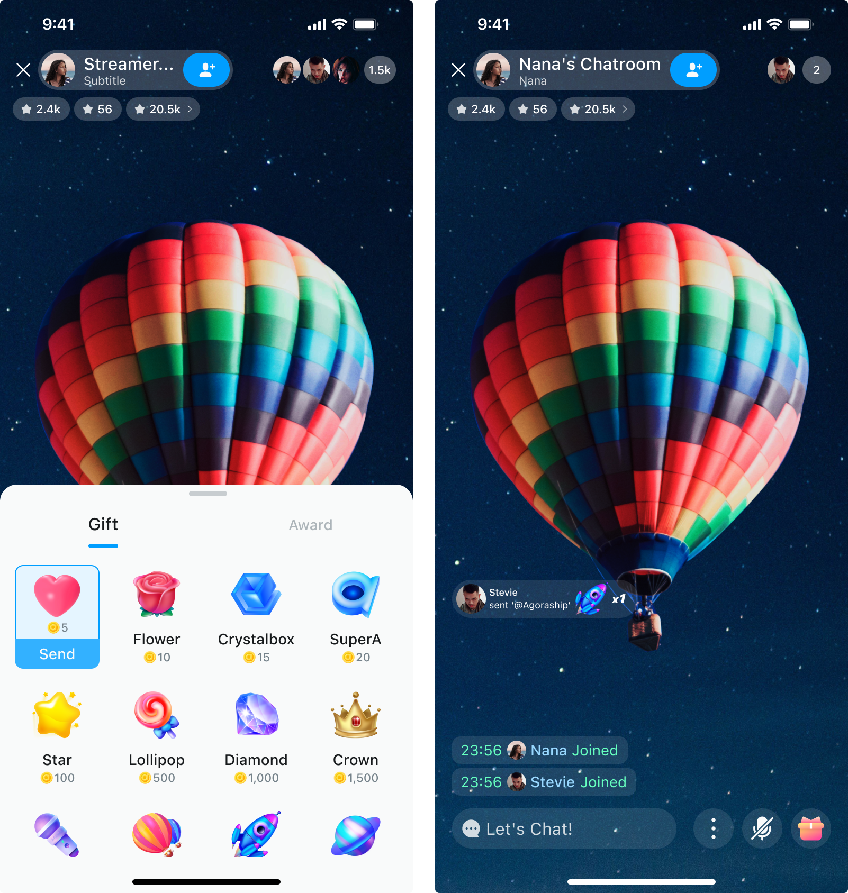
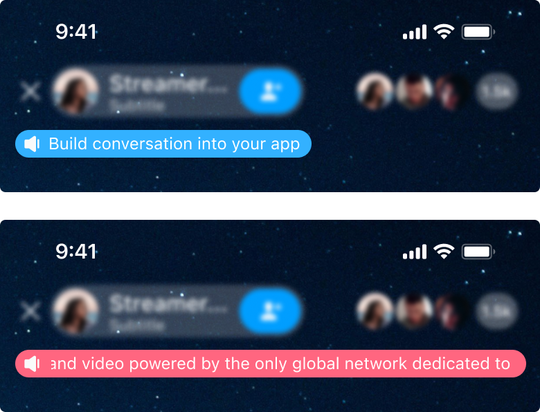
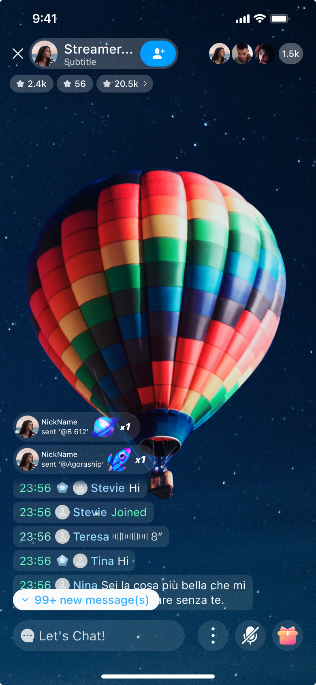
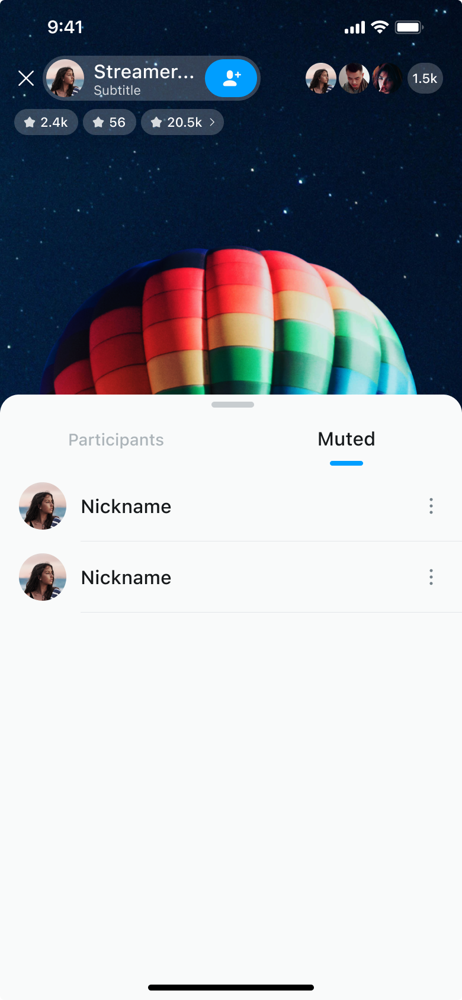

# Product features

UIKit provides the following features: 

## General

### Create a chat room

UIKit does not provide the feature of creating a chat room. Call the [Chat SDK API](https://docs.agora.io/en/agora-chat/restful-api/chatroom-management/manage-chatrooms#creating-a-chat-room) instead.

### Leave a chat room

Users in a chat room can leave the chat room on their own or be removed by the chat room owner.

### Disband a chat room

UIKit does not provide the feature of disbanding a chat room. Call the [Chat SDK API](https://docs.agora.io/en/agora-chat/restful-api/chatroom-management/manage-chatrooms#deleting-the-specified-chat-room) instead.

### Send a message

Users send text and emoji messages to other users in the chat room. Sending messages is a basic behavior of communication and exchange in the chat room, which enables participants to share information, express opinions, ask questions, share content, or establish connections with others.

In UIKit, users can edit text messages by tapping an input box to trigger the keyboard. Alternatively, they can tap an emoji button to switch the keyboard, edit emoji information, and then tap **Send** to send the message.

Users can choose to display or hide the message sending time (`HH:MM` format), user ID, and avatar.

### Give a gift

Users can express their appreciation or support to the host or other users in the chat room by giving virtual gifts representing a specific amount of money.

This not only serves as encouragement and support for other users, but also becomes one of the main sources of income for hosts and live broadcast platforms.

In UIKit, 12 different virtual gifts are provided by default. At the same time, users can customize the style, name, and amount of virtual gifts.

### Send a global broadcast

Global broadcasting is sending messages or notifications to all users in all chat rooms within the app. It can be used to convey important information, announcements, reminders, or emergency notifications.

Global broadcasts usually use attention-grabbing logos or formats to distinguish them from ordinary chat messages.

In UIKit, you can customize the global broadcast logo and content. The default display strategy for global broadcast messages is as follows:

- If the content fits in the screen, the message will stay visible for 3 seconds.
- If the content needs to be scrolled, the message will stay for 2 seconds to display the beginning, then scroll at a speed of 10 characters per second, and stay for another 2 seconds after the scrolling is completed.
- If there are multiple global broadcast messages at the same time, they will be displayed in turn, in the order of sending.

You can also call the [REST API](https://docs.agora.io/en/agora-chat/restful-api/message-management#send-a-chat-room-message) to send global broadcasts.

### Unread messages

In UIKit, when the user slides the screen to view messages, the position of the message area will change, and the new messages generated at this time will be marked as unread messages. At the same time, an unread message button will appear in the lower right corner of the message area. This button displays the number of unread messages. After the user taps it, the message chain is scrolled to the latest message (usually the bottom of the message area) to ensure that unread messages are not missed.

If the number of unread messages does not exceed 99, the button will display the actual number. If it reaches 100 or more, it will display **99+**.

### Muted list

This represents a list of banned users. When a user violates the chat room rules, the chat room owner bans them, that is, adds them to the banned list. Banned members cannot send messages in the chat room, but they can still stay in the chat room and view messages.

In UIKit, by default, clicking the member button in the upper right corner of the chat room interface triggers the muted list. The user can view all muted members in the chat room in the list, including their identities, avatars, and nicknames. At the same time, the user can click the management function button on the right side of the member to trigger the unmute option.

### Dark theme

Dark theme is an interface design choice that aims to provide a visual appearance with lower contrast and darker tones. Users can enable or disable the dark theme as needed.

UIKit supports one-click switching to the dark mode. The default style of UIKit is the light theme. After switching to the dark one, all elements in the chat room interface will be replaced with dark style design to provide users with a comfortable visual experience.

