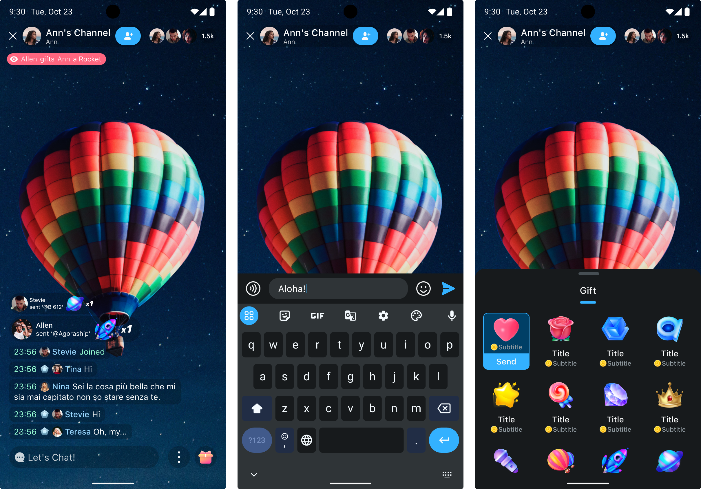

# Theme

UIKit for chatroom has built-in light (default) and dark themes.

- Light

  

- Dark

  

## Switch to a built-in theme

To switch from the current theme to the built-in light or dark theme of `ChatroomUIKit`, use the following method:

```swift
Theme.switchTheme(style: .dark)
```

```swift
Theme.switchTheme(style: .dark)
```

## Switch to a custom theme

When customizing a theme, refer to the theme colors in the design guide to define the hue values of the following five theme colors.

All colors in UIKit are defined using the HSLA color model, which is a way of representing color using hue, saturation, brightness, and alpha.

- H (Hue): Hue, the basic attribute of color, the degree from `0` to `360` on the color wheel. `0` is red, `120` is green, `240` is blue.

- S (Saturation): Saturation is the intensity or purity of a color. The higher the saturation, the more vivid the color; the lower the saturation, the closer the color is to gray. Saturation is expressed as a percentage value ranging from 0% to 100%. 0% represents grayscale and 100% represents a full color.

- L (Lightness): Lightness is the brightness or darkness of a color. The higher the lightness, the lighter the color; the lower the lightness, the darker the color. Lightness is expressed as a percentage value ranging from 0% to 100%. 0% represents black and 100% represents white.

- A (Alpha): Alpha is the transparency of the color. A value of 0 means completely opaque and 1 means completely transparent.

By adjusting the hue value of the HSLA model, you can achieve precise color control.

```swift
Appearance.primaryHue = 191/360.0
Appearance.secondaryHue = 210/360.0
Appearance.errorHue = 189/360.0
Appearance.neutralHue = 191/360.0
Appearance.neutralSpecialHue = 199/360.0
Theme.switchTheme(style: .custom)
```

## Switch the theme of other views in the app except UIKit

After setting the theme of UIKit, if you want other parts of the app to use the same theme, you can use the following method to ensure that the app uses a unified theme:

1. Register your views in the `Theme` class.

    ```swift
    Theme.registerSwitchThemeViews(view: self)
    ```
   
1. Implement `ThemeSwitchProtocol` in the above view.
    ```swift
    extension YourView: ThemeSwitchProtocol {

    }
    ```
1. In the `switchTheme` method, set the corresponding color for your subview according to the theme type (light, dark, and custom).

See also [Design guide](../design-guide.md) and [design resources](https://www.figma.com/community/file/1322495388317476706/chatroom-uikit). 