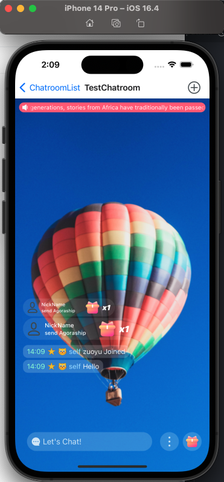
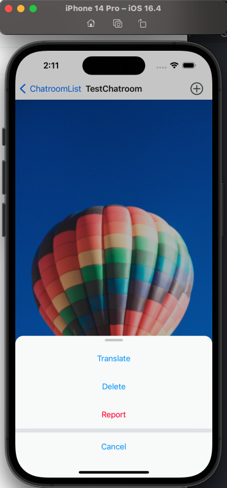
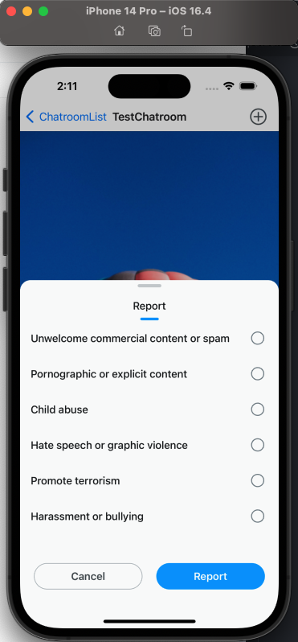
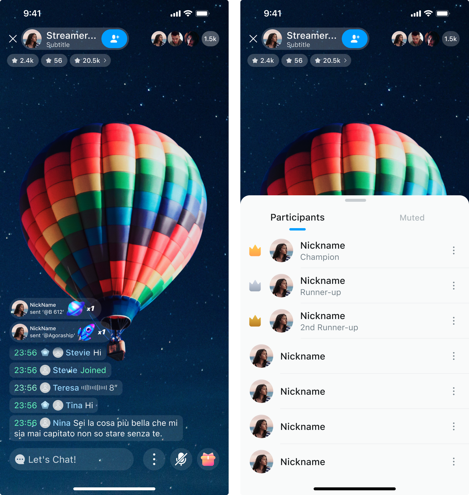
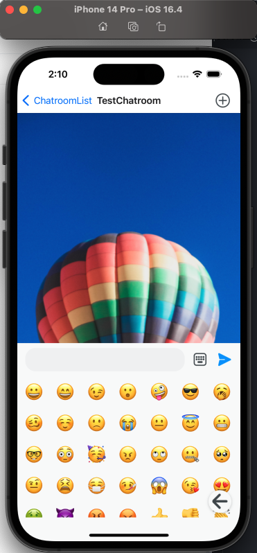
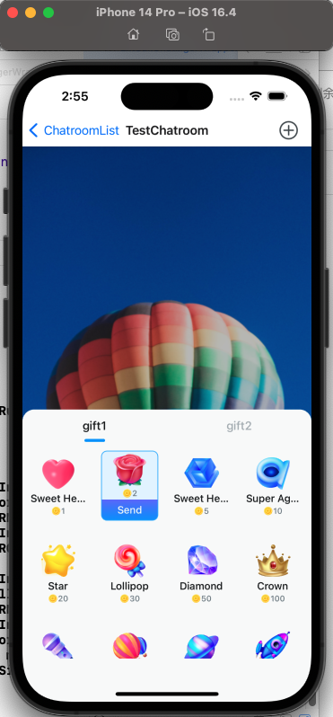

# Configurable items

UIKit contains various properties that you can set according to your needs. In addition to the theme components, this includes the following:

| Component | Description |
|:---:|:---:|
| `I18n` | The language of all UI components can be set here. |
| `Chatroom` | The chat room component integrates gift sending, message list, member list, gift receiving, and other components. |
| `MessageList` | The chat room message area component, used to display sent or received messages. |
| `ParticipantList` | The chat room member list component, including the management of chat room members and muted members. |
| `GiftMessageList` | The chat room gift area component, used to display gifts. |
| `GlobalBroadcast` | The chat room global broadcast component, used to send messages to all chat rooms under the app. |
| `MessageInput` | The message input component, used to send messages. |
| `BottomToolbar` | The toolbar area at the bottom of the chat room. Can be switched with the message input component and supports adding custom buttons. |
| `BottomSheetGift` | The gift sending component. The source of the gift is specified by the developer. |
| `ReportMessage` | The chat room reporting component. |

## Internationalization components

UIKit supports multi-language switching. Currently, English is built-in, and other languages can be added. For example, if you want UIKit to display in English, you can set it as follows:

```typescript
<Container appKey={env.appKey} language={'en'} />
```

If the language is not set, the default system language is used.

For example, if you want to use French for both the UIKit and the application, the settings are as follows:

```typescript
// ...
// Create an app extension language collection.
function createAppLanguage(type: LanguageCode): StringSet {
  if (type === 'fr') {
    return {
      'French text.': 'Text français.',
    };
  }
  return {
    'French text.': 'French text.',
  };
}
// To create a language set for UIKit, find the built-in file `StringSet.en.tsx` and change all `value` to the French version.
export function createUIKitLanguage(type: LanguageCode): StringSet {
  if (type === 'fr') {
    return {
      'Private Chat': 'Private Chat',
      '...': '...',
    };
  }
}
// ...
// Set the specified language and provide language translation sources.
<Container
  appKey={env.appKey}
  language={'fr'}
  languageBuiltInFactory={createUIKitLanguage}
  languageExtensionFactory={createAppLanguage}
/>;
```

## Initialization

The entry point of UIKit is the `Container` component, which is mainly responsible for integrating other components and parameter configuration.

```typescript
export type ContainerProps = React.PropsWithChildren<{
  appKey: string;
  isDevMode?: boolean;
  language?: StringSetType;
  languageBuiltInFactory?: CreateStringSet;
  languageExtensionFactory?: CreateStringSet;
  palette?: Palette;
  theme?: Theme;
  roomOption?: PartialRoomOption;
  avatar?: {
    borderRadiusStyle?: CornerRadiusPaletteType;
  };
  fontFamily?: string;
  onInitialized?: () => void;
}>;
```

```typescript
// Mainly controls whether the components in the `Chatroom` component are loaded.
export type RoomOption = {
  globalBroadcast: {
    isVisible: boolean;
  };
  gift: {
    isVisible: boolean;
  };
  messageList: {
    isVisibleGift: boolean;
    isVisibleTime: boolean;
    isVisibleTag: boolean;
    isVisibleAvatar: boolean;
  };
};
```

| Parameter | Required/Optional | Description |
|---|---|---|
| `appKey` | Required | Your app key from Agora Console. |
| `isDevMode` | Optional | If set to `true`, this property activates tools such as log printing. |
| `language` | Optional | Set the current language. If not set, this parameter sets the system's current language as the default value. |
| `languageBuiltInFactory` | Optional | If not set, the built-in language resources are used. Usually the built-in UI content can be modified. |
| `languageExtensionFactory` | Optional | If set, the language resources will be expanded. Usually the UI of the application also needs to be internationalized. |
| `palette` | Optional | Set the current palette, an important dependency of the theme service. |
| `theme` | Optional | If no theme is set, the default light theme is used. |
| `roomOption` | Optional | The chat room options. See the global configuration parameters below for details. |
| `avatar` | Optional | Set the rounded corner style of the global avatar. |
| `fontFamily` | Optional | Supports custom fonts. Uses system fonts by default. |
| `onInitialized` | Optional | Callback notification when initialization is completed. |

The global configuration parameters are as follows:

| Parameter | Required/Optional | Description |
|---|---|---|
| `globalBroadcast` | Optional | The global broadcast component configuration. |
| `gift` | Optional | The chat room gift area component. |
| `messageList` | Optional | The chat room message area configuration: `isVisibleGift`: Whether to load the chat room gift area component; `isVisibleTime`: Whether to display the time tag; `isVisibleTag`: Whether to display the user tag; `isVisibleAvatar`: Whether to display the avatar tag. |

Usually `Container` is at the root of the app or at the same level. For example:

```typescript
export function App() {
  return <Container appKey={'your app key'}>{children}</Container>;
}
```

## Chatroom 

The Chatroom component integrates the member list component `ParticipantList`, message input component `MessageInput`, message area component `MessageList`, gift area component `GiftMessageList`, and the global broadcast notification component `GlobalBroadcast`. This component is a page-level component that basically occupies the entire screen. If you want to add a component, it is recommended to add it as a subcomponent or background component of Chatroom.

The sample code is as follows:

```typescript
// ...
// Creating a reference object
const ref = React.useRef<Chatroom>({} as any);
// ...
// Adding components to the render tree
<Chatroom ref={chatroomRef} roomId={room.roomId} ownerId={room.owner} />;
```

Since there is no routing, if member search is required, the settings are as follows:

```typescript
<Chatroom
  ref={chatroomRef}
  participantList={{
    props: {
      onSearch: (memberType) => {
        // todo: Click the search button to jump to the search page
        navigation.push('SearchParticipant', { params: { memberType } });
      },
    },
  }}
  roomId={room.roomId}
  ownerId={room.owner}
/>
```

The `Chatroom` component provides the following properties:

| Property | Required/Optional | Description |
|:---:|:---:|:---:|
| `containerStyle` | Optional | Set the component container style. This property can control the background, position, size, border and other styles of the component. |
| `GiftMessageList` | Optional | Renderer for the gift message area component. By default, the internal `GiftMessageList` component is used, and a custom component of the `GiftMessageListComponent` type can be set. The behavior after replacement is completely controlled by the developer. It is more convenient to extend or modify it based on the `GiftMessageList` component. |
| `GlobalBroadcast` | Optional | The renderer of the global broadcast component. By default, the internal `GlobalBroadcast` component is used, and a custom component of the `GlobalBroadcastComponent` type can be set. |
| `MessageList` | Optional | The renderer of the message area component. By default, an internal `MessageList` component is used, and a custom component of the `MessageListComponent` type can be set. |
| `MessageInput` | Optional | The input component renderer. By default, the internal `MessageInput` components are used. You can set a custom component of the `MessageInputComponent` type. This component includes the `BottomToolbar` toolbar area component at the bottom of the chat room. You need to consider this if you want to customize it. |
| `BottomSheetParticipantList` | Optional | The renderer of the member list component. By default, the internal `BottomSheetParticipantList` component is used, and a custom component of the `BottomSheetParticipantListComponent` type can be set. |
| `input` | Optional | The input component properties. |
| `messageList` | Optional | The message area properties. |
| `globalBroadcast` | Optional | The global broadcast properties. |
| `gift` | Optional | The attributes of the gift message. |
| `participantList` | Optional | The member list attributes. |
| `backgroundView` | Optional | The background component. |

`Chatroom` provides the following methods:

| Method | Description |
|:---:|:---:|
| `getGlobalBroadcastRef` | Get a reference of the `GlobalBroadcast` component. By default, it is displayed by receiving the message broadcast from the background. Developers can insert custom global broadcast messages. |
| `getGiftMessageListRef` | Get a reference to the `GiftMessageList` component. |
| `getParticipantListRef` | Get a reference of the `BottomSheetParticipantList` component. Developers can customize member management related content. |
| `getMessageListRef` | Get a reference of the `MessageList` component. Developers can manually insert custom messages, delete messages, scroll to the bottom, etc. |
| `joinRoom` | Join the chat room. When loading the `Chatroom` component, you will automatically join the chat room. If joining fails due to network problems, developers can use this method to try to rejoin the chat room. |
| `leaveRoom` | Exit the chat room without uninstalling the component. |



## MessageList 

The chat room message area component `MessageList` provides message display. Text messages, emoji messages, gift messages, and successfully sent messages received in the chat room will be displayed in this area.

A user can long-press a message list item to call up the menu and perform actions on the messages, for example, translate, recall, or report. The data reporting component supports custom options.

The sample code is as follows:

```typescript
// ...
// Create a component reference object
const ref = React.useRef<MessageListRef>({} as any);
// Add a message list component to the render tree
<MessageList ref={ref} />;
// ...
// Add a message to the message list, and the message will be displayed in the list
ref?.current?.addSendedMessage?.(message);
```

`MessageList` provides the following properties:

| Property | Required/Optional | Description |
|:---:|:---:|:---:|
| `visible` | Optional | Sets whether the component is visible. |
| `onUnreadCount` | Optional | Callback notification when the unread value changes. |
| `onLongPressItem` | Optional | Callback notification when long-pressing a message list item. |
| `containerStyle` | Optional | Set the component container style. Supports settings for background, position, size, border, etc. |
| `onLayout` | Optional | Callback notification when the component layout changes. |
| `MessageListItemComponent` | Optional | Renderer for message list items. |
| `reportProps` | Optional | Attributes of the message report. |
| `maxMessageCount` | Optional | The maximum number of messages that the component can display. By default 1000, the oldest message will be removed after the limit is exceeded. |
| `messageMenuItems` | Optional | Custom message menu items are appended to the built-in menus. |

`MessageList` provides the following methods:

| Method | Description |
|:---:|:---:|
| `addSendedMessage` | Send the content in the input box to the message list. |
| `scrollToEnd` | Scroll to the bottom of the message list. |





## ParticipantList 

The `ParticipantList` component can display and manage chat room members, chat room owners, ban lists, and administrative permissions.

Chat room owners can modify member status, for example, muting or kicking a member out of the chat room.

The entry for displaying the chat room member list component is not available in UIKit. Application developers need to implement it by themselves, for example, by adding a button that displays the chat room member list component after clicking it.

The `BottomSheetParticipantList` component is an independent component, consisting of `SimulativeModal` and `ParticipantList`, which can be displayed and hidden.

The sample code is as follows:

```typescript
// ...
// Create a component reference object
const ref = React.useRef<BottomSheetParticipantListRef>({} as any);
// Add a member list component to the render tree
<BottomSheetParticipantList ref={this.ref} />;
// ...
// The user implements the display of specific actions, such as adding a button and clicking the button to display the member list component.
ref?.current?.startShow?.();
```

`BottomSheetParticipantList` provides the following properties:

| Property | Required/Optional | Description |
|:---:|:---:|:---:|
| `onSearch` | Optional | Click on the search callback notification. |
| `onNoMoreMember` | Optional | When sliding down to load more members, there are no more members. |
| `containerStyle` | Optional | Set the component container style. Supports settings for background, position, size, border, etc. |
| `maskStyle` | Optional | Sets the style of the area outside the component container. |
| `MemberItemComponent` | Optional | The renderer for the member list items. |

`BottomSheetParticipantList` provides the following methods:

| Method | Description |
|:---:|:---:|
| `startShow` | Displays the member list component. |
| `startHide` | Hide the member list component and return a notification after the hiding animation is completed. |
| `getParticipantListRef` | Get a reference to the member list or ban list component. |

`ParticipantList` provides the following methods:

| Method | Description |
|:---:|:---:|
| `initMenu` | Initialize the custom member list menu and append it to the end of the built-in menu. |
| `removeMember` | Delete a member. |
| `muteMember` | Mute or unmute members. |
| `closeMenu` | Close the menu. |




## GiftMessageList

The chat room gift component `GiftMessageList` is used to display the effects of sent gifts. Gift messages can be displayed in the message list or in this component.

The sample code is as follows:

```typescript
// ...
// Create a component reference object
const ref = React.useRef<GiftMessageListRef>({} as any);
// Adding components to the render tree
<GiftMessageList ref={ref} />;
// ...
// Add a gift message to the component message queue and queue it for display.
ref.current?.pushTask({
  model: {
    id: seqId('_gf').toString(),
    nickName: 'NickName',
    giftCount: 1,
    giftIcon: 'http://notext.png',
    content: 'send Agoraship too too too long',
  },
});
```

`GiftMessageList` provides the following properties:

| Property | Required/Optional | Description |
|:---:|:---:|:---:|
| `visible` | Optional | Sets whether the component is visible. |
| `containerStyle` | Optional | Set the component container style. Supports settings for background, position, border, etc. |
| `GiftEffectItemComponent` | Optional | The renderer for the gift message list items. |

`GiftMessageList` provides the following methods:

| Method | Description |
|:---:|:---:|
| `pushTask` | Add the gift message task to the queue and queue it for loading. |

## GlobalBroadcast 

The global broadcast notification component `GlobalBroadcast` receives and displays global broadcasts.

The sample code is as follows:

```typescript
// ...
// Create a component reference object
const ref = React.useRef<GlobalBroadcastRef>({} as any);
// ...
// Add components to the render tree
<GlobalBroadcast ref={ref} />;
// ...
// Add the message to the task queue and queue it for display
let count = 1;
ref.current?.pushTask?.({
  model: {
    id: count.toString(),
    content: count.toString() + content,
  },
});
```

`GlobalBroadcast` provides the following properties:

| Property | Required/Optional | Description |
|:---:|:---:|:---:|
| `visible` | Optional | Sets whether the component is visible. |
| `playSpeed` | Optional | The scrolling speed when the message is played. The default value is 8. |
| `containerStyle` | Optional | Set the component container style. Supports settings for background, position, size, border, etc. |
| `textStyle` | Optional | Sets the component text style. |
| `Icon` | Optional | Sets the icon style on the component. |
| `GiftEffectItemComponent` | Optional | The renderer for the gift message list items. |
| `onFinished` | Optional | The callback notification when all messages have been displayed. |
| `onLayout` | Optional | The callback notification when the component layout changes. |

`GlobalBroadcast` provides the following methods:

| Method | Description |
|:---:|:---:|
| `pushTask` | Add the message to the queue and queue it for loading. |

## MessageInput 

The message input box component `MessageInput` can send messages such as text and emojis, and can be dynamically switched with the toolbar area at the bottom of the chat room. When a user clicks the toolbar area component at the bottom of the chat room, it switches to the input state, and when a user sends a message or closes the input box, it switches to the toolbar area component at the bottom of the chat room.

The sample code is as follows:

```typescript
// ...
// Creating a reference object
const ref = React.useRef<MessageInputRef>({} as any);
// ...
// Adding components to the render tree
<MessageInput
  ref={ref}
  onSended={(_content, message) => {
    // todo: Call the message list reference object to add the message to the message list
  }}
/>;
// ...
// Close input state
ref?.current?.close?.();
```

`MessageInput` provides the following properties:

| Property | Required/Optional | Description |
|:---:|:---:|:---:|
| `onInputBarWillShow` | Optional | The callback notification when the state is about to switch to input. |
| `onInputBarWillHide` | Optional | The callback notification when the toolbar area at the bottom of the chat room is about to be switched. |
| `onSended` | Optional | The callback notification when sending is completed. |
| `keyboardVerticalOffset` | Optional | The keyboard offset value. |
| `closeAfterSend` | Optional | Whether to switch to the toolbar area at the bottom after sending a message. |
| `first` | Optional | The first custom component for the toolbar area at the bottom. |
| `after` | Optional | The custom component list in the toolbar area at the bottom. You can add up to 3 custom components. |
| `onLayout` | Optional | The callback notification when the layout of the toolbar area at the bottom changes. |

`MessageInput` provides the following methods:

| Method | Description |
|:---:|:---:|
| `close` | Actively close the input state and switch to the toolbar area at the bottom. |




## BottomToolbar

The toolbar area component at the bottom and the message input box component form a composite component and can be switched.

## BottomSheetGift 

The gift list component `BottomSheetGift` provides a custom gift list. The gift list component is an independent component that requires application developers to implement operations such as display and loading by themselves.

The sample code is as follows:

```typescript
// ...
// Creating a reference object
const ref = React.useRef<BottomSheetGiftSimuRef>({} as any);
// ...
// Adding components to the render tree
<BottomSheetGift
  ref={ref}
  gifts={[
    {
      title: 'gift1',
      gifts: [
        {
          giftId: '2665752a-e273-427c-ac5a-4b2a9c82b255',
          giftIcon:
            'https://fullapp.oss-cn-beijing.aliyuncs.com/uikit/pictures/gift/AUIKitGift1.png',
          giftName: 'Sweet Heart',
          giftPrice: 1,
        },
      ],
    },
  ]}
  onSend={(giftId) => {
    // todo: Send the selected gift.
  }}
/>;
// ...
// Display the gift list component
ref?.current?.startShow?.();
```

The gift component provides `BottomSheetGift` and `BottomSheetGift2`; the difference between the two is whether they are modal or non-modal.

`BottomSheetGift` provides the following properties:

| Property | Required/Optional | Description |
|:---:|:---:|:---:|
| `gifts` | Optional | An array of gift lists. |
| `maskStyle` | Optional | Sets the style of the area outside the component container. |
| `onSend` | Optional | The callback notification when the **Send** button is clicked. |

`BottomSheetGift` provides the following methods:

| Method | Description |
|:---:|:---:|
| `startShow` | Display components. |
| `startShowWithInit` | Display components and initialize the list. |
| `startHide` | Hide the component and return a notification after the hiding animation is completed. |



## ReportMessage

With the `ReportMessage` component, you can set the reporting content.

The sample code is as follows:

```typescript
// ...
// Creating a reference object
const ref = React.useRef<BottomSheetMessageReport>({} as any);
// ...
// Adding components to the render tree
<BottomSheetMessageReport
  ref={ref}
  onReport={getOnReport.onReport}
  data={getReportData}
/>;
// ...
// Display components
ref?.current?.startShow?.();
// ...
// Select the list item and confirm the report.
```

`BottomSheetMessageReport` provides the following properties:

| Property | Required/Optional | Description |
|:---:|:---:|:---:|
| `data` | Optional | Report content list array. |
| `maskStyle` | Optional | Set the style of the area outside the component container. |
| `containerStyle` | Optional | Set the component container style. Supports settings for background, position, size, border, etc. |
| `onReport` | Optional | The callback notification when the report button is clicked. |

`BottomSheetMessageReport` provides the following methods:

| Method | Description |
|:---:|:---:|
| `startShow` | Display components. |
| `startHide` | Hide the component and return a notification after the hiding animation is completed. |


