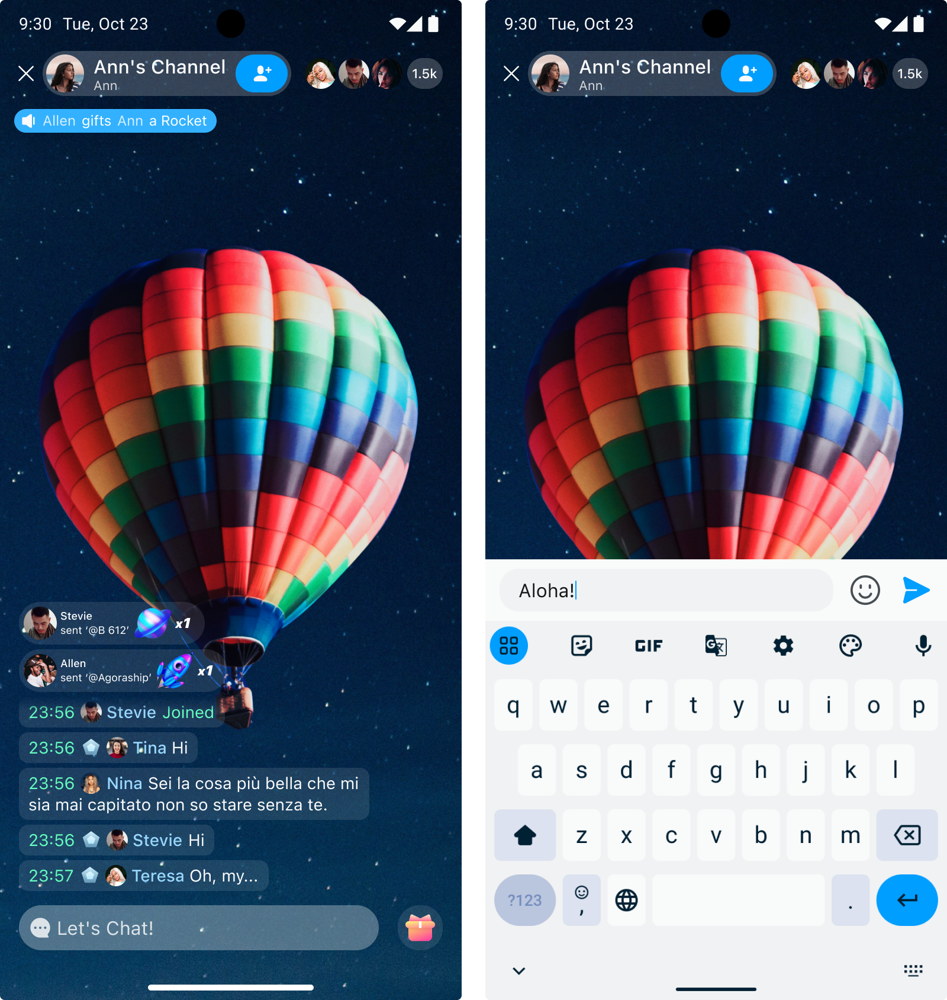

# Quickstart

With UIKit, you can easily implement user interaction in a chat room. This page describes how to implement sending chat room messages.

## Prerequisites

- MacOS 12 or above;
- React-Native 0.66 or above;
- NodeJs 16.18 or above;
- iOS apps: Xcode 13 or above, and its dependencies.
- Android apps: Android Studio 2021 or above, and its dependent tools.
- A valid Agora project with users and tokens generated. See [Enable and configure Chat](https://docs.agora.io/en/agora-chat/get-started/enable) and [Secure authentication with tokens](https://docs.agora.io/en/agora-chat/develop/authentication) for details. 

## Implementation

Take the following steps to implement message sending:

1. Create a project:

    ```
    npx react-native init MyApp --version 0.71.11
    ```

1. Install UIKit into your project.

    Enter the project and execute the following command:
    
    ```
    npm install react-native-chat-room
    # or
    yarn add react-native-chat-room
    # or
    npx expo install react-native-chat-room
    ```
   
1. Initialize UIKit.

   You can initialize UIKit when your application loads or before using it. During initialization, pass in your app key, fill in the necessary parameters and configurations, and place `Container` at the root of the component tree.

   ```typescript
    export function App() {
      const appKey = '<your app key>';
      return <Container appKey={appKey}>{/* // todo: 在这里添加组件 */}</Container>;
    }
   ```

1. Log in to UIKit.

   Before entering the chat room, you must first log in with your user ID and user token. If you have integrated Chat SDK, the corresponding user IDs can be used to log into UIKit. 

     ```typescript
         // ...
         // Get IM service object
         const im = useRoomContext();
         // ...
         // Login service
         // userId and userToken are required
         im.login({
            userId: '<user ID>',
            userToken: '<user token>',
            userNickname: '<user nick name>',
            userAvatarURL: '<user avatar url>',
            gender: 1,
            identify: '<user custom data>',
            result: ({ isOk, error }) => {
              // todo: isOk === true User login successful
              // todo: isOk === false User login failed
            },
         });
     ```

1.  Enter the chat room.

   Before entering a chat room, call the `im.fetchChatroomList` method to obtain the chat room ID and the user ID of the creator of the chat room.
   
   By loading the `Chatroom` component, you will automatically join the chat room. If the component fails to load, you can call the API to join the chat room.
   
    ```typescript
    // ...
    // Create a component reference object.
    const chatroomRef = React.useRef<Chatroom>({} as any);
    // ...
    // Pay attention to component state changes.
    useRoomListener(
      React.useMemo(() => {
        return {
          onError: (params) => {
            // todo: Failed notification processing. For error types, refer to UIKitError.
            // todo: For example: After being kicked out of a chat room, you can call the API to rejoin: chatroomRef.current?.joinRoom({roomId, ownerId}});
          },
          onFinished: (params) => {
            // todo: The notification will contain the completion result. For example, you will receive a notification after joining a chat room. For notification types, see RoomEventType.
          },
        };
      }, [])
    );
    // ...
    // Loads a component into the render tree.
    <Chatroom ref={chatroomRef} roomId={room.roomId} ownerId={room.owner} />;
    // ...
    ```

1. Send a message

   Enter the message content at the bottom of the screen and click **Send** to send the message.

   