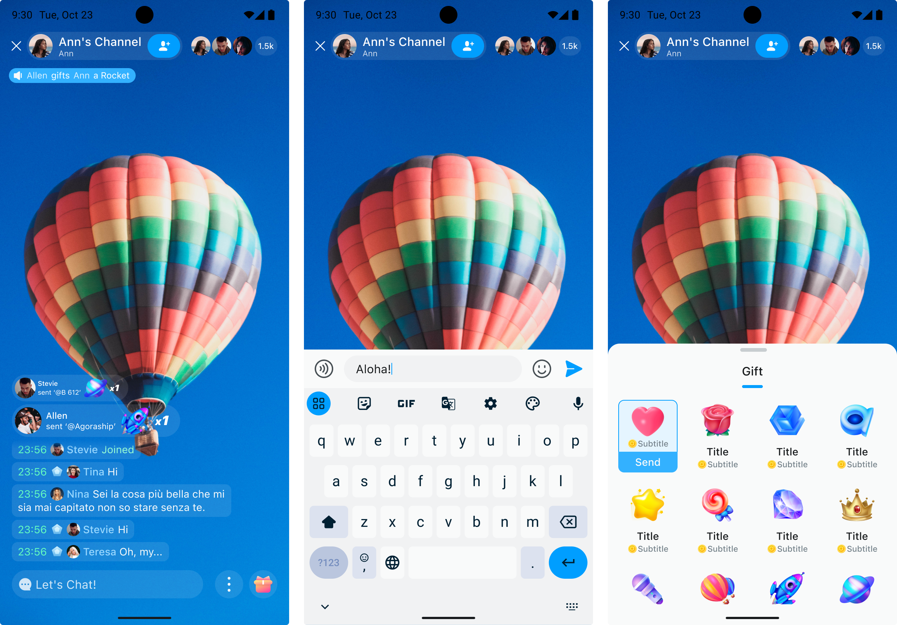
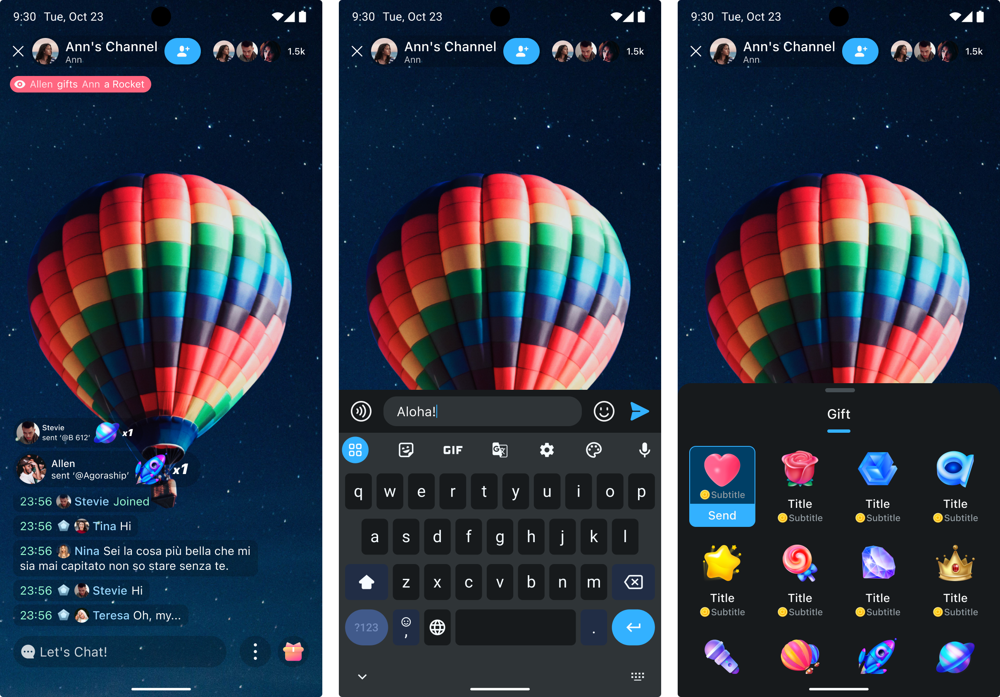

# Theme

UIKit for chatroom has built-in light (default) and dark themes.

- Light

  

- Dark

  


## Switch the theme

Switch the built-in light or dark theme of UIKit in the following way:

```typescript
// ...
// Set the theme
const palette = usePresetPalette();
const dark = useDarkTheme(palette);
const light = useLightTheme(palette);
const [theme, setTheme] = React.useState(light);
// ...
// Add components to the render tree
<Container appKey={env.appKey} palette={palette} theme={theme} />;
// ...
// Switch to the light or dark theme
setTheme(theme === light ? dark : light);
```

## Set custom theme colors

You can use the built-in default theme colors in `usePresetPalette` or set a custom theme color in `useCreatePalette`.

```swift
// Custom colors. By modifying the specific color value, the corresponding color in the component will change accordingly.
// See here:https://www.figma.com/file/OX2dUdilAKHahAh9VwX8aI/Streamuikit?type=design&node-id=101-41012&mode=design&t=Fzou3Gwsk4owLLbr-4
const { createPalette } = useCreatePalette({
  colors: {
    primary: 203,
    secondary: 155,
    error: 350,
    neutral: 203,
    neutralSpecial: 220,
  },
});
const palette = createPalette();
// ...
```

See also [Design guide](../design-guide.md) and [design resources](https://www.figma.com/@agora_chat). 