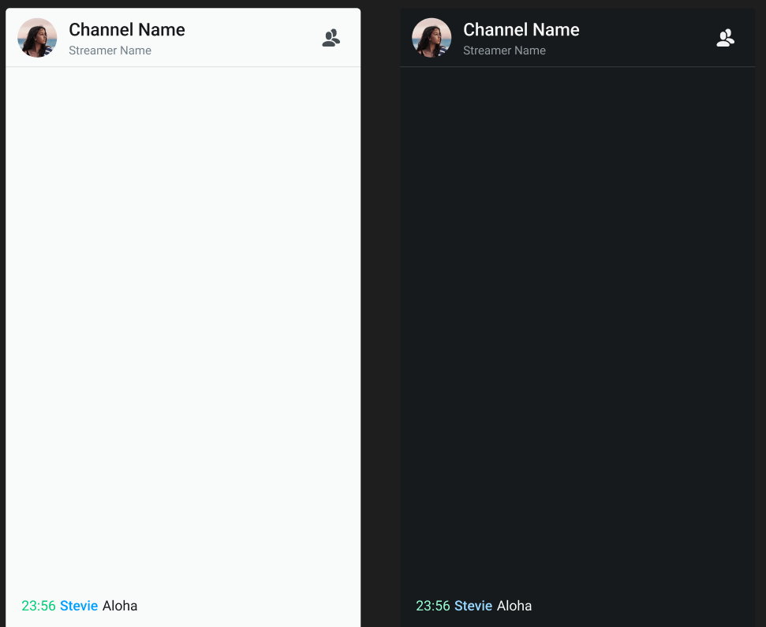

# Theme

UIKit for chatroom has built-in light (default) and dark themes.

  

## Modify the theme

You can change the theme by setting the `UIKitProvider` component's `theme` property:

```javascript
import { Chatroom, UIKitProvider } from 'agora-chat-uikit';

const ChatApp = () => {
  return (
    <UIKitProvider
      theme={{
        mode: 'light', // Light or dark
        primaryColor: '#00CE76', // Hexadecimal color value
      }}
    >
      <Chatroom className="customClass" />
    </UIKitProvider>
  );
};
```

See also [Design guide](../design-guide.md) and [design resources](https://www.figma.com/@agora_chat). 