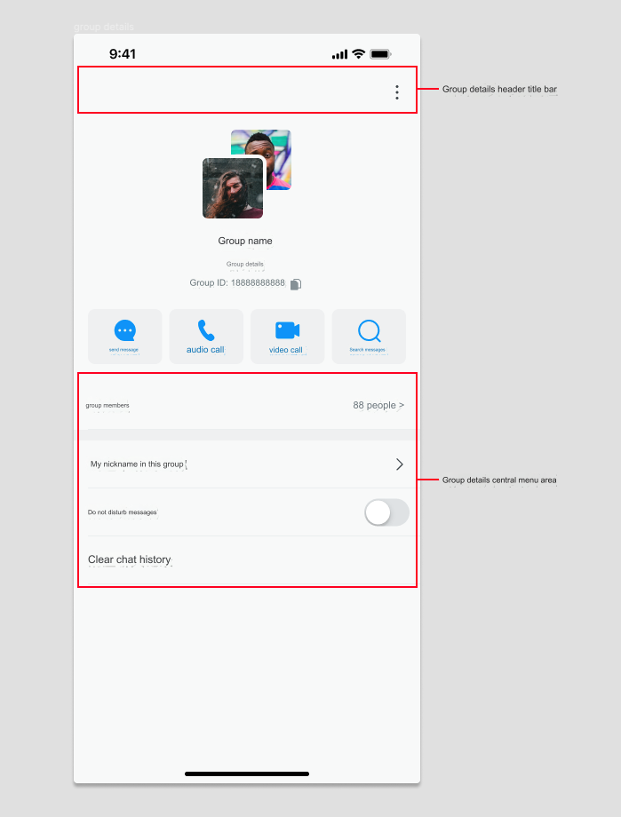

## 1. Customize the navigation section of group details

- In the demo, inherit the `EaseChatNavigationBar` class from `EaseChatUIKit` to create your own conversation list page navigation. This example is named `CustomConversationNavigationBar`.

- Override the `createNavigation()` method and return the object you created using `CustomConversationNavigationBar`. The sample code is as follows:

``` swift
    override func createNavigationBar() -> EaseChatNavigationBar {
        CustomConversationNavigationBar(showLeftItem: false,rightImages: [UIImage(named: "more", in: .chatBundle, with: nil,hiddenAvatar: false)
    }
```

- To customize the right side of the navigation bar button to display images, set `rightImages` in the above code to return the picture you want. Note that the order is 0, 1, 2. Whether to display the avatar on the left side of the navigation bar can be controlled by the `hiddenAvatar` parameter in the above code.

- To customize navigation and listen to the original navigation click event, you need to overload the `navigationClick` method in the session list page, and then perform corresponding processing according to the corresponding click area. The sample code is as follows:

``` swift
    override func navigationClick(type: EaseChatNavigationBarClickEvent, indexPath: IndexPath?) {
        switch type {
        case .back: self.backAction()
        case .avatar: self.avatarAction()
        case .title: self.titleAction()
        case .subtitle: self.subtitleAction()
        case .rightItems: self.rightItemsAction(indexPath: indexPath)
        default:
            break
        }
    }
```

- The edit mode of the navigation bar can be enabled by setting `editMode = true`, which means that both the **back** button and the three buttons on the right side will be hidden, and a **cancel** button will appear on the right side.

- Changing the navigation title content can be achieved by `self.navigation.title = "Chats".chat.localize`, and the implementation of the navigation subtitle  `self.navigation.subtitle = "xxx"` is similar, but it should be noted that you need to set up the subtitle before setting up the title. But if there is no subtitle, then the title can be set directly. The reason for setting the subtitle first and then the title is to update the corresponding layout position inside (if both are present).

- Changing the navigation avatar can be accomplished with `self.navigation.avatarURL = "https://xxx.xxx.xxx"`.

- Setting the navigation and background color can be achieved through `self.navigation.backgroudColor = .red`. The internal components of the navigation can also support this method of modification provided that the theme is not switched. If the theme is switched, it will switch to the theme's default color.

- Click the `...` button in the upper right corner of the group details page to bring up the `ActionSheet` menu to see the configurable data source items `Appearance.contact.moreActions`. The following example shows how to add or remove them:

``` swift
    //Add
    Appearance.contact.moreActions.append(ActionSheetItem(title: "new list item", type: .destructive, tag: "contact_custom"))
    //Remove
    Appearance.contact.moreActions.removeAll { $0. tag == "you want remove" }
```

Get the click event of a single item in the array, example:

``` swift
    if let item = Appearance.contact.moreActions.first(where: { $0.tag == "xxx" }) {
        item.actionClosure = { [weak self] _ in
            //do something
        }
    }
    if let item = Appearance.contact.moreActions.first(where: { $0.tag == "xxx" }) {
        item.actionClosure = { [weak self] _ in
            //do something
        }
    }
```


## 2. Group details customized list item section

- The data source in the `CollectionView` of the button in the Header of the contact details page can be configured with items `Appearance.contact.detailExtensionActionItems`. Event listening to the same user as above, add items with the following code. First, integrate contact inheritance and register the detail page into `EaseChatUIKit`, `ComponentsRegister.shared.GroupInfoController = MineGroupDetailViewController.self`, then

``` swift
final class MineGroupDetailViewController: GroupInfoViewController {
    
    override func cleanHistoryMessages() {
        super.cleanHistoryMessages()
        self.showToast(toast: "Clean successful!".localized())
    }

    override func viewDidLoad() {
        Appearance.contact.detailExtensionActionItems = [ContactListHeaderItem(featureIdentify: "Chat", featureName: "Chat".chat.localize, featureIcon: UIImage(named: "chatTo", in: .chatBundle, with: nil)),ContactListHeaderItem(featureIdentify: "AudioCall", featureName: "AudioCall".chat.localize, featureIcon: UIImage(named: "voice_call", in: .chatBundle, with: nil)),ContactListHeaderItem(featureIdentify: "VideoCall", featureName: "VideoCall".chat.localize, featureIcon: UIImage(named: "video_call", in: .chatBundle, with: nil)),ContactListHeaderItem(featureIdentify: "SearchMessages", featureName: "SearchMessages".chat.localize, featureIcon: UIImage(named: "search_history_messages", in: .chatBundle, with: nil))]
        super.viewDidLoad()
        // Do any additional setup after loading the view.
        self.header.status.isHidden = true
    }
    

    override func headerActions() {
        if let chat = Appearance.contact.detailExtensionActionItems.first(where: { $0.featureIdentify == "Chat" }) {
            chat.actionClosure = { [weak self] in
                //do something
            }
        }
        if let search = Appearance.contact.detailExtensionActionItems.first(where: { $0.featureIdentify == "SearchMessages" }) {
            search.actionClosure = { [weak self] in
                //do something
            }
        }
        if let audioCall = Appearance.contact.detailExtensionActionItems.first(where: { $0.featureIdentify == "AudioCall" }) {
            audioCall.actionClosure = { [weak self] in
                //do something
            }
        }
        if let videoCall = Appearance.contact.detailExtensionActionItems.first(where: { $0.featureIdentify == "VideoCall" }) {
            videoCall.actionClosure = { [weak self] in
                //do something
            }
        }
    }
    
    
}
```
