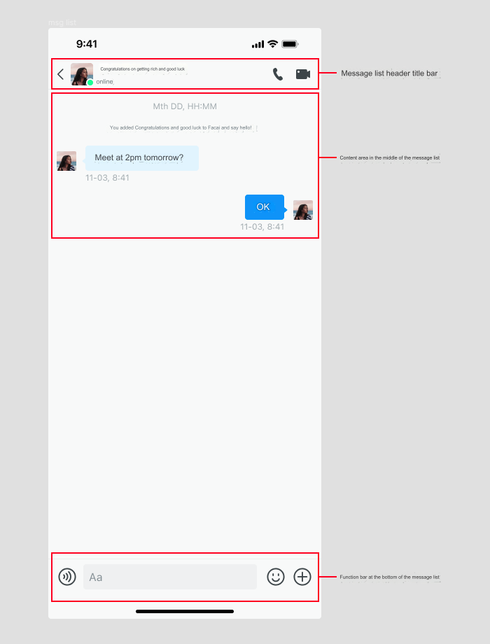

## 1. Customize the navigation bar UI in the message list page

- In the demo, inherit the `EaseChatNavigationBar` class in `EaseChatUIKit` to create your own conversation list page navigation. This example is named `CustomConversationNavigationBar`.

- Override the `createNavigation()` method and return the object you created using `CustomConversationNavigationBar`. The sample code is as follows:

``` swift
    override func createNavigationBar() -> EaseChatNavigationBar {
        CustomConversationNavigationBar(showLeftItem: false,rightImages: [UIImage(named: "add", in: .chatBundle, with: nil,hiddenAvatar: false)
    }
```

- To customize the right side of the navigation bar button to display images, set `rightImages` in the above code to return the picture you want. Note that the order is 0, 1, 2. Whether to display the avatar on the left side of the navigation bar can be controlled by the `hiddenAvatar` parameter in the above code.

- To customize navigation and listen to the original navigation click event, you need to overload the `navigationClick` method in the session list page, and then perform corresponding processing according to the corresponding click area. The sample code is as follows:

```
    override func navigationClick(type: EaseChatNavigationBarClickEvent, indexPath: IndexPath?) {
        switch type {
        case .back: self.backAction()
        case .avatar: self.avatarAction()
        case .title: self.titleAction()
        case .subtitle: self.subtitleAction()
        case .rightItems: self.rightItemsAction(indexPath: indexPath)
        default:
            break
        }
    }
```

- The edit mode of the navigation bar can be enabled by setting `editMode = true`, which means that both the **back** button and the three buttons on the right side will be hidden, and a **cancel** button will appear on the right side.

- Changing the navigation title content can be achieved by `self.navigation.title = "Chats".chat.localize`, and the implementation of the navigation subtitle  `self.navigation.subtitle = "xxx"` is similar, but it should be noted that you need to set up the subtitle before setting up the title. But if there is no subtitle, then the title can be set directly. The reason for setting the subtitle first and then the title is to update the corresponding layout position inside (if both are present).

- Changing the navigation avatar can be accomplished with `self.navigation.avatarURL = "https://xxx.xxx.xxx"`.

- Setting the navigation and background color can be achieved through `self.navigation.backgroudColor = .red`. The internal components of the navigation can also support this method of modification provided that the theme is not switched. If the theme is switched, it will switch to the theme's default color.

- To customize the redirect event, you can check for the overloadable methods marked as **open** in the message list page and overload the corresponding methods to jump to your own business page. Here are some examples of API's that can be overloaded:

| Method name            | Usage         | Is it reloadable? |
|------------------------|---------------|-------------------|
| `messageBubbleClicked` | Message bubble click | yes        |
| `messageAvatarClick`   | Message avatar click | yes        |
| `audioDialog`          | Input box audio button click event | yes         |
| `attachmentDialog`     | Input box sends attachment message click event | yes          |


## 2. Customize the list items in the message list, i.e. the cell for each message type.

- Customize the content of the list items in the message table, i.e., `TextMessageCell`. You need to inherit the cell of the message type that you want to inherit, register and overload some services in the subscript in `EaseChatUIKit`, and then set the following code:

| Cell class name       | Usage                     | Swift code to register corresponding overload property |
|-----------------------|---------------------------|--------------------------------------------------------|
| `TextMessageCell `    | Text type message         | `ComponentsRegister.shared.ChatTextMessageCell = YourTextMessageCell.self`     |
| `ImageMessageCell`    | Picture type message      | `ComponentsRegister.shared.ChatImageMessageCell = YourImageMessageCell.self`   |
| `AudioMessageCell`    | Audio type message        | `ComponentsRegister.shared.ChatAudioMessageCell = YourAudioMessageCell.self`   |
| `VideoMessageCell`    | Video type message        | `ComponentsRegister.shared.ChatVideoMessageCell = YourVideoMessageCell.self`   |
| `FileMessageCell`     | File type message         | `ComponentsRegister.shared.ChatFileMessageCell = YourFileMessageCell.self`     |
| `ContactCardCell`     | Contact card type message | `ComponentsRegister.shared.ChatContactMessageCell = YourContactCardCell.self`  |
| `LocationMessageCell` | Location type message     | `ComponentsRegister.shared.ChatLocationCell = YourLocationMessageCell.self`    |
| `CombineMessageCell`  | Merge forwarding type message                 | `ComponentsRegister.shared.ChatCombineCell = YourCombineMessageCell.self`      |
| `AlertMessageCell`    | Prompt type message                   | `ComponentsRegister.shared.ChatAlertCell = YourAlertMessageCell.self`          |
| `CustomMessageCell`   | Custom type message                   | `ComponentsRegister.shared.ChatCustomMessageCell = YourCustomMessageCell.self` |

Then in your custom class, overload the corresponding overloadable method. If you need to reuse the existing logic and add new logic on this basis, you only need to overload a method and call `super.xxx` in it. For example:

``` swift
    override open func refresh(entity: MessageEntity） {
       super.refresh(entity:entity)
       // Continue with your new logic
    }
```

If you need to make changes to the previous logic, you need to copy the code from the previous `refresh` method and make changes without calling `super.xxxx`. Each corresponding message type cell has an initialization method and a content `createContent` and `refresh` method in the bubble that can be overloaded, as well as other UI creation overload methods for other small modules.

## 3. Other customizable methods in the message list page

All other methods marked as **open** are overloadable methods. If users need to, they can overload the corresponding methods to implement their own business logic.

## 4. Configurable items in the message list module

The `ChatAppearance` class is a configurable container class. For simple configuration items, look at the default values of the properties of the container class.

- `Appearance.chat.bubbleStyle = .withArrow`: This property is the style type of the message bubble. It has two enumeration values. The default is a bubble with sharp corners and the other is a message bubble with polygonal rounded corners.

- `Appearance.chat.contentStyle = [.withReply,.withAvatar,.withNickName,.withDateAndTime]`: This property is the message list item, which is the content displayed in the cell. By default, it displays the reply message bubble, the message sender's avatar, the message sender's nickname, and the date and time of the message. The value-added functions include the expression response to the message (`MessageReaction`) and the opening of a topic discussion group in the group based on the current message (`MessageThread`). Make sure to enable these two features in the Console before adding them.

``` swift
    //Whether to show the message topic or not.
    if self.messageThread {
        Appearance.chat.contentStyle.append(.withMessageThread)
    }
    //Whether to show the message reaction or not.
    if self.messageReaction {
        Appearance.chat.contentStyle.append(.withMessageReaction)
    }
```

- `Appearance.chat.messageLongPressedActions`: The data source array of the `ActionSheet` that pops up after long pressing a message bubble. Users can filter or add some actions according to their own `MessageListController` inheritance triggered after long pressing a message in the sample code:

  

``` swift
override func filterMessageActions(message: MessageEntity) -> [ActionSheetItemProtocol] {
    if let ext = message.message.ext,let value = ext[callIdentifier] as? String,value == callValue {
        return [
            ActionSheetItem(title: "barrage_long_press_menu_delete".chat.localize, type: .normal,tag: "Delete",image: UIImage(named: "message_action_delete", in: .chatBundle, with: nil)),
            ActionSheetItem(title: "barrage_long_press_menu_multi_select".chat.localize, type: .normal,tag: "MultiSelect",image: UIImage(named: "message_action_multi_select", in: .chatBundle, with: nil)),
            ActionSheetItem(title: "barrage_long_press_menu_forward".chat.localize, type: .normal,tag: "Forward",image: UIImage(named: "message_action_forward", in: .chatBundle, with: nil))
        ]
    } else {
        return super.filterMessageActions(message: message)
    }
}
```

Get an action of the click event, sample code:

``` swift
    Appearance.chat.messageLongPressedActions.first { $0.tag == "xxx" }?.action = { [weak self ] in 
        //action handler
    }
```

- `Appearance.chat.targetLanguage= .Chinese`: After long pressing a text message, a translation menu will appear. After clicking **Translate**, you need to set the target language to be translated to. The prerequisite is that you need to apply for the translation function in the background of Agora Console and set `Appearance.chat.enableTranslation` to `true` to enable the translation function of text message long press. If the background application is not passed, the front-end API call will fail to translate.

- `Appearance.chat.reportSelectionTags` & `Appearance.chat.reportSelectionReasons`: The message reporting feature has an array of report tags and a corresponding array of reasons, kv one-to-one.

- `Appearance.chat.inputExtendActions`: Click on the right side of the message input box +to pop up the `ActionSheet` data source array. For usage refer to `Appearance.chat.messageLongPressedActions` above.

- `Appearance.chat.dateFormatToday = "HH:mm"` & `Appearance.chat.dateFormatOtherDay = "yyyy-MM-dd HH:mm"`: Time format of the message.

- `Appearance.chat.audioDuration`:  Maximum recording duration of an audio message. The default is 60 seconds.

- `Appearance.chat.recallExpiredTime`: The default maximum time limit for withdrawing a message is 2 minutes.
