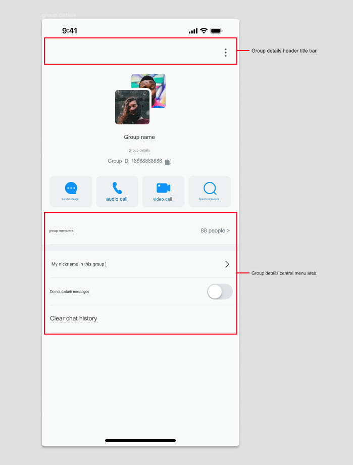

## 1. Customize the navigation section of contact details

- In the demo, inherit the `EaseChatNavigationBar` class in `EaseChatUIKit` to create your own page navigation. In this example, it is called `CustomConversationNavigationBar`.

- Override the `createNavigation()` method and return the object you created using `CustomConversationNavigationBar`. The sample code is as follows:

    ```Swift
        override func createNavigationBar() -> EaseChatNavigationBar {
            CustomConversationNavigationBar(showLeftItem: false,rightImages: [UIImage(named: "more", in: .chatBundle, with: nil,hiddenAvatar: false)
        }
    ```

- To customize the look of the button on the right side of the navigation bar, set `rightImages` in the above sample code to return the required image. Note that the order is 0, 1, 2. Control whether to display the avatar on the left side of the navigation bar with the `hiddenAvatar` parameter.

- To customize navigation and listen to the original navigation click event, override the `navigationClick` method and then perform the processing according to the corresponding click area. The sample code is as follows:

    ```
        override func navigationClick(type: EaseChatNavigationBarClickEvent, indexPath: IndexPath?) {
            switch type {
            case .back: self.backAction()
            case .avatar: self.avatarAction()
            case .title: self.titleAction()
            case .subtitle: self.subtitleAction()
            case .rightItems: self.rightItemsAction(indexPath: indexPath)
            default:
                break
            }
        }
    ```

- Enable the editing mode of the navigation bar by setting `editMode = true`. In this mode, both the **back** button and the three buttons on the right side will be hidden, and a **cancel** button will appear.

- Set `self.navigation.title = "Chats".chat.localize` and `self.navigation.subtitle = "xxx"` to change the navigation title and subtitle, respectively. If present, set the subtitle first to update the corresponding layout position inside.

- Change the navigation avatar with `self.navigation.avatarURL = "https://xxx.xxx.xxx"`.

- Set the navigation background color through `self.navigation.backgroudColor = .red`. The internal components of the navigation can also support this method of modification provided that the theme is not switched. If the theme is switched, it will use the theme's default color.

- Click the `...` button in the upper right corner of the contact details page to bring up the `ActionSheet` menu to see the configurable data source items `Appearance.contact.moreActions`. The following example shows how to add or remove them:

    ```Swift
         //Add
         Appearance.contact.moreActions.append(ActionSheetItem(title: "new list item", type: .destructive, tag: "contact_custom"))
         //Remove
         Appearance.contact.moreActions.removeAll { $0. tag == "you want remove" }
    ```

    Get the click event of a single item in the array:
    
    ```Swift
        if let item = Appearance.contact.moreActions.first(where: { $0.tag == "xxx" }) {
            item.actionClosure = { [weak self] _ in
                //do something
            }
        }
        if let item = Appearance.contact.moreActions.first(where: { $0.tag == "xxx" }) {
            item.actionClosure = { [weak self] _ in
                //do something
            }
        }
    ```


## 2. Customize the contact list item 

- The data source in the `CollectionView` of the header button of the contact details page can be configured with `Appearance.contact.detailExtensionActionItems`. The event listening is the same as above, and the added items are the same as the following code.

- Contact details list item extension: First, integrate contact inheritance and register the detail page into `EaseChatUIKit`, then set `ComponentsRegister.shared.ContactInfoController = MineContactDetailViewController.self`.

    ```Swift
    final class MineContactDetailViewController: ContactInfoViewController {
        
        override func createHeader() -> DetailInfoHeader {
            super.createHeader()
        }
        
        override func dataSource() -> [DetailInfo] {
            let json: [String : Any] = ["title":"contact_details_button_remark".localized(),"detail":"","withSwitch": false,"switchValue":false]
            let info = self.dictionaryMapToInfo(json: json)
            var infos = super.dataSource()
            infos.insert(info, at: 0)
            return infos
        }
    
        override func viewDidLoad() {
            Appearance.contact.detailExtensionActionItems = [
                ContactListHeaderItem(featureIdentify: "Chat", featureName: "Chat".chat.localize, featureIcon: UIImage(named: "chatTo", in: .chatBundle, with: nil)),
                ContactListHeaderItem(featureIdentify: "AudioCall", featureName: "AudioCall".chat.localize, featureIcon: UIImage(named: "voice_call", in: .chatBundle, with: nil)),
                ContactListHeaderItem(featureIdentify: "VideoCall", featureName: "VideoCall".chat.localize, featureIcon: UIImage(named: "video_call", in: .chatBundle, with: nil)),
                ContactListHeaderItem(featureIdentify: "SearchMessages", featureName: "SearchMessages".chat.localize, featureIcon: UIImage(named: "search_history_messages", in: .chatBundle, with: nil))
            ]
            super.viewDidLoad()
            self.requestInfo()
            self.header.status.isHidden = true
            // Do any additional setup after loading the view.
        }  
    }
    ```
