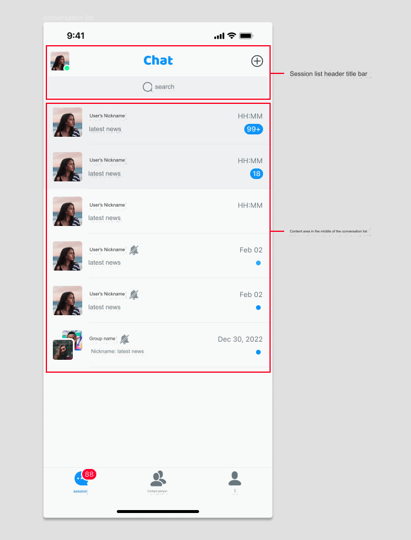

## 1. Customize the header navigation bar of the conversation list (ConversationListController.swift)

- In the demo, inherit the `EaseChatNavigationBar` class in `EaseChatUIKit` to create your own conversation list navigation. In this example, it is called `CustomConversationNavigationBar`.

- Override the `createNavigation()` method and return the object you have created using `CustomConversationNavigationBar`. The sample code is as follows:

    ```Swift
        override func createNavigationBar() -> EaseChatNavigationBar {
            CustomConversationNavigationBar(showLeftItem: false,rightImages: [UIImage(named: "add", in: .chatBundle, with: nil,hiddenAvatar: false)
        }
    ```

- To customize the right side of the navigation bar button to display images, set `rightImages` in the above code to return the picture you want. Note that the order is 0, 1, 2. Control whether to display the avatar on the left side of the navigation bar with the `hiddenAvatar` parameter.

- To customize navigation and listen to the original navigation click event, override the `navigationClick` method in the conversation list page, and then perform the processing according to the corresponding click area. The sample code is as follows:

    ```
        override func navigationClick(type: EaseChatNavigationBarClickEvent, indexPath: IndexPath?) {
            switch type {
            case .back: self.backAction()
            case .avatar: self.avatarAction()
            case .title: self.titleAction()
            case .subtitle: self.subtitleAction()
            case .rightItems: self.rightItemsAction(indexPath: indexPath)
            default:
                break
            }
        }
    ```

- Enable the editing mode of the navigation bar by setting `editMode = true`, which means that both the **back** button and the three buttons on the right side will be hidden, and a **cancel** button will appear on the right side.

- Set `self.navigation.title = "Chats".chat.localize` to change the navigation title content. The implementation of the navigation subtitle  `self.navigation.subtitle = "xxx"` is similar, but it should be noted that you need to set up the subtitle before setting up the title. If there is no subtitle, then the title can be set directly. The reason for setting the subtitle first is to update the corresponding layout position inside (if both are present).

- Change the navigation avatar with `self.navigation.avatarURL = "https://xxx.xxx.xxx"`.

- Set the navigation and background color through `self.navigation.backgroudColor = .red`. The internal components of the navigation can also support this method of modification provided that the theme is not switched. If the theme is switched, it will switch to the theme's default color.

## 2. Customize the conversation list and items

- To customize the conversation list `TableView`, override the `createList` method in the conversation list page and return the `ConversationList` class object that you inherited from `EaseChatUIKit`. Find and take a closer look at the `ConversationList.swift` class to implement the business logic. The sample code is as follows:

    ```Swift
        override open func createList() -> ConversationList {
            CustomConversationList(frame: CGRect(x: 0, y: self.search.frame.maxY+5, width: self.view.frame.width, height: self.view.frame.height-NavigationHeight-BottomBarHeight-(self.tabBarController?.tabBar.frame.height ?? 49)), style: .plain)
        }
    ```

- To customize the contents of the list items, create a new custom class `CustomConversationCell` by inheriting the `ConversationCell` class in `EaseChatUIKit`, and then set it up with the following code:

    ```Swift
        ComponentsRegister.shared.ConversationCell = CustomConversationCell.self
    ```

    Then, in the `CustomConversationCell` class, override the corresponding method. If you need to reuse the existing logic and add new logic on this basis, override the method and call       `super.xxx` in it. For example:
    
        ```Swift
            override open func refresh(info: ConversationInfo) {
               super.refresh(info:info)
               // Continue with your new logic
            }
        ```

    If you need to make changes to the previous logic, copy the code from the previous `refresh` method and make changes without calling `super.xxxx`. Initialization methods and some of       the UI creation methods can be overriden.

## 3. Other customizable methods in the conversation list

All other methods marked as **open** can be overriden. If users need to, they can override the corresponding methods to implement their own business logic.

## 4. Configurable items in the conversation list module

- `Appearance.conversation.swipeLeftActions` data source items displayed after swiping left or right on a single conversation list item can only be decremented, not incremented (because it's an enumerated array). The existing functions include left swipe (mute, pin, delete), right swipe (read, evoke more menu), right slide (read, call up more `ActionSheet` menu):

    ```Swift
        //Remove
        Appearance.conversation.swipeLeftActions.removeAll { $0 == .more }
    ```

- Time format in list items: `Appearance.conversation.dateFormatToday = "HH:mm"` or `Appearance.conversation.dateFormatOtherDay = "MM/dd"`.

- Swipe right on the list item in the conversation list to display `...`. The `ActionSheet` list item data source that pops up after clicking `Appearance.conversation.moreActions` and the example of obtaining click events are the same as the code example below.

- Click the `+` button in the upper right corner of the contact details page and the data source in the `ActionSheet` menu will pop up. `Appearance.conversation.listMoreActions` can be assigned. The following example shows how to add or remove:

    ```Swift
        //Add
        Appearance.conversation.listMoreActions.append(ActionSheetItem(title: "new list item", type: .destructive, tag: "custom"))
        //Remove
        Appearance.conversation.listMoreActions.removeAll { $0. tag == "you want remove" }
    ```

Get the click event for a single item in this array, for example:

```Swift
    if let item = Appearance.conversation.listMoreActions.first(where: { $0.tag == "xxx" }) {
        item.actionClosure = { [weak self] _ in
            //do something
        }
    }
    if let item = Appearance.conversation.listMoreActions.first(where: { $0.tag == "xxx" }) {
        item.actionClosure = { [weak self] _ in
            //do something
        }
    }
```
