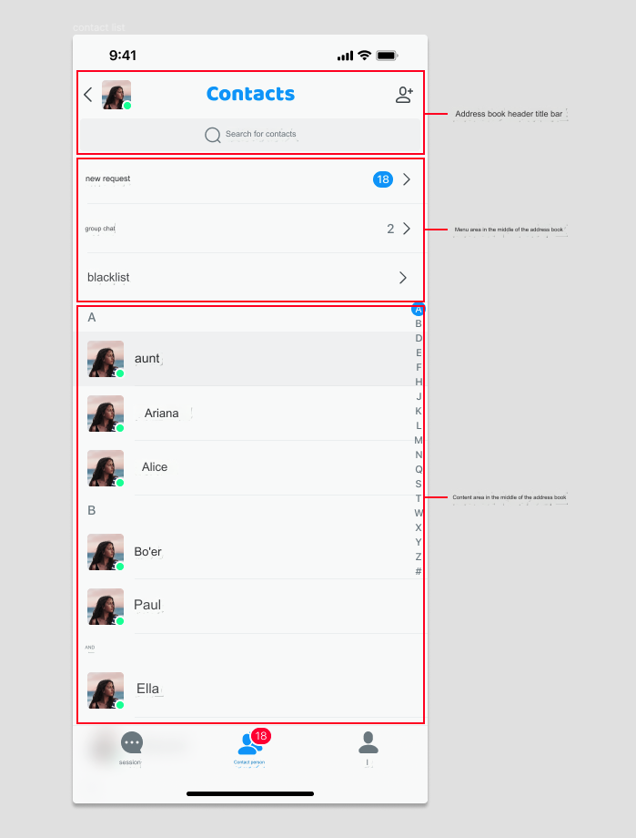

## 1. Customize the header navigation bar of the contact list (ContactViewController.swift)

- In the demo, inherit the `EaseChatNavigationBar` class in `EaseChatUIKit` to create your own page navigation. In this example, it is called `CustomConversationNavigationBar`.

- Override the `createNavigation()` method and return the object you created using `CustomConversationNavigationBar`. The sample code is as follows:

    ```Swift
        override func createNavigationBar() -> EaseChatNavigationBar {
            CustomConversationNavigationBar(showLeftItem: false,rightImages: [UIImage(named: "add", in: .chatBundle, with: nil,hiddenAvatar: false)
        }
    ```

- To customize the right side of the navigation bar button to display images, set `rightImages` in the above code to return the picture you want. Note that the order is 0, 1, 2. Control whether to display the avatar on the left side of the navigation bar with the `hiddenAvatar` parameter.

- To customize navigation and listen to the original navigation click event, override the `navigationClick` method and then perform the processing according to the corresponding click area. The sample code is as follows:

    ```
        override func navigationClick(type: EaseChatNavigationBarClickEvent, indexPath: IndexPath?) {
            switch type {
            case .back: self.backAction()
            case .avatar: self.avatarAction()
            case .title: self.titleAction()
            case .subtitle: self.subtitleAction()
            case .rightItems: self.rightItemsAction(indexPath: indexPath)
            default:
                break
            }
        }
    ```

- Enable the editing mode of the navigation bar by setting `editMode = true`. In this mode, both the **back** button and the three buttons on the right side will be hidden, and a **cancel** button will appear.

- Change the navigation title content by setting `self.navigation.title = "Chats".chat.localize`. The implementation of the navigation subtitle  `self.navigation.subtitle = "xxx"` is similar, but it should be noted that you need to set up the subtitle before setting up the title. If there is no subtitle, then the title can be set directly. The reason for setting the subtitle first is to update the corresponding layout position inside (if both are present).

- Change the navigation avatar with `self.navigation.avatarURL = "https://xxx.xxx.xxx"`.

- Set the navigation background color by setting `self.navigation.backgroudColor = .red`. The internal components of the navigation can also support this method of modification provided that the theme is not switched. If the theme is switched, it will switch to the theme's default color.

## 2. Customize the list and list items in the contact list page

- To customize the contact list `TableView`, override the `createContactList` method and return the `ContactView` class object that you inherited from `EaseChatUIKit`. Find and take a closer look at the `ContactView.swift` class to implement the business logic. The sample code is as follows:

    ```Swift
        override open func createContactList() -> ContactView {
            CustomContactView(frame: CGRect(x: 0, y: self.search.frame.maxY+5, width: self.view.frame.width, height: self.view.frame.height-NavigationHeight-BottomBarHeight-(self.tabBarController?.tabBar.frame.height ?? 49)), style: .plain)
        }
    ```

- To customize the contents of the list items in the `ContactCell`, create a new custom class `CustomContactCell` by inheriting the `ContactCell` class in `EaseChatUIKit`, and then set it up with the following code:

    ```Swift
        ComponentsRegister.shared.ContactsCell = CustomContactCell.self
    ```

    Then, in the `CustomContactCell` class, override the corresponding method. If you need to reuse the existing logic and add new logic on this basis, override the method and call `super.xxx` in it. For example:

    ```Swift
        override open func refresh(profile: EaseProfileProtocol) {
           super.refresh(profile: profile)
           // Continue with your new logic
        }
    ```

    If you need to make changes to the previous logic, copy the code from the previous `refresh` method and make changes without calling `super.xxxx`. Initialization methods and some of the UI creation methods can be overriden.

## 3. Other customizable methods in the contact list page

All other methods marked as **open** can be overriden to implement a custom business logic.

## 4. Configurable items in the contacts module

The following example shows how to add or remove data source items in the contact list header using `Appearance.contact.listHeaderExtensionActions`:

```Swift
    //Add
    Appearance.contact.listHeaderExtensionActions.append(ContactListHeaderItem(featureIdentify: "New", featureName: "NewFeature", featureIcon: UIImage(named: "NewFeature")))
    //Remove
    Appearance.contact.listHeaderExtensionActions.removeAll { $0.featureIdentify == "you want remove" }
```

Get the click event for a single item in this array, for example:

```Swift
    if let item = Appearance.contact.listHeaderExtensionActions.first(where: { $0.featureIdentify == "NewFriendRequest" }) {
        item.actionClosure = { [weak self] _ in
            //do something
        }
    }
    if let item = Appearance.contact.listHeaderExtensionActions.first(where: { $0.featureIdentify == "GroupChats" }) {
        item.actionClosure = { [weak self] _ in
            //do something
        }
    }
```
